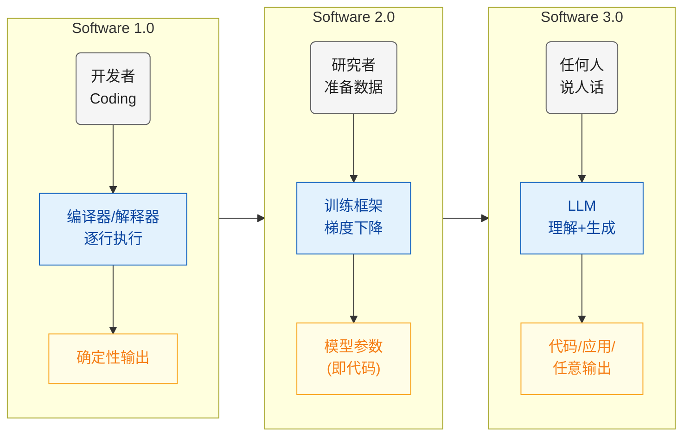
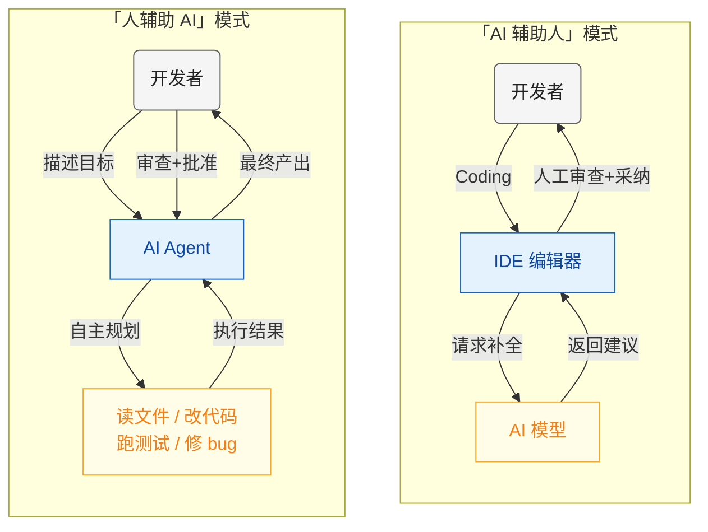
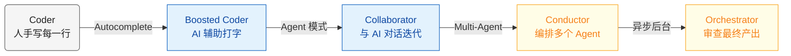
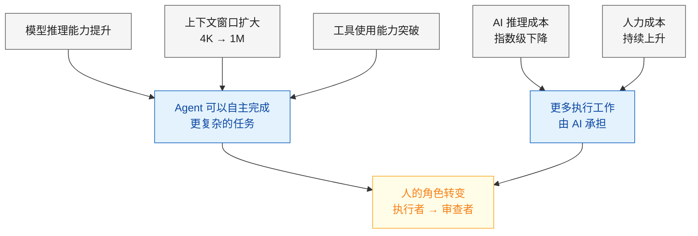

我的工作方式在过去这段时间经历了一次很大的转变。

以前，我每天打开 Cursor，在编辑器里 coding，AI 在旁边给我补全、提建议、帮我改 bug。我是主角，AI 是配角，整个过程跟过去 coding 没有本质区别——只是打字更快了。

现在，我打开终端，用自然语言描述一个目标，Claude Code 自己去读代码、改文件、跑测试、修 bug，遇到复杂任务还会拉起一个 Agent 团队并行干活。我的工作从 coding 变成了 reviewing——审查 AI 的输出、确认方向、批准关键决策。

这两种体验的差别，不是"哪个工具更好用"的问题，而是**人和 AI 的关系发生了根本性的反转**。

虽然我是从编程场景切入的，但这个转变远不止编程。写文档、做研究、数据分析、项目管理——几乎所有知识工作都在经历类似的分化。编程只是最先、最明显感受到冲击的领域。

我想聊三个问题：AI 工具到底分几种？它们真的是同一类东西吗？从"AI 辅助人"到"人辅助 AI"，变的到底是什么？这个趋势会走多远，对我们意味着什么？

## Software 的三个时代

Andrej Karpathy 在 2024-2025 年间提出了一个很有洞察力的框架，把软件开发分成三个时代：

**Software 1.0** 是传统编程。人用 Python、C++、Java 写出确定性指令，编译器逐行执行。代码就是代码，所见即所得。

**Software 2.0** 是深度学习时代。神经网络的权重参数本身就是"代码"——你不再手写规则，而是用数据训练出一组参数，模型自己学会做决策。ImageNet 时代的 CNN，AlphaGo 背后的强化学习，都属于这个范式。

**Software 3.0** 是 LLM 时代。自然语言成了编程接口。你不需要写 Python，也不需要准备训练数据，只要用人话描述你想要什么，模型就去执行。Karpathy 的原话是："The hottest new programming language is English"。

2025 年 2 月，Karpathy 又抛出了一个概念叫 **Vibe Coding**——大意是你不用真的去理解每一行代码，而是"凭感觉"告诉 AI 你要什么，AI 来 coding，你看效果，不满意就继续调。这个词后来火到被 Collins 英语词典收录为 2025 年度词汇之一。

三个时代的关系可以用一张图说清楚：

那 Vibe Coding 是不是就是 Software 3.0 的终极形态了？我觉得不是。

Vibe Coding 本质上还是"人在 coding"，只不过方式从键盘变成了嘴巴（或者说 prompt）。你说一句，AI 写一段，你看看对不对，再说下一句——这个循环里，人还是那个驾驶员，只是方向盘换了个形状。

真正的转变，不是方向盘的形状变了，而是**你从驾驶座换到了副驾驶座**。

## 两大阵营：谁在辅助谁？

如果你把市面上的 AI 编程工具摆在一起看，会发现它们其实分成了两个截然不同的阵营。

### "AI 辅助人"阵营

这个阵营的代表是 Cursor、Trae、GitHub Copilot。

**GitHub Copilot** 是这条路线的开创者。2021 年发布，到现在累计超过 2000 万用户，470 多万付费订阅，90% 的 Fortune 100 公司都在用。它的核心体验就是 autocomplete——你写半行代码，AI 帮你补完，你按 Tab 接受，或者无视它继续写自己的。后来加了 Chat 和 Agent 模式，但本质没变：你在 IDE 里 coding，AI 辅助你。

**Cursor** 把这条路线推到了一个新高度。它直接 fork 了 VS Code，把 AI 深度集成进编辑器的每一个角落。Autocomplete、Cmd+K inline edit、Agent 模式，甚至可以让 AI 操作整个项目。Cursor 的增长速度堪称恐怖——2023 年 ARR 还是 100 万美元，2024 年冲到 1 亿，2025 年中到了 5 亿，超过一半的 Fortune 500 工程团队在用。但如果你仔细体会，不管 Cursor 的 Agent 模式多花哨，你的注意力始终绑定在那个编辑器窗口上——你盯着它干活，它干完一步你看一步，本质上还是**人在主导整个流程**。

**Trae** 是字节跳动做的 AI IDE。它有个叫 SOLO 的模式，可以让 AI 从头到尾帮你构建一个完整的应用。Trae 在海外增长很快，注册用户超过 600 万，月活 160 万左右。但仔细看，SOLO 模式更像是一个增强版的 scaffolding 工具，在做复杂的已有项目开发时，你还是得回到编辑器里一行行盯着。

这个阵营的共同特征：**不管 AI 能力多强，范式没变——你是主人，AI 是工具。**

### "人辅助 AI"阵营

这个阵营的代表是 Claude Code、OpenAI Codex、Claude Cowork。

**Claude Code** 是我目前的主力工具。最新的 Claude Opus 4.6 模型支持 100 万 token 的上下文窗口，可以一次"看到"整个大型代码库。它跑在终端里，没有花哨的 IDE 界面，你用自然语言描述目标，它自己决定要做什么——读哪些文件、改哪些代码、跑什么命令、怎么修 bug。上一代 Claude Sonnet 4.5 就已经能autonomous coding 30 小时以上，这个时长超过了大多数人类开发者一天的工作时间。Opus 4.6 带来的 Agent Teams 功能更进一步：遇到复杂任务，它会自己拉起一个团队，Team Lead 拆分任务，Teammates 并行执行，互相通信协作。

**OpenAI Codex** 走得更远。它是异步后台模式——你提交一个任务，Codex 在云端沙箱里自主执行，你不需要盯着看，可以同时提交好几个任务。它用的是专门优化过的 GPT-5.3-Codex 模型，每个任务在独立的云端沙箱中运行，默认禁用网络访问，只能操作你提供的代码仓库。跑完了给你一个 diff 和执行日志，你 review 通过就合并。这种体验已经完全不像 coding 了，更像你在 Jira 上给同事派任务。

**Claude Cowork** 则在试图超越编程本身。它面向的不只是开发者，而是所有知识工作者——帮你做研究、写报告、分析数据、管理项目。编程只是它能力的一个子集。

这个阵营的共同特征：**AI 是执行者，人是审批者。决策权正在发生转移。**

### 两者对比

| 维度 | AI 辅助人 | 人辅助 AI |
|------|----------|----------|
| 代表工具 | Cursor, Copilot, Trae | Claude Code, Codex, Cowork |
| 交互界面 | IDE（图形编辑器） | 终端 / 异步任务面板 |
| 人的角色 | Coder、决策者 | Reviewer、方向指引者 |
| AI 的角色 | Autocomplete、建议、辅助 | 自主 planning、执行、协作 |
| 决策权 | 人持有 | 逐步转向 AI |
| 注意力绑定 | 强（必须盯着看） | 弱（可以异步、并行） |
| 并行能力 | 弱（一次一个任务） | 强（多 Agent / 多任务） |
| 适合场景 | 精确编辑、已知问题修复 | 大型任务、探索性工作、多模块协作 |

两个阵营的交互模式差异很大：

## 从 Coder 到 Conductor

Google Chrome 团队的 Addy Osmani 写过一篇很有影响力的文章叫"The 70% Problem"，后来他又在一系列文章中提出了开发者角色演进的三层模式：

**第一层：CLI Agent。** 一个终端，一个 Agent，你给它指令，它执行。Claude Code 单人模式就是这层。你和 AI 一对一协作，AI 做执行，你做审查。

**第二层：并行编排。** 多个 Agent 同时工作，各自负责不同模块，像一个小团队。Claude Code Agent Teams 就是这层。你从 coder 变成了 team lead。

**第三层：异步后台。** 你提交任务就不用管了，AI 在后台自主完成，做完通知你来 review。OpenAI Codex 在探索这层。你从 team lead 变成了 orchestrator。

微软 CEO Satya Nadella 在 2025 年 4 月的 LlamaCon 上透露，微软内部 20-30% 的代码由 AI 编写。Google CEO Sundar Pichai 说了类似的数字——超过 30%。Zuckerberg 更激进，预计一年内 AI 将处理 Meta 半数的开发工作。这些不是实验室里的数字，是全球最大的几家科技公司在生产环境里的真实比例。

这让我想到一个类比——**乐团指挥**。

一个好的指挥不需要会拉小提琴、吹双簧管、敲定音鼓，但他必须懂音乐——懂结构、懂节奏、懂各声部之间的关系。他的价值不在于"能不能演奏"，而在于"能不能让整个乐团发出正确的声音"。

开发者的角色正在往这个方向走。你不需要记住每个 API 的参数，不需要手写每一行 boilerplate，但你必须理解系统架构、知道哪些决策会带来哪些后果、能判断 AI 的输出是不是正确的。

## 人机协作的三种姿势

有一项[研究](https://d3.harvard.edu/the-three-ways-professionals-work-with-ai-which-one-are-you/)发现，知识工作者与 AI 协作时自然分化出了三种模式，我觉得这个分类用来理解 AI 编程工具的分化特别合适：

**Centaur 模式**（研究中占 14%）：人在驾驶座，AI 在需要的时候帮忙。人决定什么时候用 AI、用多少。这对应最早期的 Copilot autocomplete——你写到一半，AI 补一句，你看看要不要。人完全掌控流程，AI 是个被动的工具。研究发现 Centaur 的准确率最高，因为人始终在把关。

**Cyborg 模式**（占比最大）：人和 AI 高度融合，持续迭代对话，你一句我一句，人机界限变得模糊。这对应 Cursor Agent 模式——你告诉 AI 要实现什么功能，它改一版你看看，不满意再聊，来回几轮直到满意。Cyborg 在实验中发展出了最强的 AI 协作技巧——他们学会了何时该推回 AI 的输出、如何暴露 AI 的矛盾。

**Self-Automator 模式**（占 27%）：人把整个工作流委派出去，几乎不迭代。这对应 Claude Code Agent Teams 或 OpenAI Codex——你描述目标，AI 自主拆解、执行、完成，你最后看结果。研究里的一个有意思的发现是：Self-Automator 既不增加领域专业知识，也不增加 AI 专业知识。换句话说，**光委派不审查，人不会成长，AI 也不会变好**。

| 协作模式 | 人的角色 | AI 的角色 | 对应工具 |
|---------|---------|----------|---------|
| Centaur | 驾驶员 | 乘客 | Copilot Autocomplete |
| Cyborg | 驾驶员 + 领航员混合 | 领航员 + 驾驶员混合 | Cursor Agent, Trae SOLO |
| Self-Automator | Reviewer / Conductor | Autonomous Executor | Claude Code, Codex |

这三种模式不是互相替代的关系。在实际工作中，同一个人一天之内可能在三种模式之间切换——改个 typo 用 Centaur 就够了，实现一个新功能可能用 Cyborg，重构整个模块就切到 Self-Automator。

但趋势的方向很明确：**重心在从 Centaur 往 Self-Automator 移动。**

## 一个数据悖论

有几组数据放在一起看很有意思。

Stack Overflow 2025 年的开发者调查显示，80% 的开发者在工作流中使用 AI 工具，DX 的报告更夸张——13.5 万名开发者中 AI 采用率达到 91%。GitHub 自己的数据是，使用 Copilot 的开发者coding 速度提升了 55%。多项研究表明，AI 辅助下个人任务完成量平均提升 20% 以上。

这些数字看起来都在说一件事：AI 让开发者变快了。

但另一组数据讲了一个不同的故事。GitHub 与 Accenture 合作做了大规模随机对照试验，发现虽然开发者的 PR 数量增加了约 9%，合并率提高了 11%，但一个耐人寻味的现象出现了：随着 AI 生成代码量的增加，Code Review 正在成为新的瓶颈。代码写得更快了，但审查反而更慢了。

这不矛盾。恰恰印证了范式转变的方向——**当 AI 承担了更多的"写"，人就必须承担更多的"审"。**

Coding 从来不是软件工程的瓶颈。真正难的是理解需求、设计架构、做权衡取舍、保证正确性。当代码生成被 AI 加速了 10 倍，这些"审"的能力反而变成了稀缺资源。

一个极端点的说法：**如果你只会 coding 不会 reviewing，你在新范式下的价值会急剧缩水。**

## 我的亲身体验

这不是纯理论分析。我确实经历了从一种工作方式到另一种的切换。

### Cursor 阶段

刚开始用 Cursor 的时候觉得确实爽——autocomplete 命中率很高，写 boilerplate 的时候效率提升明显。Cmd+K inline edit 也很方便，选中一段代码告诉它要改什么，它就地修改。

但用了一段时间我发现一个问题：**我的注意力始终被绑死在编辑器上。** AI 虽然帮我加速了打字，但工作的心智模型没变——我还是在逐行思考、逐文件修改。遇到跨多个文件的大改动，我还是得自己规划改哪些文件、按什么顺序改，AI 只是帮我在每个文件里打字更快。

说白了，Cursor 让我从"每分钟打 60 个字的程序员"变成了"每分钟打 200 个字的程序员"。快了不少，但做的事情没变。

### Claude Code 阶段

后来切到 Claude Code，体验完全不同。

我不再在编辑器里一行行 coding 了。我在终端里用自然语言描述我要做什么，Claude Code 自己去搜索代码库、理解上下文、制定计划、逐步执行。它会自己读文件、改代码、跑测试，测试失败了还会自己分析错误然后修。

一开始我很不适应，总想插手——看到它改的代码不是我想的写法就忍不住打断。后来我发现，只要最终结果正确、代码质量可以，写法跟我想的不一样其实无所谓。**我的角色从 coder 变成了 reviewer。**

更大的转变发生在 Agent Teams 出来之后。遇到需要并行处理的复杂任务，一个 Team Lead 负责拆任务，几个 Teammates 各领一块并行干活，互相之间还能通信协调。

我现在的工作状态更像是一个 Tech Lead 带着一个 AI 团队：我定方向、拆任务、做关键决策、审查产出。具体的 coding、testing、debugging，大部分交给 AI。

心态的变化比工具的变化更深刻。以前遇到 bug 我的第一反应是"打个断点看看"，现在的第一反应是"描述清楚症状让 Agent 去查"。以前要加一个功能我会先想"技术方案怎么设计"，现在会先想"怎么把需求描述清楚"。

Agent 的工作原理其实并不复杂：核心就是一个循环——模型决策、调用工具、拿到结果、再决策，直到任务完成。剥去所有外衣，不到 100 行代码。但就是这个简单的循环，改变了人和 AI 的关系。

## 跃迁的驱动力

这个范式转变不是凭空发生的。背后有几个关键的技术和经济因素在推动。

**模型能力是根因。** 早期的模型 coding 还经常出低级错误，现在的模型可以理解几十万行的代码库、做多步推理、自己规划执行路径。上下文窗口从最初的几千 token 扩大到了百万级别（Claude Opus 4.6 已经到了 100 万 token）。窗口的扩大意味着 AI 可以"看到"更多信息，理解更完整的系统结构，做出更准确的决策。

**工具使用能力的突破。** 光会 coding 没用，Agent 还得会用工具——读文件、写文件、跑命令、调 API。这个能力在最近一两年有了质的飞跃。以前的模型调用工具经常出错，现在的模型可以稳定地编排十几步的工具调用链。

**经济因素在加速。** AI 推理成本在指数级下降——同样的任务，成本可能只有一年前的几十分之一。另一边，知识工作者的人力成本在持续上升。这个剪刀差决定了，把更多执行层面的工作交给 AI 是一个经济上的必然。这不只是编程的事——任何可以被清晰定义的知识工作，都在这个趋势里。

这几个因素之间还在互相加强：

## 不只是编程：对所有知识工作者意味着什么

前面用编程工具做了分析，但这个范式转变的影响面远比编程大。Coding 只是最先被冲击的领域，因为代码有明确的对错标准、可以自动化测试、AI 容易验证自己的输出。但同样的逻辑正在向其他领域扩散：

- 写文档：从"人写 AI 润色"到"AI 起草人审核"
- 数据分析：从"人写 SQL 查数据"到"描述问题让 AI 去查"
- 项目管理：从"人排计划"到"AI 拆任务人做决策"
- 研究调研：从"人搜信息 AI 总结"到"AI 多线程搜索人做判断"

这篇文章本身就是一个例子——我描述了文章的结构、论点、数据需求，AI Agent 去搜集数据、生成初稿、排版图表，我做审查和方向调整。

如果这个方向是对的，有几件事值得认真想想。

**审查能力比执行能力更重要了。** 对程序员来说，是能快速读懂代码、判断架构是否合理；对分析师来说，是能判断 AI 给出的结论是否靠谱；对写作者来说，是能分辨 AI 的输出是不是有 AI 味。"快速产出"的能力在贬值，因为 AI 已经比大多数人快了。而"判断好坏"的能力在升值。

**系统思维比实现能力更重要了。** 当执行成本趋近于零，决定结果好坏的因素就完全变成了"做什么"和"怎么做"的决策质量。理解真正的需求、设计合理的方案、做好权衡取舍——这些高层决策的权重在变大。

**描述问题的能力成了核心技能。** 你能不能把一个模糊的需求拆解成 AI 可以执行的清晰指令？能不能用自然语言定义好验收标准？这些能力以前叫"沟通能力"，现在可能得叫"人机协作能力"。不管你是开发者、产品经理还是研究员，这个能力都在变得越来越关键。

**学会带"AI 团队"。** 当多 Agent 协作成为主流，你需要的技能更接近于一个管理者而不是一个执行者。任务拆分、并行调度、结果聚合、质量把控——这些管理能力在 AI 时代并没有被淘汰，反而变得更重要了。

一个可能比较极端的判断：**再过几年，不会用 AI Agent 的知识工作者，处境大概跟今天不会用搜索引擎的人差不多。** 不是说完全没法工作，但效率差距会越拉越大。

## 往远处想一想

编程是这波范式转变的前线阵地，但绝不是终点。如果我们把视野拉开，"人辅助 AI"这个模式能渗透到哪里？

**法律行业**可能是下一个被深度改变的领域。律师的核心工作是什么？检索判例、起草合同、审查条款、准备诉讼材料。这些工作对上下文理解和精准表达的要求极高，但本质上是信息密集型的执行工作。当模型能处理百万 token 上下文的时候，让 AI 通读几百页合同找出风险条款，再由律师做最终判断，这个模式已经不是想象了——LexisNexis、Harvey 这些法律 AI 产品正在往这个方向走。以后的律师可能更像一个"法律架构师"：定义策略、审查 AI 产出、做最终的法律判断，而不是花大量时间在文书工作上。

**医疗诊断**也在经历类似的转变。影像科医生每天看几百张 CT、MRI，本质上是模式识别——而这恰恰是 AI 最擅长的事。Google 的 Med-PaLM、微软和 Nuance 的合作，都在把 AI 推向"初筛者"的角色。未来的场景可能是：AI 看完所有影像，标出疑似异常的区域，医生聚焦在 AI 标注的那 5% 做深度判断。医生的价值从"能看片子"变成"能在 AI 不确定的地方做出正确判断"。

**金融分析**的变化已经在发生了。量化交易本身就是 AI 驱动的，但现在这个趋势在向研究分析扩散。一个分析师以前要花几天做 due diligence，现在可以让多个 AI Agent 并行扫描财报、行业报告、新闻舆情，分析师的角色转向"提出正确的问题"和"判断 AI 给出的结论是否合理"。高盛、摩根士丹利已经在内部大规模部署这类工具。

**教育行业**的范式转变可能最深远。当 AI 可以一对一辅导学生、批改作业、设计个性化学习路径时，老师的角色会从"传递知识"转向"激发思考"和"情感支持"。知识的获取不再稀缺，稀缺的是判断力、创造力和动机。一对一的苏格拉底式对话，以前只有富人请得起家庭教师才能实现，AI 正在把这个门槛打平。

**创意行业**——设计、写作、音乐——情况更复杂一些。AI 已经能生成质量不错的图片、文案、音乐片段，但"好不好"的判断标准很主观。这个领域的范式转变可能不是"人辅助 AI 创作"，而是**AI 极大扩展了人的创作带宽**。一个导演以前需要整个后期团队花几个月做特效，以后可能只需要描述想要的视觉效果，AI 生成多个版本，导演选一个。创作的瓶颈从"做不做得出来"变成了"想不想得到"。

那更远一点呢？如果多 Agent 协作继续发展下去，我觉得有几个趋势值得关注：

**AI 不只是工具，而是"同事"。** 现在的 Agent Teams 已经有了雏形——多个 AI 实例可以分工、通信、协作。这个模式如果继续演进，AI 在组织中的角色会从"被调用的工具"变成"被分配任务的团队成员"。你可能会看到项目团队里有 3 个人类和 5 个 AI Agent，混合协作。

**个人 AI 助理会变成标配。** 不是 Siri 那种只会设闹钟的助理，而是真正理解你的工作上下文、能代你处理大量日常事务的 Agent。它可以帮你整理邮件、准备会议材料、跟进任务进度、起草回复——你只需要在关键节点做决策。有点像每个人都有了一个不知疲倦的秘书。

**"做什么"比"怎么做"更值钱。** 当执行的成本趋近于零，真正稀缺的就是判断力——知道该做什么、不该做什么。这对个人来说意味着领域知识和品味变得更重要；对企业来说意味着战略和方向感比执行力更关键。

当然，这一切不是没有风险。AI 生成的内容质量参差不齐，如果审查环节缺失，"垃圾进垃圾出"的速度也会被放大几十倍。前面提到的研究已经发现了这个问题——Self-Automator 如果只委派不审查，既不增长自己的能力，也得不到好的结果。**范式可以转变，但人的判断力不能让渡。这是底线。**

## 回到最初的三个问题

AI 工具到底分几种？分两种。一种是 AI 来辅助人做事，一种是人来辅助 AI 做事。它们不是同一个东西的不同版本，而是两种根本不同的人机关系。编程领域最先分化出来，但这个分化正在向法律、医疗、金融、教育、创意等所有知识工作蔓延。

从"AI 辅助人"到"人辅助 AI"，变的是什么？变的是决策权的归属。在前一种范式里，人做所有决策，AI 只是帮忙执行细节。在后一种范式里，AI 做大部分执行决策，人只做关键的方向决策和最终审查。

这个趋势会走多远？从技术和经济的双重驱动来看，方向不会逆转。模型在变强，成本在变低，工具链在完善——三个趋势都在加速这个转变。至于最终会到什么程度，说实话，我也不确定。但 Addy Osmani 的三层模型给了一个不错的参照：我们大概率正在从第一层（单 Agent 协作）走向第二层（多 Agent 并行编排），第三层（异步后台自主执行）已经有产品在探索了。

不管在哪个行业，底层逻辑是一样的：**能被清晰描述的执行工作，终将由 AI 承担。人的价值会越来越集中在"判断"和"决策"上——这两件事，恰恰是最难被自动化的。**

*Don't do, conduct.*

## 参考资料

- [Andrej Karpathy - Software 3.0](https://karpathy.ai/software-3.html)
- [Andrej Karpathy on Vibe Coding](https://x.com/karpathy/status/1886192184808149383)
- [Collins Dictionary - Word of the Year 2025: Vibe Coding](https://blog.collinsdictionary.com/language-lovers/collins-word-of-the-year-2025-ai-meets-authenticity-as-society-shifts/)
- [Addy Osmani - The 70% Problem: Hard Truths About AI-Assisted Coding](https://addyo.substack.com/p/the-70-problem-hard-truths-about)
- [Addy Osmani - Coding for the Future Agentic World](https://addyo.substack.com/p/coding-for-the-future-agentic-world)
- [Harvard - Cyborgs, Centaurs and Self-Automators (HBS Working Paper)](https://www.hbs.edu/ris/Publication%20Files/26-036_e7d0e59a-904c-49f1-b610-56eb2bdfe6f9.pdf)
- [Fortune - Are you a cyborg, centaur, or self-automator?](https://fortune.com/2026/01/30/ai-business-humans-in-the-loop-cyborg-centaur-or-self-automator/)
- [Microsoft CEO says up to 30% of code was written by AI (TechCrunch)](https://techcrunch.com/2025/04/29/microsoft-ceo-says-up-to-30-of-the-companys-code-was-written-by-ai/)
- [Stack Overflow Developer Survey 2025 - AI](https://survey.stackoverflow.co/2025/ai)
- [GitHub & Accenture - Quantifying Copilot's Impact](https://github.blog/news-insights/research/research-quantifying-github-copilots-impact-in-the-enterprise-with-accenture/)
- [Anthropic - Claude Sonnet 4.5 can work autonomously for 30 hours (Axios)](https://www.axios.com/2025/09/29/anthropic-claude-sonnet-coding-agent)
- [Anthropic - Introducing Claude Opus 4.6](https://www.anthropic.com/news/claude-opus-4-6)
- [Claude Opus 4.6 brings 1M token context and Agent Teams (VentureBeat)](https://venturebeat.com/technology/anthropics-claude-opus-4-6-brings-1m-token-context-and-agent-teams-to-take)
- [OpenAI - Introducing Codex](https://openai.com/index/introducing-codex/)
