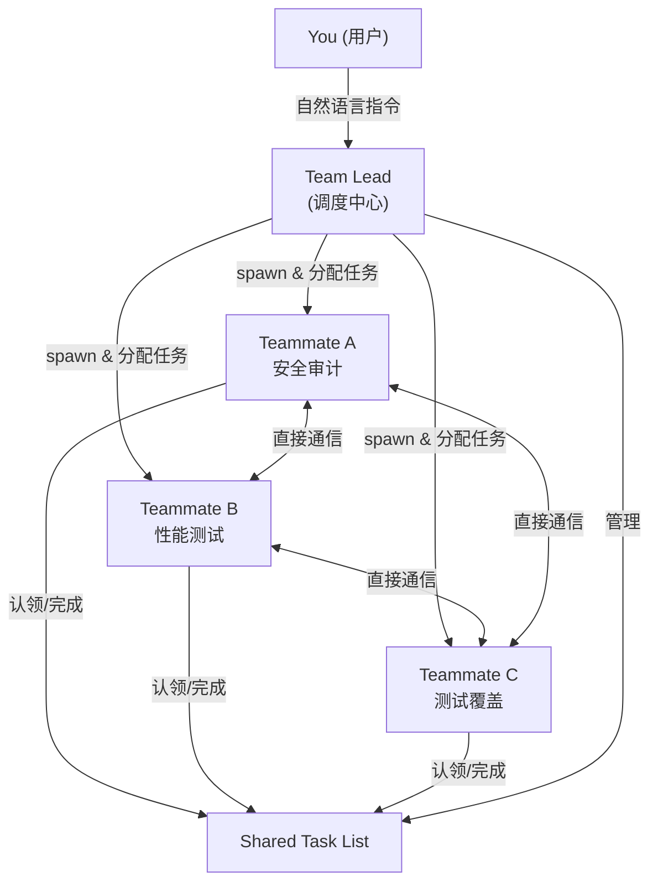
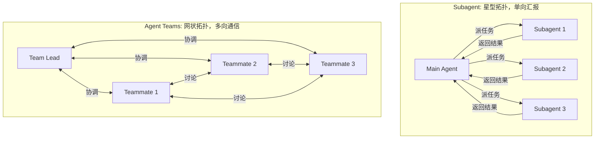
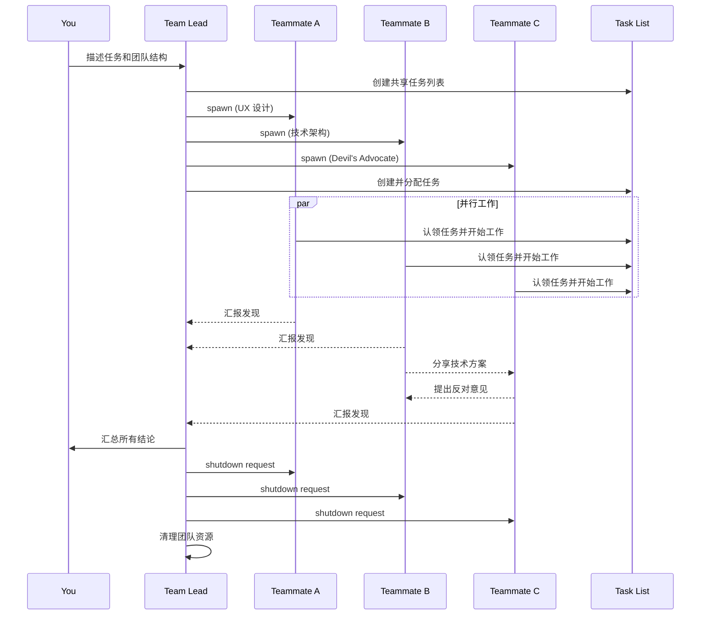
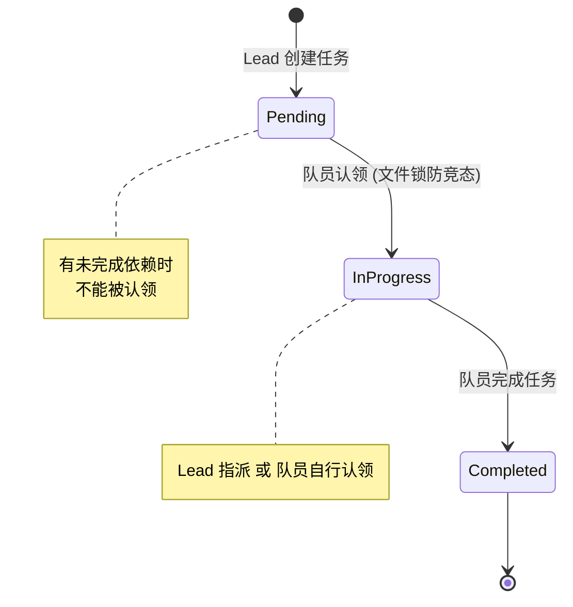
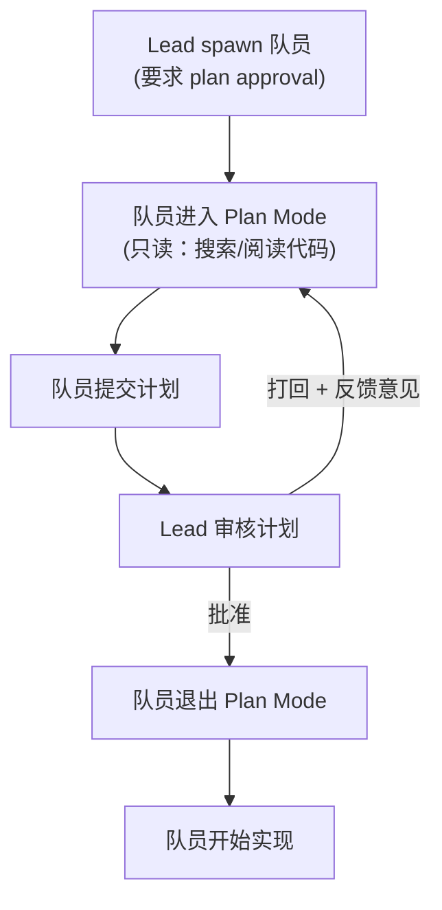
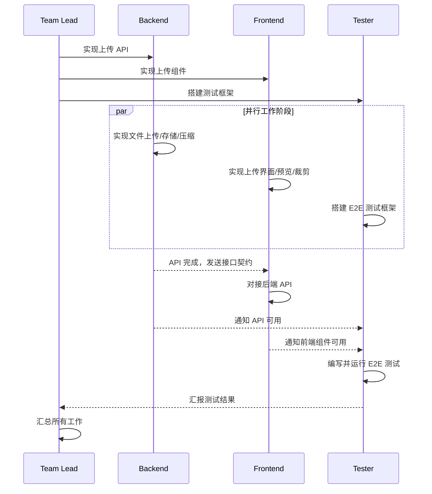

> 当一个 Agent 不够用的时候，就上一个团队

## 从单兵作战到团队协作

用过 Claude Code 的应该都有体会，它虽然已经很强了，但本质上还是"单兵作战"——一个 Agent 实例从头干到尾，遇到复杂任务就只能串行处理。

Claude Code 其实一直有 subagent（子代理）的能力，主 Agent 可以派生出一些小弟去跑腿——搜索文件、读代码、跑命令——然后把结果汇报回来。但 subagent 有个限制：它只能跟主 Agent 单线汇报，subagent 之间互相不知道对方的存在，更不可能互相讨论。

但问题来了：现实中的大型任务往往涉及多个维度。比如你想重构一个认证模块，安全性要审、性能要测、测试用例要补，这些工作彼此独立，却不得不排着队一个一个来。又比如排查一个诡异的 bug，你可能有三四个不同的假设，但只能一个一个试，试到第三个才发现第一个方向走偏了。

Anthropic 显然也意识到了这个瓶颈。Claude Code 最近推出了一个实验性功能——**Agent Teams**。说白了，就是让你像带团队一样指挥多个 Claude Code 实例并行干活，一个当"领导"负责调度，其他的当"队员"各自领任务，队员之间还能互相交流。

## Agent Teams 的核心架构

先从整体架构说起。一个 Agent Team 由四个核心组件构成：

| 组件 | 职责 |
|------|------|
| **Team Lead** | 主 Claude Code session，创建团队、拆分任务、分配工作、汇总结果 |
| **Teammates** | 独立的 Claude Code 实例，各自有自己的上下文窗口，独立执行任务 |
| **Task List** | 共享的任务列表，所有队员都能看到，可以认领和完成任务 |
| **Mailbox** | 消息系统，Agent 之间的通信通道 |

用一张图表示它们的关系：



和 subagent 最本质的区别是：**teammate 之间可以直接通信**。subagent 只能把结果报告给主 Agent，是单向的上报关系；而 Agent Teams 里的队员可以互相发消息、互相质疑对方的结论，更像真实的团队协作。

团队和任务的数据都存储在本地文件系统：

```
~/.claude/teams/{team-name}/config.json    # 团队配置（成员列表、ID、类型）
~/.claude/tasks/{team-name}/               # 共享任务列表
```

团队配置文件里有一个 `members` 数组，记录了每个队员的 `name`、`agentId` 和 `agentType`，队员可以读这个文件来发现团队里的其他成员。

### 团队是怎么启动的

Agent Teams 的启动有两种方式：

1. **你主动要求**：明确告诉 Claude 要创建一个团队，它按你的描述来组建
2. **Claude 自己建议**：如果 Claude 判断你的任务适合并行处理，它会主动提议创建团队，但你确认之后它才会执行

不管哪种方式，创建团队这件事始终需要你的确认，Claude 不会自作主张。

### 上下文和通信机制

每个 teammate 拥有自己独立的上下文窗口。被 spawn 出来的时候，teammate 会自动加载和普通 session 一样的项目上下文：`CLAUDE.md`、MCP servers、skills。它还会收到 team lead 给的 spawn prompt（创建时的指令）。但有一点要注意——**lead 的对话历史不会传递给 teammate**。所以在 spawn prompt 里要把任务相关的信息说清楚。

这里有个实用的细节：**teammates 会正常读取工作目录下的 `CLAUDE.md` 文件**。如果你的项目有 `CLAUDE.md`，所有队员都会自动加载，不需要额外配置。可以利用这一点给所有队员提供统一的项目级指引。

队员之间的通信有几种方式：

- **message（私信）**：发给某个特定的队员，用队员的 name 来指定接收人
- **broadcast（广播）**：发给所有队员。但这个操作的成本和队员数量成正比（N 个队员 = N 条消息），所以要慎用，只在真正需要全员通知的时候才发
- **自动消息投递**：队员发出的消息会自动送达接收方，lead 不需要手动轮询
- **空闲通知**：队员完成当前任务后会自动通知 lead

Task List 也是一种隐性的"通信"——所有人都能看到任务的状态变化，任务之间还支持依赖关系，当一个阻塞任务完成后，被阻塞的任务会自动解锁。

### 权限模型

队员在 spawn 的时候会继承 lead 的权限设置。如果 lead 开了 `--dangerously-skip-permissions`，所有队员也会跳过权限检查。spawn 之后可以单独修改某个队员的权限模式，但创建时没法按人指定。

这意味着如果你想对不同队员设置不同的权限级别，得在它们创建之后逐个调整。

## 什么场景适合用 Agent Teams

不是所有任务都需要组个团队来干。Agent Teams 的协调本身有开销，token 消耗也会随队员数量线性增长。那什么时候该用呢？

**适合的场景：**

- **研究和 Review**：多个队员同时调查问题的不同方面，然后互相交叉验证、互相 challenge
- **新模块/新功能开发**：前端、后端、测试各自一个队员，每人负责一块，互不踩脚
- **竞争假设调试**：一个 bug 搞不清原因？让几个队员分别验证不同假说，互相尝试推翻对方的理论
- **跨层级变更**：前端改组件、后端改接口、测试补用例，每个队员负责一层

**不适合的场景：**

串行依赖强的任务、需要反复修改同一个文件的工作、简单到一个 Agent 就能搞定的事情——这些场景用 Agent Teams 反而会增加不必要的复杂度。一个 session 或者 subagent 更合适。

### 和 Subagent 怎么选

那 Subagent 和 Agent Teams 到底怎么选？用图来对比一下两者的通信拓扑，差异一目了然：



|  | Subagent | Agent Teams |
|--|---------|-------------|
| 上下文 | 独立窗口，结果返回给调用者 | 独立窗口，完全自治 |
| 通信方式 | 只能向主 Agent 汇报结果 | 队员之间可以直接对话 |
| 协调方式 | 主 Agent 统一管理 | 共享任务列表，可自行协调 |
| 适合场景 | 聚焦型任务，只需要结果 | 需要讨论和协作的复杂任务 |
| Token 成本 | 较低（结果摘要回传） | 较高（每个队员是独立实例） |

简单来说：需要"跑腿"拿结果的用 subagent，需要"开会讨论"的用 Agent Teams。

## 上手教程

### 开启功能

Agent Teams 目前还是实验性功能，默认关闭。需要手动开启，有两种方式：

在 `settings.json` 里添加环境变量：

```json
{
  "env": {
    "CLAUDE_CODE_EXPERIMENTAL_AGENT_TEAMS": "1"
  }
}
```

或者直接设置 shell 环境变量：

```bash
export CLAUDE_CODE_EXPERIMENTAL_AGENT_TEAMS=1
```

### 创建团队

开启后，用自然语言告诉 Claude 你想要什么样的团队就行了。比如：

```
我在设计一个 CLI 工具来追踪代码库中的 TODO 注释。
创建一个 Agent Team 从不同角度来探索这个需求：
一个队员负责 UX 设计，一个负责技术架构，一个扮演 Devil's Advocate 提反对意见。
```

这个例子之所以效果好，是因为三个角色完全独立，不需要互相等待就能开始工作。

Claude 收到指令后的完整流程：



你也可以精确控制队员数量和使用的模型：

```
创建一个 4 人团队来并行重构这些模块，每个队员使用 Sonnet。
```

### 显示模式

Agent Teams 支持两种显示模式，这个选择挺影响使用体验的：

**In-process（进程内模式）**

所有队员在你的主终端内运行。用 `Shift+Up/Down` 可以切换选中不同的队员，选中后直接打字就能给它发消息。按 `Enter` 可以查看某个队员的完整 session，按 `Escape` 可以打断它当前的操作。按 `Ctrl+T` 可以切换任务列表的显示。

这个模式的好处是**任何终端都支持**，不需要额外安装东西。

**Split panes（分屏模式）**

每个队员占一个独立的终端面板，你可以同时看到所有人的输出，点击某个面板就能直接和那个队员交互。

分屏模式需要 tmux 或者 iTerm2。安装方式：

- **tmux**：用系统包管理器安装，macOS 上 `brew install tmux` 就行
- **iTerm2**：需要安装 [it2 CLI](https://github.com/mkusaka/it2)，然后在 iTerm2 的设置里启用 Python API（iTerm2 → Settings → General → Magic → Enable Python API）

默认是 `auto` 模式——如果你已经在 tmux session 里了，就自动用分屏；否则用进程内模式。`tmux` 设置会启用分屏模式，并自动检测你用的是 tmux 还是 iTerm2。也可以在 settings 里强制指定：

```json
{
  "teammateMode": "in-process"
}
```

或者启动时传参覆盖：

```bash
claude --teammate-mode in-process
```

需要注意的是，分屏模式在 VS Code 的集成终端、Windows Terminal 和 Ghostty 中不支持。如果你用这些终端，老老实实用 in-process 模式就好。官方文档也建议在 iTerm2 里用 `tmux -CC` 作为进入 tmux 的方式，兼容性最好。

### 和队员直接对话

你可以直接跟任何一个队员对话，不用通过 team lead 转达。每个 teammate 都是一个完整的、独立的 Claude Code session。

- In-process 模式下：`Shift+Up/Down` 选队员，直接打字发消息
- Split panes 模式下：点击对应的面板

这意味着你可以随时给某个队员补充指令、问后续问题、或者让它换个方向。

### 任务分配和认领

共享任务列表是整个团队协作的核心。任务有三种状态：**pending（待处理）**、**in progress（进行中）**、**completed（已完成）**。任务之间还支持依赖关系——一个 pending 的任务如果有未完成的依赖项，就不能被认领，依赖项完成后会自动解锁。

任务的状态流转：



任务分配有两种方式：

- **Lead 指派**：你告诉 lead 把哪个任务分给哪个队员
- **队员自行认领**：队员完成当前任务后，会自动去任务列表里找下一个未分配、未阻塞的任务来认领

任务认领用了**文件锁**来防止竞态——多个队员同时抢一个任务时，只有一个能拿到。

### 要求队员先做计划

对于复杂或者高风险的任务，可以要求队员在动手之前先提交计划，等 team lead 审批通过了再开始实现：

```
创建一个架构师队员来重构认证模块，要求在修改代码之前先提交计划审批。
```

队员会在只读的 plan mode 下工作，只能搜索和阅读代码，不能修改任何东西。计划写好后提交给 lead 审核。整个流程是这样的：



lead 对计划的审批是自主决策的。如果你想影响它的判断标准，可以在 prompt 里说清楚，比如"只批准包含测试覆盖方案的计划"或者"拒绝涉及数据库 schema 修改的计划"。

### Delegate 模式

有时候 team lead 会忍不住自己动手干活，而不是等队员完成。这其实挺常见的——你让它当调度员，它看到活儿就手痒想自己写代码。

如果你希望 lead 专注于调度——只管拆任务、分活、汇总结果——可以按 `Shift+Tab` 切换到 delegate 模式。这个模式下 lead 的工具被限制为只有协调类的：spawn 队员、发消息、关闭队员、管理任务。它碰不到代码。

在团队规模比较大、任务比较多的时候，delegate 模式很有用。让 lead 专心当"项目经理"，把所有实现工作都交给队员。

### 关闭队员和清理团队

当某个队员的工作完成了，让 lead 给它发关闭请求：

```
让研究员队员关闭
```

lead 会发一个 shutdown request，队员可以批准（优雅退出）或拒绝（继续工作并说明原因）。队员需要等当前正在执行的工具调用完成后才能关闭，所以可能不会立即退出。

所有队员都关闭后，让 lead 清理团队资源：

```
清理团队
```

这会删除共享的团队和任务目录。注意两个要点：

1. **必须通过 lead 来清理**。队员不应该执行清理操作，因为它们的团队上下文可能解析不正确，会导致资源残留
2. **清理前必须先关闭所有队员**。如果还有活跃的队员，清理操作会失败

## 实战案例

### 案例一：并行 Code Review

一个人 review 代码的时候，注意力往往集中在某一类问题上——你盯着安全漏洞看的时候，就容易忽略性能问题。Agent Teams 可以把不同的关注维度分给不同的队员：

```
创建一个 Agent Team 来 review PR #142，生成三个 reviewer：
- 一个专注安全隐患
- 一个检查性能影响
- 一个验证测试覆盖率
让他们各自 review 后汇报发现。
```

每个 reviewer 从同一个 PR 出发，但戴着不同的"眼镜"看代码。lead 最后把三份报告合并，安全、性能、测试三个维度都得到了充分关注。

### 案例二：竞争假设调试

这是我觉得最有意思的用法。当你遇到一个搞不清楚根因的 bug 时：

```
用户反馈 App 在发送一条消息后就断开连接了，没有保持长连接。
生成 5 个 Agent 队员调查不同的假说。
让他们互相对话，像科学辩论一样尝试推翻对方的理论。
把达成共识的结论写入分析文档。
```

这个思路很巧妙。单个 Agent 调查 bug 容易陷入**锚定效应**——找到一个说得通的解释就不再深入了。你有没有这种经历？看日志看到一个可疑的地方，就一头扎进去调了半天，最后发现根因完全在别处。

而多个 Agent 各自独立调查、互相质疑，辩论机制本身就在对抗锚定效应。最后存活下来的假说大概率更接近真相。这其实和科学界的"强推理法"（strong inference）是一个道理——同时提出多个假说，设计实验来排除错误的那些，而不是只验证你最喜欢的那一个。

### 案例三：跨层级功能开发

如果你要开发一个涉及前端、后端和测试的完整功能：

```
创建一个团队来实现用户头像上传功能：
- 一个队员负责后端 API（文件上传、存储、压缩）
- 一个队员负责前端组件（上传界面、预览、裁剪）
- 一个队员负责写端到端测试
后端队员完成 API 后通知前端队员接口契约。
```

这三个队员可以同时开工，后端和前端可以先约定好接口格式再各自实现，测试队员可以根据需求文档先搭好测试框架。实际的协作过程大致是这样：



当后端完成后，通过消息系统把实际的 API 契约发给前端，前端再对接。任务依赖系统会自动处理阻塞和解锁。

## 真实案例：16 个 Claude 并行写了一个 C 编译器

上面的案例都是设想的场景，那实际的大规模并行 Agent 协作效果怎么样？

2026 年 2 月 5 日，Anthropic 的安全研究员 Nicholas Carlini 发了一篇文章：[Building a C compiler with a team of parallel Claudes](https://www.anthropic.com/engineering/building-c-compiler)。他让 **16 个 Claude Opus 4.6 实例**同时工作在一个共享代码库上，从零开始写了一个 C 编译器。

先说结果：

- 近 **2000 个 session**，花了大约 **$20,000**
- 产出 **10 万行 Rust 代码**
- 编译器能编译 **Linux 6.9 内核**，支持 x86、ARM、RISC-V 三种架构
- 能编译 QEMU、FFmpeg、SQLite、PostgreSQL、Redis
- 通过了 **99% 的 GCC torture tests**
- ~~还能跑 Doom~~

### 怎么做到的

Carlini 的做法和 Agent Teams 的理念一脉相承：每个 Agent 独立工作，通过文件系统协调。

任务同步机制是这样的：每个 Agent 通过往 `current_tasks/` 目录写入锁文件来认领任务，用 Git 做同步防止重复分配。Agent 先 pull 最新代码，解决冲突，提交自己的改动，然后释放锁。完成一个任务后，会自动 spawn 新的工作循环。

多个 Agent 按角色分工：有的负责核心编译功能，有的负责代码质量和去重，有的做性能优化，有的维护文档。

### 几个关键教训

这个项目暴露出的问题对所有想用 Agent Teams 的人都有参考价值：

**测试质量决定一切**。Carlini 发现 Claude 会"自主地去解决你给它的任何问题"，这听起来不错，但如果测试用例本身不准确，Agent 就会"正确地"解决一个错误的问题。高质量的测试套件是整个系统的锚点。

**要为 LLM 的局限性做设计**。上下文污染是个大问题，需要限制输出中的噪声信息。另外 Claude 没有时间概念，跑完整测试套件可能要几个小时，Agent 就傻等着。Carlini 加了一个 `--fast` 选项只跑 1-10% 的测试，让 Agent 能持续推进而不是干等。

**单体任务是并行的天敌**。编译 Linux 内核是一个不可拆分的大任务，所有 Agent 遇到同样的编译错误都会卡住。解决办法是把 GCC 当作"参考答案"——大部分文件用 GCC 编译，只在特定子集上测试 Claude 生成的编译器，逐步推进。

**Agent 要有角色分工**。给不同的 Agent 分配不同的职责（优化、代码整洁、文档）比让所有人做一样的事情效率高得多。

### 局限性也很明显

这个编译器还不是 GCC 的替代品：不支持 16 位 x86 代码生成（这部分委托给了 GCC）、没有集成的汇编器和链接器、生成代码的效率不如关闭优化的 GCC、Rust 代码质量低于专家水平。

Carlini 自己也说了一个很清醒的判断：没有人类验证的情况下，"测试通过"和"生产可用"之间的距离是危险的模糊。自主开发极大地扩展了可完成的范围，但也引入了部署风险。

这个案例的价值在于它验证了多 Agent 并行协作在大型项目上的可行性，同时也揭示了边界在哪里。

## 最佳实践

### 给队员足够的上下文

队员会自动加载项目的 `CLAUDE.md`、MCP servers 和 skills，但它们**不会继承 lead 的对话历史**。所以 spawn 的时候一定要在 prompt 里把任务相关的信息说清楚：

```
创建一个安全审计队员，prompt 是："审查 src/auth/ 目录下的认证模块，
重点关注 token 处理、session 管理和输入校验。
应用使用 JWT token 存储在 httpOnly cookie 中。
按严重程度对发现的问题分级。"
```

别假设队员能从上下文推断出你之前讨论过的东西——它看不到。

### 合理拆分任务粒度

任务拆得太细，协调开销就会超过收益；任务拆得太粗，队员长时间闷头干活没有 check-in，万一方向跑偏了浪费就大了。

比较好的粒度是：**每个任务有明确的、自包含的交付物**——一个函数、一个测试文件、一份 review 报告。官方建议每个队员分配 5-6 个任务比较合适，这样既能保持生产力，lead 也有机会在队员卡住的时候重新分配工作。

### 避免文件冲突

两个队员同时编辑同一个文件会导致互相覆盖。这可能是用 Agent Teams 最容易踩的坑。拆任务的时候一定要让每个队员负责不同的文件集合。

### 盯着点，别放羊

虽然 Agent Teams 的目标是自主协作，但完全放手不管风险还是挺大的。定期检查队员的进展，发现方向不对的及时纠正，发现成果的及时汇总。长时间不管容易出现无效劳动。

### 新手建议先从研究类任务开始

如果你是第一次用 Agent Teams，建议从那些有明确边界、不需要写代码的任务开始——review 一个 PR、调研一个库、排查一个 bug。这些任务能让你感受到并行探索的价值，同时避开并行实现带来的协调难题。

### 处理 Lead 自己动手的问题

有时候 lead 会等不及队员完成，自己开始干活。如果你发现了这个情况，直接告诉它：

```
等你的队员完成任务后再继续
```

或者直接切到 delegate 模式来避免这个问题。

## Token 消耗

必须坦诚说一下成本问题：Agent Teams 的 token 消耗是实打实地线性增长的。每个队员都是一个独立的 Claude 实例，都有自己的上下文窗口。3 个队员就是大约 3 倍的 token 用量。

对于研究、review、新功能开发这些场景，额外的 token 通常是值得的——并行探索带来的效率提升远超成本增加。但如果只是日常的小修小补，老老实实用单个 session 就好。这里没什么花哨的技巧，就是一个性价比的判断。

## 已知限制

Agent Teams 还处于实验阶段，列一下当前的已知限制，省得踩了坑再回来查：

- **不支持 session 恢复**：`/resume` 和 `/rewind` 不会恢复 in-process 模式下的队员。恢复 session 后，lead 可能会尝试给已经不存在的队员发消息——这时候让它重新创建队员就行
- **任务状态可能滞后**：队员有时候干完了活但忘了把任务标为完成，导致后续有依赖的任务一直被阻塞。遇到这种情况手动更新一下状态，或者让 lead 去催一下
- **关闭比较慢**：队员需要等当前的工具调用执行完才能关闭，不能立即中断
- **一个 session 只能带一个团队**：想建新团队得先清理掉当前的
- **不支持嵌套**：队员不能再创建自己的子团队，只有 lead 能管理团队
- **Lead 不能换人**：创建团队的那个 session 就是 lead，不能把 lead 身份转给某个队员
- **权限继承**：队员继承 lead 的权限设置，spawn 之后可以单独改，但创建时没法按人指定
- **分屏模式的终端限制**：Split panes 只在 tmux 和 iTerm2 里可用，VS Code 集成终端、Windows Terminal、Ghostty 不支持

## 常见问题排查

用的过程中可能会遇到一些问题，这里列几个常见的：

**队员创建了但看不到**

在 in-process 模式下，队员可能已经在运行了但没有显示出来。按 `Shift+Down` 试试能不能切到它。如果确实没创建成功，检查一下你的任务描述是否够复杂——Claude 会根据任务复杂度判断要不要创建队员，太简单的任务它可能觉得不需要。如果用的分屏模式，确认 tmux 已安装并且在 PATH 里：

```bash
which tmux
```

iTerm2 用户则需要确认 `it2` CLI 已安装，并且在 iTerm2 偏好设置里启用了 Python API。

**权限确认弹窗太多**

队员的权限请求会冒泡到 lead，频繁弹窗会很烦。在创建团队之前，先在权限设置里预批准一些常见操作，能减少很多中断。

**队员遇到错误就停了**

队员碰到错误后可能会直接停下来而不是自己恢复。用 `Shift+Up/Down` 切到它，看看报了什么错，然后给它补充指令让它继续。或者直接 spawn 一个新队员接手它的工作。

**Lead 提前收工了**

有时候 lead 会在所有任务完成之前就判断"任务结束"，自己收工了。遇到这种情况直接告诉它继续。如果它总是这样，可以在一开始就说"等所有队员完成任务后再收尾"。

**残留的 tmux session**

如果团队结束后 tmux session 没被正确清理，可以手动处理：

```bash
tmux ls                          # 列出所有 session
tmux kill-session -t <session>   # 杀掉残留的
```

## 参考资料

- [Claude Code Agent Teams 官方文档](https://code.claude.com/docs/en/agent-teams)
- [Claude Code Sub-agents 文档](https://code.claude.com/docs/en/sub-agents)
- [Claude Code Features Overview](https://code.claude.com/docs/en/features-overview)
