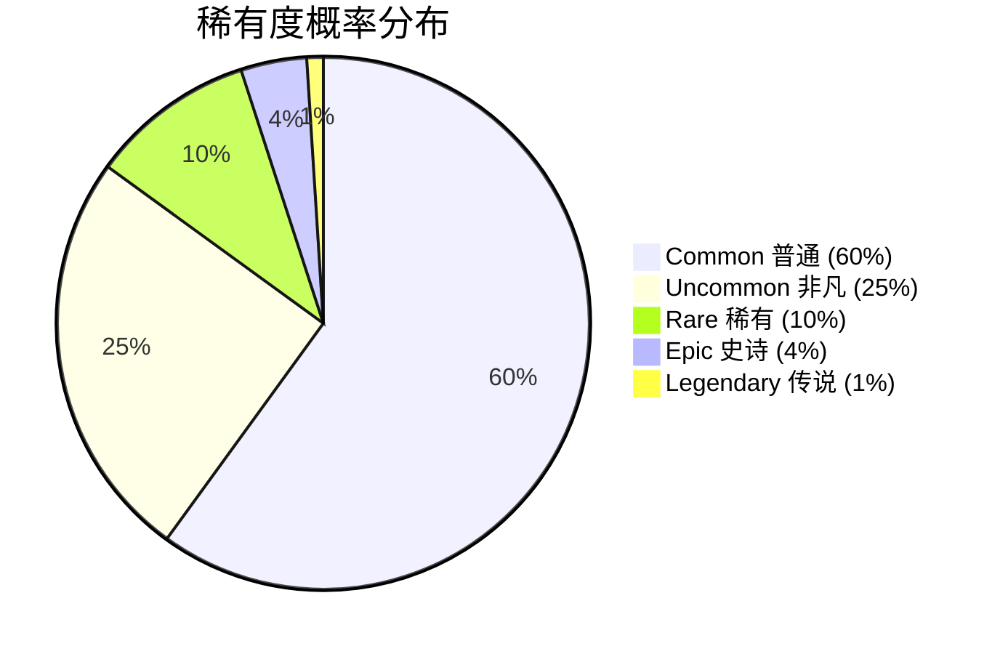
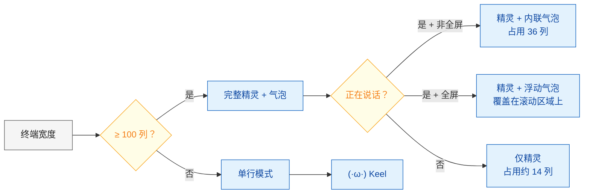
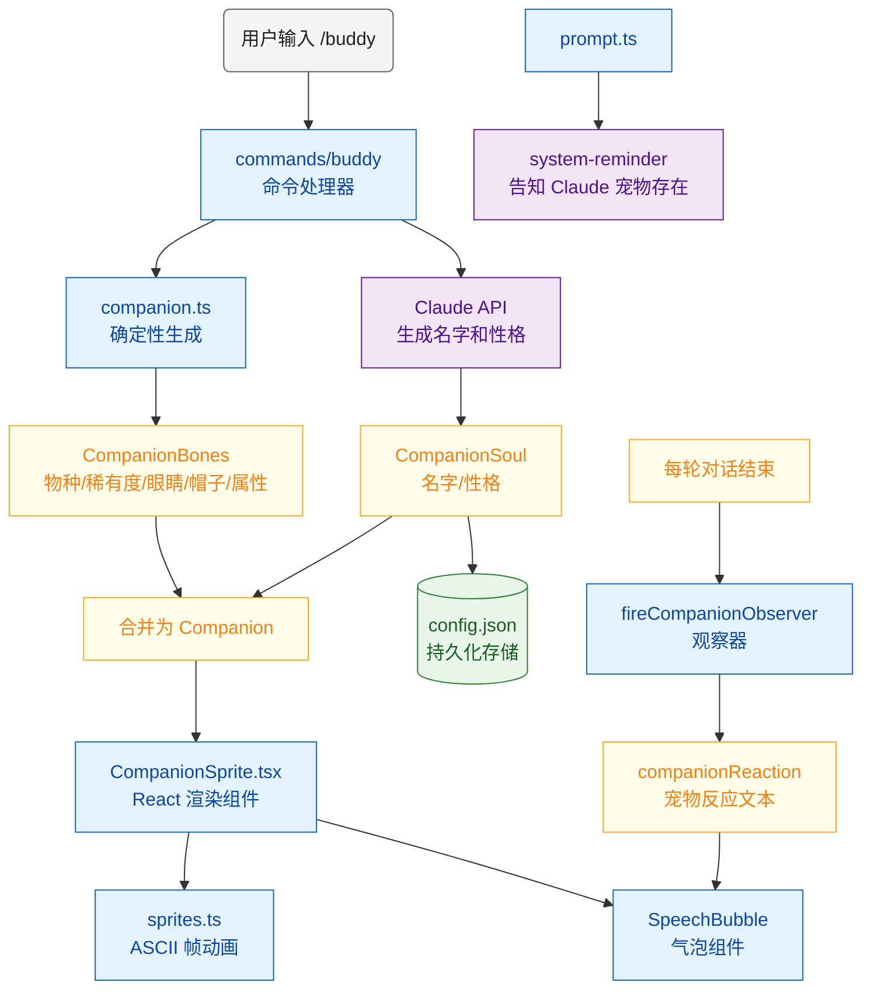
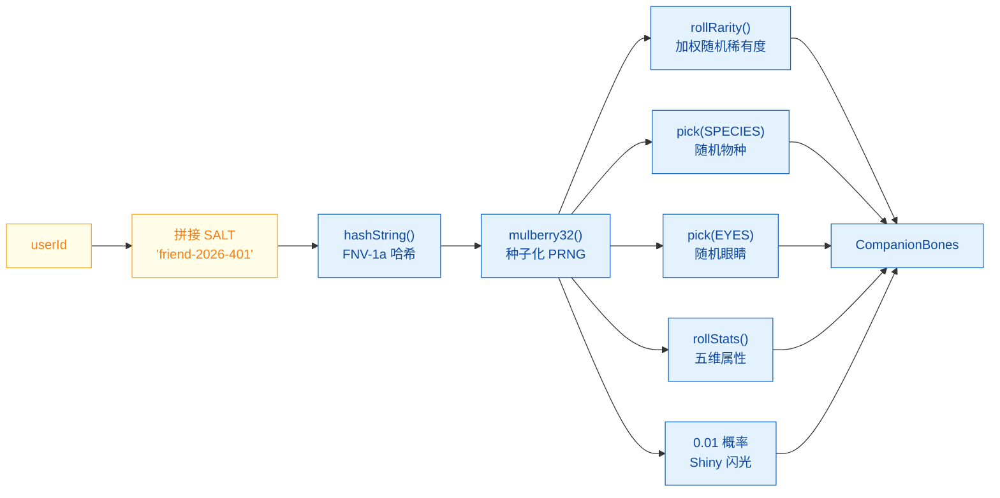
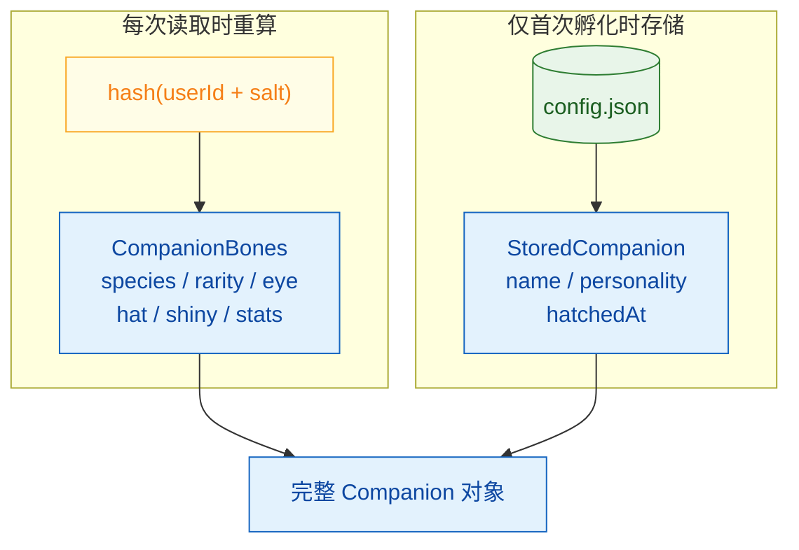
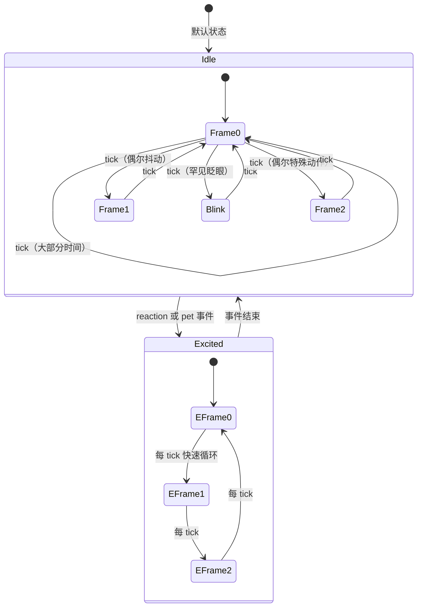
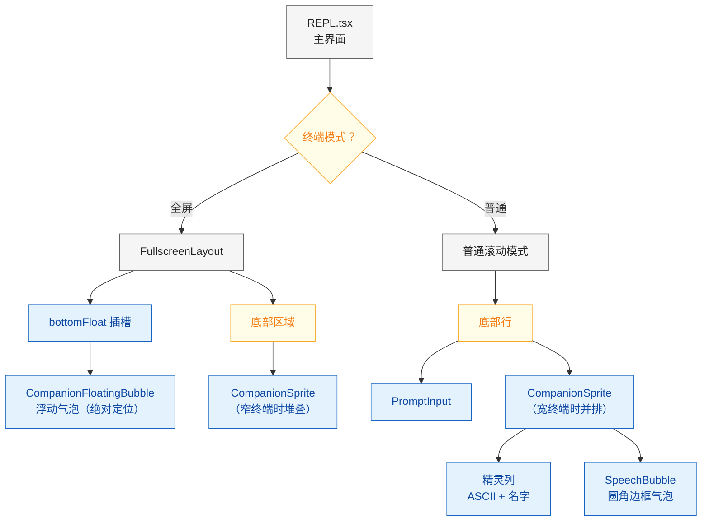
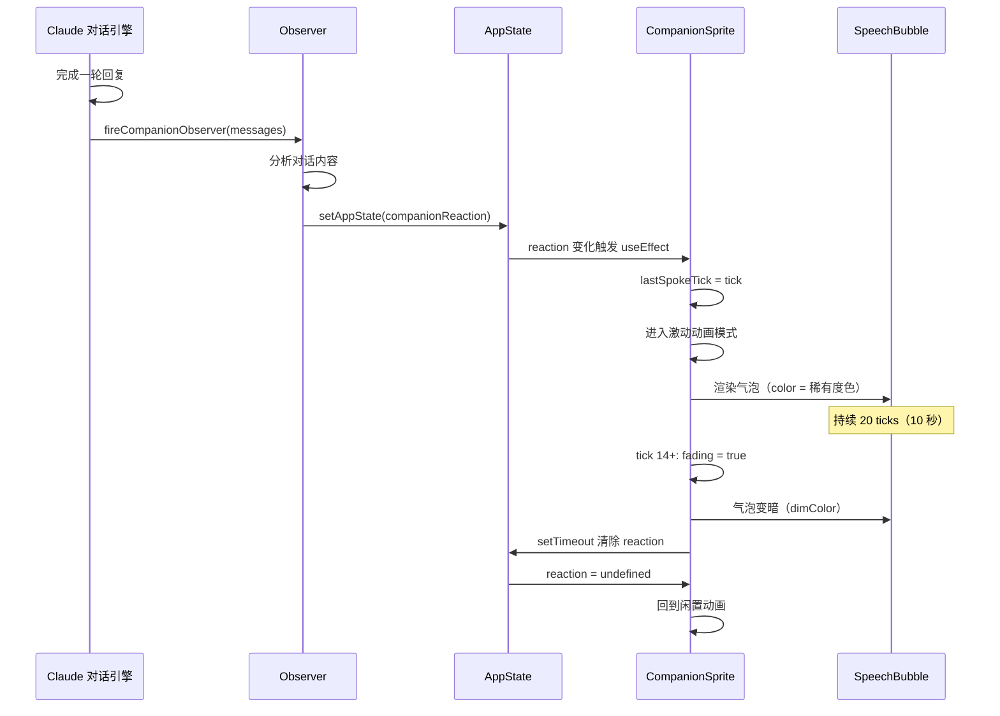
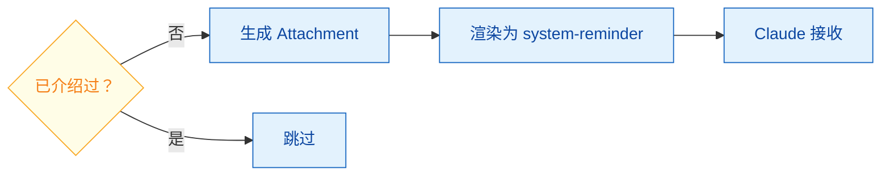
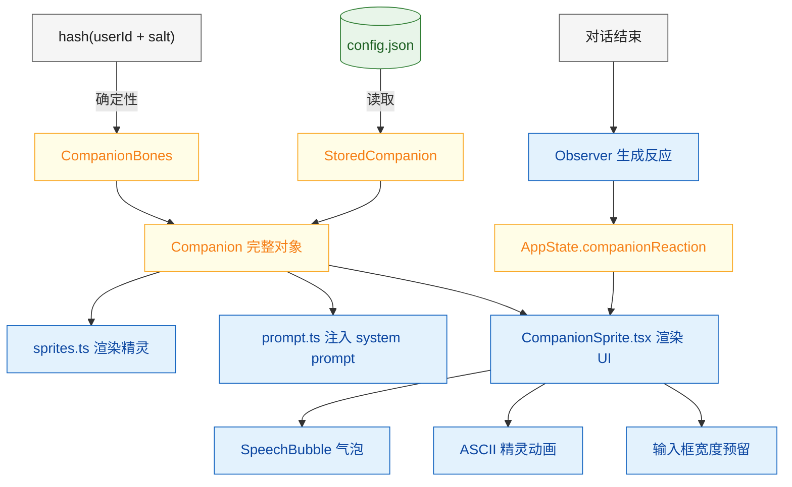

# Claude Code Buddy 电子宠物系统：完全解析

> 2026 年愚人节，Anthropic 在 Claude Code v2.1.88 中悄悄塞了一个彩蛋 —— 输入 `/buddy`，一只 ASCII 小生物就会从蛋壳里蹦出来，从此坐在你的终端旁边，看你写代码，偶尔吐槽两句。这篇文章从玩法到源码，完整拆解这个藏在命令行里的电子宠物。

---

## 一、玩法全指南

### 1.1 孵化你的宠物

在 Claude Code 终端中输入 `/buddy`，即可孵化专属于你的电子宠物。

> [!IMPORTANT]
> 宠物的物种、稀有度、眼睛、帽子等外观属性由你的 **用户 ID 哈希值**确定性生成，意味着同一个账号永远孵出同一只宠物，无法重新抽卡。

首次孵化时，Claude 会为你的宠物生成一个名字和性格描述（即"灵魂"），这是唯一由 AI 创造的部分。之后每次打开 Claude Code，它就会自动出现在输入框旁边。

**首次启动的发现流程：**

如果你还没孵化宠物，在 2026 年 4 月 1-7 日期间启动 Claude Code 时，底部会出现一行彩虹色的 `/buddy` 提示文字，持续 15 秒后消失。这是引导你发现这个隐藏功能的入口。

### 1.2 宠物物种图鉴

一共有 **18 种物种**，每种都有独特的 ASCII 造型：

| 物种 | 示意 | 特色 |
|------|------|------|
| Duck 鸭子 | `<(· )___` | 经典橡皮鸭，尾巴会摇 |
| Goose 鹅 | `(·>` | 伸脖子的鹅，脖子会左右晃 |
| Blob 果冻 | `(· ·)` | 会膨胀收缩的软体生物 |
| Cat 猫 | `(· ω ·)` | ω 嘴猫脸，尾巴会甩 |
| Dragon 龙 | `< · ~ · >` | 双角小龙，顶上有火焰 |
| Octopus 章鱼 | `(· ·) /\/\` | 触手交替摆动 |
| Owl 猫头鹰 | `((·)(·))` | 大眼睛会眨 |
| Penguin 企鹅 | `(·>·)` | 翅膀拍打，脚下有雪花 |
| Turtle 乌龟 | `(· ·) [____]` | 壳上花纹会变 |
| Snail 蜗牛 | `· .--.` | 触角伸缩，留下波浪痕迹 |
| Ghost 幽灵 | `/ · · \` | 下摆飘动 |
| Axolotl 六角恐龙 | `}~(· .. ·)~{` | 两侧腮须交替摇摆 |
| Capybara 水豚 | `(· oo ·)` | 呆萌大脸，耳朵会动 |
| Cactus 仙人掌 | `\| · · \|` | 手臂上下交替 |
| Robot 机器人 | `[ · · ]` | 天线闪烁，嘴部表情变化 |
| Rabbit 兔子 | `(· .. ·)` | 耳朵一只会耷拉 |
| Mushroom 蘑菇 | `.-o-OO-o-.` | 蘑菇帽上斑点交替 |
| Chonk 胖猫 | `(· . ·)` | 耳朵抖动，尾巴甩动 |

### 1.3 稀有度体系



不同稀有度的视觉差异：

| 稀有度 | 星级 | 主题色 | 帽子 | 属性下限 |
|--------|------|--------|------|---------|
| Common | ★ | 灰色 | 无 | 5 |
| Uncommon | ★★ | 绿色 | 随机 | 15 |
| Rare | ★★★ | 蓝色 | 随机 | 25 |
| Epic | ★★★★ | 黄绿色 | 随机 | 35 |
| Legendary | ★★★★★ | 金色 | 随机 | 50 |

**帽子种类**（Common 没有帽子，其余稀有度随机分配）：

| 帽子 | 造型 |
|------|------|
| Crown 皇冠 | `\^^^/` |
| Tophat 礼帽 | `[___]` |
| Propeller 螺旋桨帽 | `-+-` |
| Halo 光环 | `(   )` |
| Wizard 巫师帽 | `/^\` |
| Beanie 毛线帽 | `(___)` |
| Tinyduck 小鸭子 | `,>` |

此外还有 **1% 概率**出现 **Shiny（闪光版）**，属于隐藏收集要素。

### 1.4 五维属性系统

每只宠物拥有 5 项 RPG 风格的属性值：

| 属性 | 含义 | 特点 |
|------|------|------|
| DEBUGGING | 调试能力 | 找 bug 的直觉 |
| PATIENCE | 耐心 | 面对长编译的定力 |
| CHAOS | 混沌值 | 制造意外的倾向 |
| WISDOM | 智慧 | 理解代码的深度 |
| SNARK | 毒舌值 | 吐槽的犀利程度 |

属性生成规则：
- 每只宠物有一项 **峰值属性**（下限 + 50 + 随机 0~30）
- 一项 **低谷属性**（下限 - 10 + 随机 0~15）
- 其余属性散布在下限 + 随机 0~40 范围

这意味着每只宠物都有鲜明的"性格长板"和"性格短板"。

### 1.5 交互命令

| 命令 | 功能 | 效果 |
|------|------|------|
| `/buddy` | 孵化/查看宠物 | 首次孵化，之后显示宠物卡片 |
| `/buddy pet` | 抚摸宠物 | 触发爱心粒子特效，持续 2.5 秒 |
| `/buddy mute` | 静音宠物 | 隐藏精灵和气泡，不占输入框宽度 |
| `/buddy rename` | 重命名 | 修改宠物名字 |
| `/buddy card` | 查看属性卡 | 展示完整属性面板 |

**抚摸特效动画帧：**

```
   ♥    ♥      ← 第 1 帧
  ♥  ♥   ♥     ← 第 2 帧
 ♥   ♥  ♥      ← 第 3 帧
♥  ♥      ♥    ← 第 4 帧
·    ·   ·     ← 第 5 帧（消散）
```

### 1.6 宠物反应系统

每次 Claude 完成一轮回复后，宠物会"观察"整段对话，然后在气泡框里给出一句话反应。

**气泡生命周期：**
- 出现后持续 **约 10 秒**（20 个 500ms tick）
- 最后 **约 3 秒**开始淡出（文字变暗）
- 用户滚动屏幕时**立即消失**（避免遮挡内容）
- 宠物说话时精灵进入**激动模式**（快速切换帧）

### 1.7 与 Claude 的互动

宠物的存在会被注入到 Claude 的 system prompt 中，Claude 知道用户旁边坐着一只小动物。

- 用户直接 **叫宠物的名字** 时，气泡会自己回应
- 此时 Claude 会**主动退让**，只用一行或更少的文字回应
- Claude 不会假装自己是宠物，也不会代替宠物说话

### 1.8 终端适配



---

## 二、技术架构

### 2.1 系统总览



### 2.2 源码文件清单

| 文件 | 行数 | 职责 |
|------|------|------|
| `buddy/types.ts` | 149 | 类型定义：物种、稀有度、属性、数据结构 |
| `buddy/companion.ts` | 134 | 核心：哈希生成、PRNG 抽卡、缓存、读取 |
| `buddy/sprites.ts` | 514 | 18 种物种的 ASCII 精灵帧 + 帽子渲染 |
| `buddy/prompt.ts` | 37 | 生成 system prompt 附件 |
| `buddy/useBuddyNotification.tsx` | 98 | 启动提示、/buddy 触发检测 |
| `buddy/CompanionSprite.tsx` | 350+ | React 组件：精灵、气泡、布局、动画 |
| `commands/buddy/index.js` | - | 命令处理器（feature-gated） |

### 2.3 确定性角色生成

这是整个系统最精妙的部分——**同一个用户永远得到同一只宠物**，不依赖随机数，不需要服务端存储。



**关键算法：**

**1) FNV-1a 哈希**（将字符串转为 32 位整数种子）：

```typescript
function hashString(s: string): number {
  // Bun 环境用原生 Bun.hash
  if (typeof Bun !== 'undefined') {
    return Number(BigInt(Bun.hash(s)) & 0xffffffffn)
  }
  // 回退到手写 FNV-1a
  let h = 2166136261  // FNV offset basis
  for (let i = 0; i < s.length; i++) {
    h ^= s.charCodeAt(i)
    h = Math.imul(h, 16777619)  // FNV prime
  }
  return h >>> 0
}
```

**2) Mulberry32 PRNG**（从种子生成伪随机序列）：

```typescript
function mulberry32(seed: number): () => number {
  let a = seed >>> 0
  return function () {
    a |= 0
    a = (a + 0x6d2b79f5) | 0
    let t = Math.imul(a ^ (a >>> 15), 1 | a)
    t = (t + Math.imul(t ^ (t >>> 7), 61 | t)) ^ t
    return ((t ^ (t >>> 14)) >>> 0) / 4294967296
  }
}
```

**3) 加权稀有度 Roll**：

```typescript
// RARITY_WEIGHTS: common=60, uncommon=25, rare=10, epic=4, legendary=1
function rollRarity(rng: () => number): Rarity {
  const total = 100  // 60+25+10+4+1
  let roll = rng() * total
  for (const rarity of RARITIES) {
    roll -= RARITY_WEIGHTS[rarity]
    if (roll < 0) return rarity
  }
  return 'common'
}
```

### 2.4 持久化策略



> [!TIP]
> **防作弊设计**：Bones（物种、稀有度等）永远不写入配置文件，每次从 userId 重算。用户即使手动编辑 config.json，也无法伪造一只 Legendary 宠物。存储的只有 AI 生成的名字和性格。

```typescript
// 读取时：骨骼重算 + 灵魂从存储加载
export function getCompanion(): Companion | undefined {
  const stored = getGlobalConfig().companion
  if (!stored) return undefined
  const { bones } = roll(companionUserId())
  return { ...stored, ...bones }  // bones 覆盖 stored 中的旧字段
}
```

**热路径缓存**：`roll()` 结果缓存在内存中，因为它会在三个高频路径被调用：

| 调用路径 | 频率 |
|---------|------|
| 精灵动画 tick | 每 500ms |
| PromptInput 按键 | 每次按键 |
| Observer 触发 | 每轮对话 |

### 2.5 ASCII 精灵动画系统

每个物种有 **3 帧** ASCII 动画，每帧 **5 行 × 12 列**：

```
帧 0（静止）      帧 1（微动）      帧 2（特殊）
   /\_/\            /\_/\            /\-/\
  ( ·   ·)         ( ·   ·)         ( ·   ·)
  (  ω  )          (  ω  )          (  ω  )
  (")_(")          (")_(")~         (")_(")
                   ^尾巴甩           ^耳朵抖
```

**动画状态机：**



**闲置序列精确定义：**

```typescript
const IDLE_SEQUENCE = [0, 0, 0, 0, 1, 0, 0, 0, -1, 0, 0, 2, 0, 0, 0]
// 索引:              0  1  2  3  4  5  6  7   8  9 10 11 12 13 14
// 含义: 静 静 静 静 抖 静 静 静 眨眼 静 静 特殊 静 静 静
```

- `0` = 静止帧
- `1` / `2` = 对应的动画帧
- `-1` = 眨眼（在帧 0 基础上把眼睛字符替换为 `-`）

15 帧一个循环，500ms 一跳，完整周期 **7.5 秒**。

**帽子渲染规则：**

```typescript
// 帽子渲染在精灵第 0 行（仅当该行为空时）
if (bones.hat !== 'none' && !lines[0]!.trim()) {
  lines[0] = HAT_LINES[bones.hat]
}
// 如果所有帧的第 0 行都为空且无帽子，则移除该行（节省垂直空间）
if (!lines[0]!.trim() && frames.every(f => !f[0]!.trim())) 
  lines.shift()
```

### 2.6 React 组件层次



### 2.7 输入框宽度预留

宠物精灵和气泡需要在输入框旁边占据空间，PromptInput 通过 `companionReservedColumns()` 动态计算预留宽度：

```typescript
// PromptInput.tsx
const companionSpeaking = useAppState(s => s.companionReaction !== undefined)
const textInputColumns = columns - 3 
  - companionReservedColumns(columns, companionSpeaking)
```

**宽度预留公式：**

| 条件 | 预留宽度 |
|------|---------|
| 功能禁用 / 宠物未孵化 / 已静音 | 0 |
| 终端 < 100 列（窄模式） | 0（宠物在输入框上方或下方） |
| 宽模式 + 未说话 | `max(12, nameWidth+2) + 2` |
| 宽模式 + 说话中 + 非全屏 | `max(12, nameWidth+2) + 2 + 36` |
| 宽模式 + 说话中 + 全屏 | `max(12, nameWidth+2) + 2`（气泡浮动，不占宽度） |

### 2.8 气泡组件生命周期



**滚动时的气泡处理：**

```typescript
// REPL.tsx — 用户滚动时立即清除气泡
if (feature('BUDDY')) {
  setAppState(prev => prev.companionReaction === undefined 
    ? prev 
    : { ...prev, companionReaction: undefined })
}
```

### 2.9 Prompt 注入机制

宠物通过 `companion_intro` 附件类型注入 system prompt：



注入的文本模板：

```
A small {species} named {name} sits beside the user's 
input box and occasionally comments in a speech bubble. 
You're not {name} — it's a separate watcher.

When the user addresses {name} directly (by name), its 
bubble will answer. Your job in that moment is to stay 
out of the way: respond in ONE line or less.
```

**去重逻辑**：遍历消息历史，如果已有同名 `companion_intro` 附件就跳过，避免每轮重复注入。

### 2.10 Feature Gate 与编译时剥离

整个 Buddy 系统被 `feature('BUDDY')` 包裹，这是 Bun 打包器的**编译时常量**：

```typescript
// 编译时求值，未启用时整个代码块被 tree-shaking 移除
if (feature('BUDDY')) {
  // ... 所有 buddy 相关代码
}
```

**上线时间控制：**

| 环境 | Teaser 窗口 | 正式可用 |
|------|------------|---------|
| 内部构建 | 始终显示 | 始终可用 |
| 外部构建 | 2026.4.1 ~ 4.7 | 2026.4 之后永久 |

> [!TIP]
> 使用**本地时间**而非 UTC，这样全球用户的 "发现时刻" 分布在 24 小时内，Twitter 话题热度更持久，服务端 soul 生成的负载也更平滑。

### 2.11 物种名编码彩蛋

源码中所有物种名都用 `String.fromCharCode()` 编码：

```typescript
export const duck = c(0x64,0x75,0x63,0x6b) as 'duck'
export const goose = c(0x67,0x6f,0x6f,0x73,0x65) as 'goose'
// ... 18 种全部如此
```

原因是 CI 中有 `excluded-strings.txt` 敏感字符串扫描——某个物种名恰好是一个模型代号的 canary 字符串。编码后源码不包含该字面量，CI 检查通过，但运行时行为完全正常。

---

## 三、设计亮点总结

### 3.1 架构决策

| 决策 | 选择 | 原因 |
|------|------|------|
| 角色生成 | 确定性 PRNG | 同账号永远同宠物，无需服务端状态 |
| 数据持久化 | 仅存灵魂 | 骨骼每次重算，防作弊且向前兼容 |
| 帧动画 | 500ms tick | 终端刷新率低，500ms 体感自然 |
| 气泡布局 | 全屏浮动 / 普通内联 | 适配两种 ScrollBox 裁剪策略 |
| 功能开关 | 编译时 feature gate | 零运行时开销，完整 DCE |
| 发布策略 | 本地时区 | 24h 滚动波，分散负载和话题热度 |

### 3.2 数据流全景



---

## 四、总结

Claude Code Buddy 是一个完整度极高的终端电子宠物系统：

- **18 种物种** × **6 种眼睛** × **8 种帽子** × **5 级稀有度** × **1% 闪光率** = 数千种组合
- 确定性生成保证**一人一宠**，防作弊且无服务端依赖
- ASCII 动画在 7.5 秒周期内自然流畅
- 全屏/普通/窄终端三种布局**无缝适配**
- AI 驱动的反应系统让宠物真正在"看你写代码"
- 编译时 feature gate 保证**零成本禁用**

它不只是一个愚人节彩蛋，而是一个经过严肃工程设计的终端伴侣系统。
