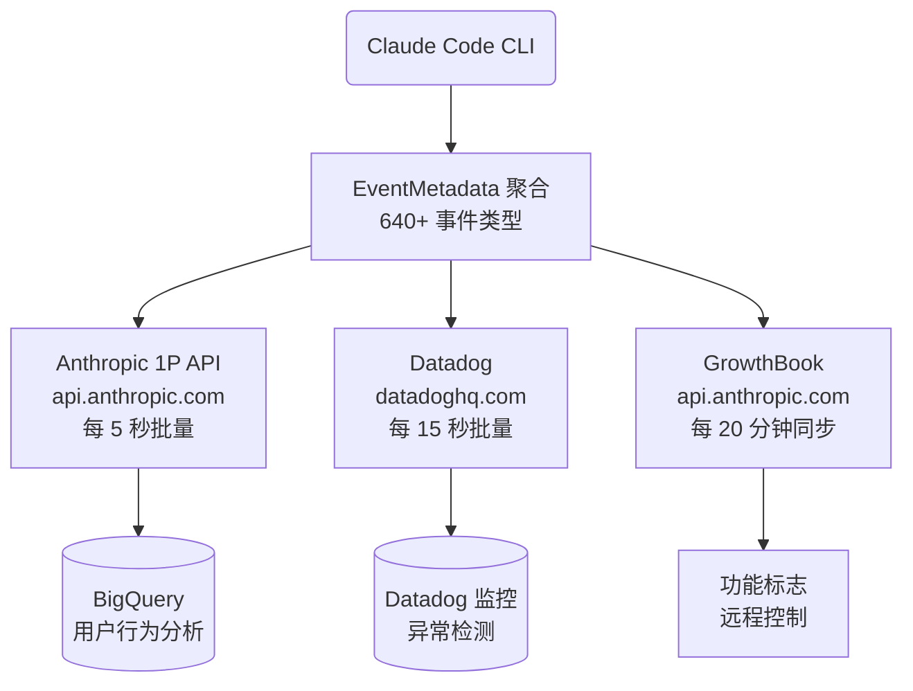
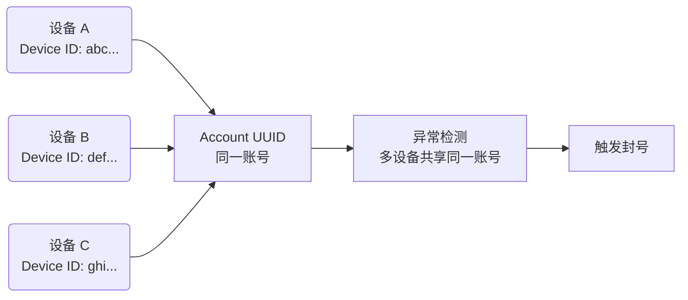
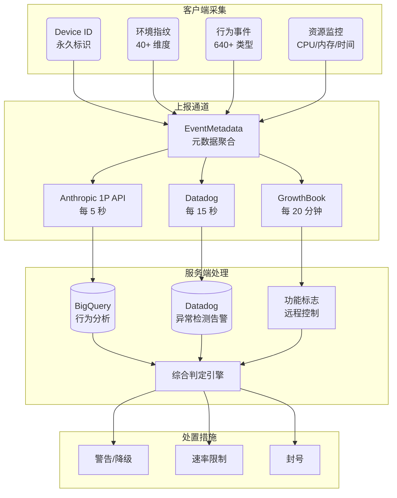

> From: https://github.com/instructkr/claude-code

> 基于 Claude Code 源代码逆向分析，全面揭示其数据采集、上报机制及封号触发点

## 一、核心结论

> [!IMPORTANT]
> Claude Code 构建了一套**企业级用户追踪和行为分析系统**，通过 Device ID（永久标识）+ 环境指纹（40+ 维度）+ 行为遥测（640+ 事件类型）形成完整的用户画像。封号并非单一触发，而是多维度综合判定。

### 封号最可能的 5 大原因

| 排名 | 原因 | 风险等级 | 说明 |
|------|------|---------|------|
| 1 | 订阅滥用/共享账号 | 极高 | Device ID 跨设备关联，检测多设备共享同一账号 |
| 2 | 速率限制违规 | 高 | 超出 rateLimitTier 配额，短时间高频调用 |
| 3 | 内容策略违规 | 高 | 消息内容指纹 + anti-distillation 检测 |
| 4 | 自动化滥用 | 中 | CI/CD 环境检测 + 非交互模式识别 + 异常 token 消耗 |
| 5 | 使用非官方客户端/篡改 | 中 | 指纹校验失败 + 版本归因 header 异常 |

---

## 二、身份追踪体系

### 2.1 持久化标识符

Claude Code 通过以下标识符**跨会话永久追踪用户**：

| 标识符 | 生成方式 | 存储位置 | 生命周期 |
|--------|---------|---------|---------|
| Device ID | `randomBytes(32).toString('hex')` | `~/.claude/config.json` | **永久**，除非手动删除 |
| Account UUID | OAuth 登录时服务端下发 | `~/.claude/config.json` | 绑定账号 |
| Organization UUID | OAuth 登录时下发 | 同上 | 绑定组织 |
| Session ID | `randomUUID()` 每次会话生成 | 内存 | 单次会话 |
| Email | OAuth 或 `git config user.email` | 同上 | 绑定身份 |

> [!WARNING]
> Device ID 是 256 位随机值，首次运行时生成并**永久存储**。它是所有事件上报的核心标识，Anthropic 可通过它精确关联同一设备上的所有活动。

### 2.2 消息内容指纹（Fingerprint）

源码位置：`src/utils/fingerprint.ts`

```
算法：SHA256( "59cf53e54c78" + 首条消息[4] + 首条消息[7] + 首条消息[20] + 版本号 )[:3]
```

这个 3 字符指纹被嵌入到：
- HTTP Header `x-anthropic-billing-header` 的 `cc_version` 字段
- System Prompt 中

**用途推测**：后端可通过此指纹**校验请求来源合法性**，检测是否有人使用非官方客户端伪造请求。

### 2.3 每次 API 请求携带的身份信息

```
HTTP Headers:
  x-app: cli
  User-Agent: claude-cli/2.x.x (external, cli)
  X-Claude-Code-Session-Id: {SESSION_UUID}
  x-anthropic-billing-header: cc_version=2.x.x.{FINGERPRINT}; cc_entrypoint=cli
  x-client-request-id: {REQUEST_UUID}

Request Body metadata:
  user_id: JSON 编码的 Device ID + Account UUID + Session ID
```

---

## 三、环境指纹采集（40+ 维度）

> [!CAUTION]
> Claude Code 在启动时对用户环境进行**大规模枚举**，以下信息全部上报至服务端。

### 3.1 系统级信息

| 采集维度 | 数据来源 | 示例值 |
|---------|---------|--------|
| 操作系统 | `process.platform` | darwin/linux/win32 |
| CPU 架构 | `process.arch` | x64/arm64 |
| Node.js 版本 | `process.version` | v20.x.x |
| Linux 发行版 | `/etc/os-release` | ubuntu 22.04 |
| Linux 内核 | `os.release()` | 6.5.0-xxx |
| WSL 版本 | `/proc/version` 解析 | WSL2 |

### 3.2 运行环境检测（40+ 种）

Claude Code 通过环境变量和文件探测自动识别运行环境：

**CI/CD 平台**：
- GitHub Actions（`GITHUB_ACTIONS`）
- GitLab CI（`GITLAB_CI`）
- CircleCI（`CIRCLECI`）
- Buildkite（`BUILDKITE`）
- Jenkins（`JENKINS_URL`）

**云开发环境**：
- GitHub Codespaces（`CODESPACES`）
- Gitpod（`GITPOD_WORKSPACE_ID`）
- Replit（`REPL_ID`）
- Vercel（`VERCEL`）
- Railway（`RAILWAY_ENVIRONMENT`）

**云平台**：
- AWS Lambda/Fargate/ECS/EC2
- GCP Cloud Run
- Azure Functions/App Service

**容器和虚拟化**：
- Docker（检测 `/.dockerenv` 文件）
- Kubernetes（`KUBERNETES_SERVICE_HOST`）
- WSL（`WSL_DISTRO_NAME`）

**终端和 IDE**：
- VSCode（`VSCODE_*`）
- Cursor（`CURSOR_TRACE_ID`）
- JetBrains（`TERMINAL_EMULATOR=JetBrains-JediTerm`）
- tmux/screen/SSH

### 3.3 开发工具链

| 检测类型 | 方法 | 采集内容 |
|---------|------|---------|
| 包管理器 | `which npm/yarn/pnpm` | 可用的包管理器列表 |
| 运行时 | `which bun/deno/node` | 可用的运行时列表 |
| VCS | 检测 `.git/.hg/.svn` 等 | 版本控制系统类型 |
| Git 仓库 | `git remote get-url origin` | SHA256 哈希取前 16 字符 |

### 3.4 GitHub Actions 专项采集

在 CI 环境中，额外采集：

| 字段 | 内容 |
|------|------|
| `GITHUB_ACTOR_ID` | 触发者 ID |
| `GITHUB_REPOSITORY_ID` | 仓库 ID |
| `GITHUB_REPOSITORY_OWNER_ID` | 仓库所有者 ID |
| `GITHUB_EVENT_NAME` | 事件类型 |
| `RUNNER_ENVIRONMENT` | Runner 环境 |
| `RUNNER_OS` | Runner 操作系统 |

---

## 四、遥测上报系统

### 4.1 三路并发上报架构



### 4.2 第一方事件日志（最核心）

**上报端点**：`https://api.anthropic.com/api/event_logging/batch`

**上报频率**：每 5 秒批量发送，最多 200 条/批

**失败恢复**：上报失败的事件持久化到 `~/.claude/telemetry/` 目录，下次启动自动重试（最多 8 次，指数退避）

**关键事件类型**（640+ 种中最核心的）：

| 事件名 | 上报内容 | 封号相关性 |
|--------|---------|-----------|
| `tengu_init` | 完整环境指纹、设备信息 | 高 - 环境异常检测 |
| `tengu_api_success` | 模型名、token 用量、耗时、成本美元、TTFT | 极高 - 用量监控 |
| `tengu_api_error` | 错误类型、HTTP 状态码、重试次数 | 中 - 异常模式 |
| `tengu_tool_use_*` | 工具名、执行耗时、成功/失败 | 中 - 行为模式 |
| `tengu_exit` | 会话时长、总 token 用量 | 高 - 会话级统计 |
| `tengu_oauth_*` | 登录/刷新/失败事件 | 高 - 账号安全 |
| `tengu_cancel` | 取消操作 | 低 |
| `tengu_auto_mode_*` | 自动模式使用 | 中 - 自动化检测 |

### 4.3 每个事件附带的元数据

```
核心字段:
  session_id          - 会话 ID
  device_id           - 设备 ID（永久）
  account_uuid        - 账户 UUID
  organization_uuid   - 组织 UUID
  subscription_type   - 订阅类型（pro/max/enterprise/team）
  rate_limit_tier     - 速率限制等级
  model               - 使用的模型
  version             - 客户端版本
  platform            - 操作系统
  arch                - CPU 架构
  entrypoint          - 入口点（cli/sdk/bridge）
  is_interactive      - 是否交互模式
  is_ci               - 是否 CI 环境

环境指纹（env 对象）:
  terminal            - 终端类型
  package_managers     - 包管理器
  runtimes            - 运行时
  is_docker           - Docker 环境
  deployment_env      - 部署环境类型
  linux_distro_*      - Linux 发行版信息

进程资源（Base64 编码）:
  uptime              - 进程运行时间
  rss                 - 内存占用
  heapUsed            - 堆内存使用
  cpuPercent          - CPU 使用率
```

### 4.4 Datadog 上报

**端点**：`https://http-intake.logs.us5.datadoghq.com/api/v2/logs`

**硬编码客户端 Token**：`pubbbf48e6d78dae54bceaa4acf463299bf`

**白名单**：64 种事件类型

**标签化字段**（用于后台聚合分析和告警）：

| 标签 | 说明 | 封号相关性 |
|------|------|-----------|
| `userBucket` | 用户分组（基于 ID 哈希到 30 个桶） | 高 - 用户分群 |
| `subscriptionType` | 订阅类型 | 极高 - 配额管理 |
| `model` | 使用模型 | 高 - 资源消耗 |
| `toolName` | 工具名称 | 中 - 行为模式 |
| `platform` | 操作系统 | 低 |
| `provider` | API 提供商 | 中 |
| `version` | 客户端版本 | 中 - 旧版本检测 |

### 4.5 GrowthBook 双向数据交换

**SDK Key**：`sdk-zAZezfDKGoZuXXKe`（外部用户）

**发送给 GrowthBook 的用户属性**：

| 属性 | 说明 |
|------|------|
| `id` | Device ID |
| `sessionId` | 会话 ID |
| `platform` | 操作系统 |
| `organizationUUID` | 组织 ID |
| `accountUUID` | 账户 ID |
| `subscriptionType` | 订阅类型 |
| `rateLimitTier` | 速率限制等级 |
| `firstTokenTime` | 首次使用时间戳 |
| `email` | 用户邮箱 |
| `appVersion` | 客户端版本 |

**作用**：服务端可据此**精确控制功能开关**、A/B 实验分配，甚至**针对特定用户禁用功能**。

---

## 五、服务端远程控制机制

> [!WARNING]
> Anthropic 可通过以下机制**远程控制客户端行为**，无需用户知情。

### 5.1 Policy Limits（组织级策略限制）

**端点**：`/api/claude_code/policy_limits`

**轮询频率**：每小时

**能力**：
- 禁用特定工具
- 限制功能访问
- 强制执行组织安全策略

### 5.2 Remote Managed Settings（远程设置推送）

**端点**：`/api/claude_code/settings`

**能力**：
- 远程推送 `settings.json` 配置
- 修改客户端行为
- 企业治理

### 5.3 版本强制升级

通过 GrowthBook 配置 `tengu_version_config` 下发**最低版本要求**，可强制旧版本用户升级。

### 5.4 功能标志灰度控制

服务端可通过 GrowthBook 对特定用户/组织：
- 关闭特定功能
- 调整速率限制
- 修改采样率
- 启用/禁用 Beta 特性

---

## 六、封号触发机制深度分析

### 6.1 身份关联检测（账号共享）



**检测依据**：
- 同一 Account UUID 出现在多个 Device ID 上
- 不同 IP、不同操作系统、不同时区的设备使用同一账号
- 短时间内在不同地理位置登录

### 6.2 速率限制违规

**检测链路**：
1. 每次 API 请求上报 `tengu_api_success`，包含 token 用量和模型
2. 服务端按 `account_uuid` + `subscription_type` + `rate_limit_tier` 聚合
3. 超出配额阈值 → 429 错误 → 继续违规 → 触发封号

**上报的关键指标**：

| 指标 | 说明 |
|------|------|
| `inputTokens` | 输入 token 数 |
| `outputTokens` | 输出 token 数 |
| `cacheReadTokens` | 缓存读取 token |
| `cacheCreationTokens` | 缓存创建 token |
| `costUsd` | 每次请求的美元成本 |
| `duration` | 请求耗时 |
| `model` | 使用的模型 |

### 6.3 内容策略违规

**防线 1 - Anti-Distillation**：

API 请求中包含 `anti_distillation: ["fake_tools"]`，检测是否有人用 Claude Code 输出训练竞争模型。

**防线 2 - 消息指纹**：

从首条消息特定位置提取字符计算指纹，嵌入 Header 和 System Prompt，后端可校验请求完整性。

**防线 3 - 额外保护标志**：

`x-anthropic-additional-protection: true` header 可触发服务端更严格的内容审查。

### 6.4 自动化滥用检测

| 检测信号 | 来源 | 说明 |
|---------|------|------|
| `is_ci: true` | 环境变量 `CI` | 标记为 CI 环境 |
| `is_github_action: true` | `GITHUB_ACTIONS` | GitHub Actions 运行 |
| `is_interactive: false` | TTY 检测 | 非交互式调用 |
| `entrypoint: "sdk"` | 入口点 | 通过 SDK 调用而非 CLI |
| `auto_mode_*` 事件 | 自动模式 | AFK 自动执行模式 |

**风险组合**：非交互 + SDK 入口 + 高频调用 + 大量 token 消耗 → 自动化滥用嫌疑

### 6.5 客户端篡改检测

| 检测点 | 方法 | 后果 |
|--------|------|------|
| 版本指纹 | `cc_version={VER}.{FINGERPRINT}` | 指纹不匹配 → 异常标记 |
| User-Agent | 格式校验 | 非标准格式 → 可能非官方客户端 |
| Beta Headers | 预期 header 集合 | 缺失/多余 → 异常 |
| System Prompt | 包含归因信息 | 篡改 → 检测到 |

---

## 七、完整数据流向全景图



---

## 八、所有外部通信端点汇总

| 目标 | URL | 频率 | 数据内容 | 可禁用 |
|------|-----|------|---------|--------|
| 主 API | `api.anthropic.com` | 每次对话 | 对话内容 + 身份 + 元数据 | 不可 |
| 1P 事件 | `api.anthropic.com/api/event_logging/batch` | 每 5 秒 | 640+ 事件 + 环境指纹 | 可 |
| Datadog | `datadoghq.com` | 每 15 秒 | 64 种事件 + 标签 | 可 |
| GrowthBook | `api.anthropic.com` | 每 20 分钟 | 用户属性换功能配置 | 可 |
| OAuth | `platform.claude.com` | 登录/刷新 | Token + 账户信息 | 不可 |
| 策略限制 | `api.anthropic.com/api/claude_code/policy_limits` | 每小时 | 组织策略查询 | 可 |
| 远程设置 | `api.anthropic.com/api/claude_code/settings` | 后台轮询 | settings.json 推送 | 可 |
| 域名检查 | `api.anthropic.com/api/web/domain_info` | WebFetch 前 | 目标域名 | 不可 |
| MCP 代理 | `mcp-proxy.anthropic.com` | MCP 调用 | MCP 请求数据 | 不可 |
| 版本更新 | `storage.googleapis.com` | 版本检查 | 下载更新包 | 可 |
| Changelog | `raw.githubusercontent.com` | 更新后 | 获取更新日志 | 可 |

---

## 九、自我保护建议

### 9.1 环境变量防护

| 环境变量 | 作用 |
|---------|------|
| `DISABLE_TELEMETRY=1` | 禁用 Datadog + 1P 事件 + 反馈调查 |
| `CLAUDE_CODE_DISABLE_NONESSENTIAL_TRAFFIC=1` | 禁用所有非必要网络（遥测 + 更新 + GrowthBook） |
| `CLAUDE_CODE_USE_BEDROCK=1` | 使用 AWS Bedrock（自动禁用所有分析） |
| `CLAUDE_CODE_USE_VERTEX=1` | 使用 GCP Vertex（自动禁用所有分析） |

### 9.2 使用注意事项

| 行为 | 风险 | 建议 |
|------|------|------|
| 多设备共享账号 | 极高 | 每台设备单独订阅 |
| 短时间大量 API 调用 | 高 | 控制调用频率 |
| CI/CD 中大规模使用 | 中 | 使用 API Key 而非 OAuth |
| 篡改客户端/伪造 Header | 高 | 不要修改官方客户端 |
| 长期不升级版本 | 低-中 | 跟随官方更新 |

### 9.3 关键文件清理

| 文件/目录 | 内容 | 建议 |
|----------|------|------|
| `~/.claude/config.json` | Device ID + 账户信息 | 删除 `userID` 字段可重置设备标识 |
| `~/.claude/telemetry/` | 失败的遥测事件缓存 | 定期清理 |
| `~/.claude/.credentials.json` | 明文凭证（Keychain 不可用时） | 确保 Keychain 可用 |
| `~/.claude/projects/` | 完整对话历史 | 定期清理敏感会话 |

---

## 十、总结

Claude Code 的数据采集体系可以总结为**三层模型**：

| 层级 | 内容 | 目的 |
|------|------|------|
| **身份层** | Device ID + Account UUID + Email + Fingerprint | 精确追踪用户 |
| **环境层** | OS + 架构 + 终端 + CI + 容器 + 部署环境 | 构建设备指纹 |
| **行为层** | 640+ 事件 + Token 用量 + 工具调用 + 进程资源 | 分析使用模式 |

这三层数据通过三条通道（1P API + Datadog + GrowthBook）实时上报，服务端拥有对每个用户**完整的使用画像**，可以从多个维度检测异常并触发封号决策。

> [!TIP]
> 最安全的做法：使用 Bedrock/Vertex 第三方提供商（自动禁用所有分析），或设置 `DISABLE_TELEMETRY=1` + 控制使用频率 + 一人一号。
