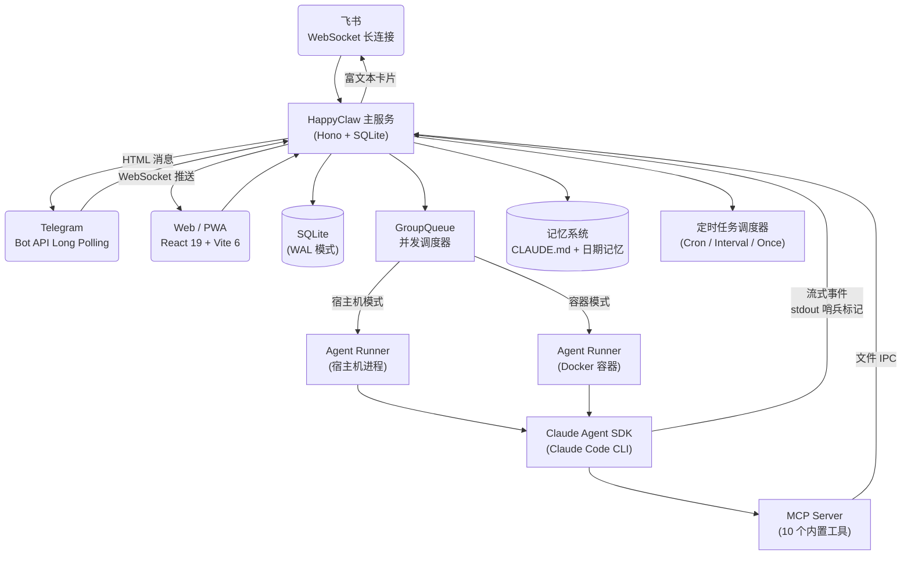

## 背景

2026 年初，本地个人 AI Agent 这个概念彻底出圈了。OpenClaw 60 天拿下 157K GitHub Stars，NanoClaw 用 4000 行代码证明了"极简也能很强"。越来越多的人意识到：**Claude Code 不应该只活在终端里**。

我自己折腾了一阵子，核心痛点有两个：

1. **OpenClaw 只能跑在 IM 里**。简单的对话没问题，但碰到复杂任务——需要看实时执行过程、需要容器隔离、需要多会话管理——纯 IM 交互就力不从心了。我需要一个 Web 界面来更好地跟进任务进度。更重要的是，我希望底层的 Agent 就是 Claude Code 本身，而不是一套自己实现的 Agent 框架。
2. **我需要一个远程的 Claude Code**。市面上有一些类似的方案，但要么 bug 比较多，要么更新太慢跟不上 Claude Code 的迭代节奏。我希望的是：Claude Code 升级了什么能力，我的 Agent 立刻就有。

说到底，我想要的东西很明确：**一个基于 Claude Code 的、有 Web 界面的、支持容器隔离的远程 AI Agent 服务**。

既然没有现成的轮子完美契合，那就自己造一个。

于是有了 [HappyClaw](https://github.com/riba2534/happyclaw)。

## HappyClaw 是什么

一句话概括：**HappyClaw 是一个基于 Claude Agent SDK 构建的自托管多用户 AI Agent 系统**。

它把完整的 Claude Code CLI 运行时封装为一个多用户 SaaS 化平台，通过飞书、Telegram 和 Web 三个渠道接入。你可以把它理解为"把 Claude Code 从终端搬到了云端，再搬到了你的手机上"。

核心设计原则只有一条：

> **不重新实现 Agent 能力，直接复用 Claude Code。**

这意味着 Claude Code 的每一次升级——新工具、更强的推理、更多的 MCP 支持——HappyClaw 零适配自动受益。底层调用的是完整的 Claude Code CLI 运行时，而非 API Wrapper 或 Prompt Chain。

项目开源在 GitHub：[https://github.com/riba2534/happyclaw](https://github.com/riba2534/happyclaw)，MIT 协议。

先上几张截图感受一下：

| 工具调用追踪 | Markdown 渲染 | 图片生成 + 文件管理 |
|:---:|:---:|:---:|
|  |  |  |

## 核心功能

### 三端消息接入

| 渠道 | 连接方式 | 消息格式 | 特色 |
|------|---------|---------|------|
| **飞书** | WebSocket 长连接 | 富文本卡片 | 图片消息、Reaction 反馈、自动注册群组 |
| **Telegram** | Bot API Long Polling | Markdown → HTML | 长消息自动分片（3800 字符） |
| **Web** | WebSocket 实时通信 | 流式 Markdown | 图片粘贴/拖拽上传、虚拟滚动 |

每个用户可以独立配置自己的 IM 通道——你用你的飞书应用凭据，我用我的 Telegram Bot Token，互不干扰。消息路由规则也很简单：**飞书来的回飞书，Telegram 来的回 Telegram，Web 来的回 Web**。

| 飞书 Bot 聊天 | 飞书富文本卡片回复 |
|:---:|:---:|
|  |  |

### Agent 执行引擎

执行引擎基于 [Claude Agent SDK](https://github.com/anthropics/claude-code/tree/main/packages/claude-agent-sdk) 构建，底层是完整的 Claude Code CLI 运行时。

两种执行模式：

- **宿主机模式**：Agent 直接在服务器上运行，访问本地文件系统，零 Docker 依赖。admin 用户默认使用这种模式。
- **容器模式**：Docker 隔离执行，非 root 用户，容器内预装了 40+ 工具（Chromium、Python、ffmpeg、ImageMagick、数据库客户端等）。member 用户默认走这条路。

并发控制方面，最多支持 **20 个容器 + 5 个宿主机进程**同时运行，配合会话级队列调度。指数退避重试机制（5s → 80s，最多 5 次）保证了任务执行的可靠性。上下文溢出时自动压缩并归档历史，不丢失长对话记忆。

### 实时流式体验

这是我自己最喜欢的一个特性。Agent 的思考和执行过程是**实时推送**到前端的，而不是等它全部跑完再给你一坨结果。

具体来说，前端能看到 11 种不同类型的流式事件：

- **思考过程**：可折叠的 Extended Thinking 面板，逐字推送
- **工具调用追踪**：工具名称、执行耗时、嵌套层级、输入参数摘要
- **调用轨迹时间线**：最近 30 条工具调用记录，方便回溯
- **Hook 执行状态**：PreToolUse / PostToolUse Hook 的启动、进度、结果

这种体验跟在终端里看 Claude Code 干活的感觉几乎一样，只不过是在浏览器里，或者在手机上。

### 10 个 MCP 内置工具

Agent 在运行时可以通过内置的 MCP Server 跟主进程通信，做一些"超出对话范畴"的事情：

| 工具 | 说明 |
|------|------|
| `send_message` | 运行期间即时发送消息给用户/群组 |
| `schedule_task` | 创建定时/周期/一次性任务 |
| `list_tasks` / `pause_task` / `resume_task` / `cancel_task` | 任务生命周期管理 |
| `register_group` | 注册新群组 |
| `memory_append` | 追加时效性记忆到 `memory/YYYY-MM-DD.md` |
| `memory_search` / `memory_get` | 全文检索和读取记忆文件 |

比如你可以让 Agent 自己设一个定时任务，每天早上 8 点抓取新闻摘要然后通过飞书发给你——**Agent 是自主安排这件事的**，不需要你手动去 crontab 里配。

### 持久记忆系统

跨会话记忆是 Agent 从"一次性工具"变成"长期助手"的关键。HappyClaw 实现了四层记忆结构：

- **用户全局记忆**：`CLAUDE.md` 文件，每个用户独立，所有会话共享
- **会话记忆**：每个会话有自己私有的 `CLAUDE.md`
- **日期记忆**：`memory/YYYY-MM-DD.md`，适合存储时效性信息
- **对话归档**：PreCompact Hook 在上下文压缩前自动归档完整对话

Agent 会自主维护这些记忆文件。你告诉它"记住我喜欢用 Go 写后端"，下次在另一个会话里问它推荐技术栈，它就知道优先考虑 Go。

### 多用户隔离

这是 HappyClaw 跟大多数个人 Agent 项目的最大区别——**它是为多人共享设计的**。

| 隔离维度 | 实现方式 |
|---------|---------|
| 执行环境 | 每用户独立工作区 `home-{userId}` |
| IM 通道 | per-user 飞书/Telegram 连接池 |
| 权限控制 | RBAC：5 种权限 × 4 种角色模板 |
| 注册管理 | 开放注册 / 邀请码 / 关闭注册 |
| 配置安全 | API Key AES-256-GCM 加密存储 |
| 审计追踪 | 18 种事件类型的完整日志 |

你可以把它部署在公司内网，通过邀请码让同事注册使用。每个人有自己独立的执行环境、记忆空间和 IM 通道，互不干扰。

### 移动端 PWA

手机浏览器打开 HappyClaw 的 Web 地址，一键安装到桌面，就是一个原生 App 的体验：全屏模式运行、独立应用图标、iOS / Android 均已适配。

这解决了我最大的一个痛点：**随时随地能用**。等电梯的时候掏出手机问一句"帮我查一下那个 API 的返回格式"，Agent 直接在服务器上执行，结果推送到手机。

| 登录 | 工作区 | 系统监控 | 设置 |
|:---:|:---:|:---:|:---:|
|  |  |  |  |

### Web Terminal

基于 xterm.js + node-pty 实现的浏览器内完整终端。WebSocket 连接，可拖拽调整面板大小，直接在 Web 界面里操作服务器——不用再另外开 SSH 了。容器模式下用户可以访问自己容器的终端，宿主机模式出于安全考虑不开放。

### Skills 系统

HappyClaw 支持两级 Skills 扩展：

- **项目级 Skills**：放在 `container/skills/`，所有容器自动挂载
- **用户级 Skills**：放在 `~/.claude/skills/`，同样自动挂载

不需要重建 Docker 镜像，volume 挂载 + 符号链接自动发现。你在宿主机上写好一个 Skill，所有容器内的 Agent 立刻就能用。

## 技术架构

### 整体结构

HappyClaw 由三个独立的 Node.js 项目组成：

| 项目 | 目录 | 职责 |
|------|------|------|
| 主服务 | `/` | Hono Web 服务器、消息轮询、IPC 监听、容器生命周期管理 |
| Web 前端 | `web/` | React 19 + Vite 6 SPA，Tailwind CSS，PWA |
| Agent Runner | `container/agent-runner/` | Claude Agent SDK 执行引擎，MCP Server |

整体架构如下：




### 数据流

消息从接入到执行，经过以下流程：

1. 用户通过飞书/Telegram/Web 发送消息，存储到 SQLite 并广播
2. 主进程每 2 秒轮询新消息，按 chat_jid 分组去重，分发到 GroupQueue
3. GroupQueue 判断工作区状态：空闲则启动容器/进程，运行中则通过文件 IPC 注入后续消息，满载则排队
4. Agent SDK 执行过程中，流式事件通过 stdout 哨兵标记输出，主进程解析后实时推送前端
5. 执行完成，结果通过对应 IM 渠道回复

### IPC 通信

容器和宿主机之间的通信**完全基于文件系统**，没有用 gRPC、HTTP 或者消息队列这种重型方案。主进程往 `data/ipc/{folder}/input/` 写 JSON 文件注入消息，Agent Runner 往 `messages/` 和 `tasks/` 写文件回传结果。文件操作使用原子写入（先写 `.tmp` 再 `rename`），读取后立即删除。

流式输出则通过 stdout 的**哨兵标记**（`---HAPPYCLAW_OUTPUT_START---` / `---HAPPYCLAW_OUTPUT_END---`）来分隔 JSON 数据和普通日志，避免了复杂的协议设计。

## 快速开始

### 前置要求

- **Node.js >= 20**
- **Docker**（容器模式需要，admin 宿主机模式可不装）
- **Claude API 密钥**

### 安装部署

```bash
# 克隆仓库
git clone https://github.com/riba2534/happyclaw.git
cd happyclaw

# 一键启动（首次自动安装依赖 + 编译）
make start
```

访问 `http://localhost:3000`，按照设置向导完成初始化：

1. **创建管理员** — 自定义用户名和密码
2. **配置 Claude API** — 填入 API 密钥和模型
3. **配置 IM 通道**（可选）— 飞书 App ID/Secret 或 Telegram Bot Token
4. **开始对话** — 在 Web 聊天页面直接发送消息

所有配置通过 Web 界面完成，不需要手动编辑 `.env` 文件。

| 创建管理员 | 配置接入（飞书 + Claude） |
|:---:|:---:|
|  |  |

### 启用容器模式

如果需要给 member 用户使用容器模式：

```bash
# 构建容器镜像（基于 node:22-slim，预装 40+ 工具）
./container/build.sh
```

新用户注册后自动创建容器工作区，无需额外配置。

### 飞书集成

1. 去[飞书开放平台](https://open.feishu.cn)创建企业自建应用
2. 事件订阅添加 `im.message.receive_v1`
3. 权限开通 `im:message` 和 `im:message.receive_v3`
4. 发布应用等待审批
5. 在 HappyClaw 设置页填入 App ID 和 App Secret

### Telegram 集成

1. 跟 [@BotFather](https://t.me/BotFather) 创建一个 Bot
2. 在 HappyClaw 设置页填入 Bot Token


## 写在最后

做完这个项目最大的感受是：**AI Agent 平台的核心价值不在于重新实现 Agent 能力，而在于如何让这个能力触达更多场景**。

Claude Code 本身已经足够强大——它能读写文件、执行命令、搜索代码、浏览网页。但它被锁在终端里，只有一个人能用，只有坐在电脑前才能用。HappyClaw 做的事情就是**把这个能力解放出来**：多个人可以用，手机上可以用，飞书群里可以用。

如果你也有类似的需求——家里有台闲置的 Mac mini 或者 Linux 服务器，想让 Claude Code 变成一个 7×24 小时在线的 AI 助手，服务自己和身边的朋友——那 HappyClaw 也许正好适合你。

> 最好的代码是不需要写的代码。最好的 Agent 框架是不需要造的 Agent 框架。

项目地址：[https://github.com/riba2534/happyclaw](https://github.com/riba2534/happyclaw)

欢迎 Star、Issue 和 PR。

## 参考资料

- [HappyClaw GitHub](https://github.com/riba2534/happyclaw)
- [Claude Agent SDK](https://github.com/anthropics/claude-code/tree/main/packages/claude-agent-sdk)
- [OpenClaw](https://github.com/nicepkg/OpenClaw)
- [NanoClaw](https://github.com/nicepkg/NanoClaw)
- [Claude Code 官方文档](https://docs.anthropic.com/en/docs/claude-code)
