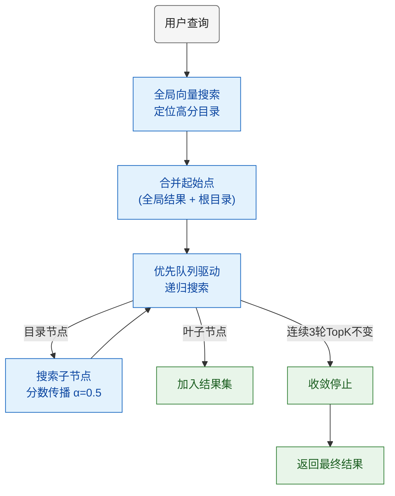
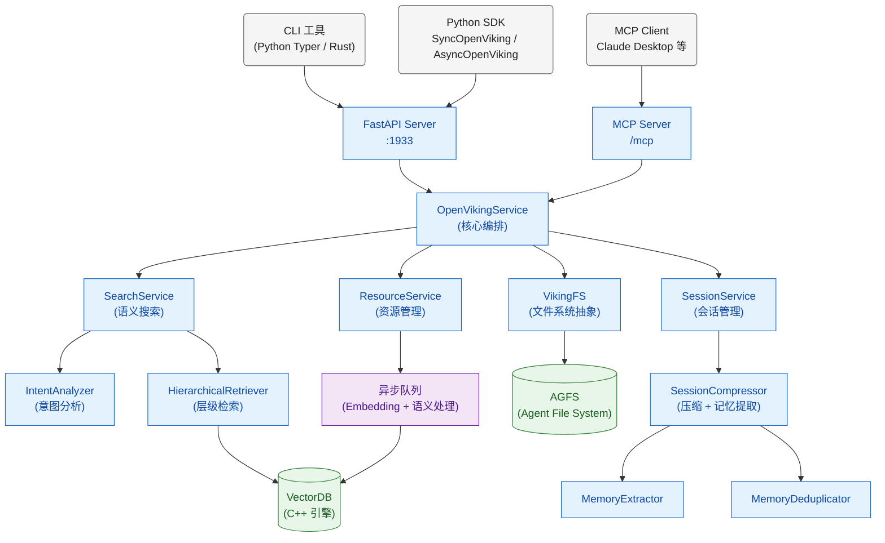

## 背景

做 AI Agent 开发的人，多少都被"上下文管理"折磨过。

你可能遇到过这些场景：Agent 跑着跑着忘了之前聊过什么；上传了十几份文档，检索出来的永远是那几段不太相关的内容；想让 Agent 记住用户偏好，结果下次对话又从零开始。

本质问题在于：**现有的 RAG 方案把所有文档切成扁平的 chunk 扔进向量数据库，缺少结构化的组织和层级化的检索策略**。你的知识库是一个巨大的"文本碎片池"，Agent 只能盲目地做相似度匹配，没有全局视图，也没有上下文感知。

字节跳动火山引擎的 Viking 团队显然也意识到了这个问题。他们开源了 [OpenViking](https://github.com/volcengine/openviking)，定位是一个 **Agent 原生的上下文数据库（Context Database）**。

我花了一些时间深入读了这个项目的源码，发现几个设计思路确实有意思。这篇文章就来拆解一下 OpenViking 的核心架构和设计哲学。

## OpenViking 是什么

一句话概括：**OpenViking 是一个面向 AI Agent 的上下文数据库，用文件系统范式统一管理记忆（Memory）、资源（Resource）和技能（Skill）**。

它不是一个 Agent 框架，不负责 tool calling 或推理链。它是 Agent 的"大脑后端"——负责存储、组织和检索 Agent 运行过程中需要的所有上下文信息。

项目的核心创新可以用一张表概括：

| 传统 RAG | OpenViking |
|---------|-----------|
| 扁平 chunk 存储 | 文件系统 + 目录层级 |
| 全量加载上下文 | L0/L1/L2 按需加载 |
| 单次相似度匹配 | 目录递归检索 + 分数传播 |
| 检索过程黑盒 | 检索轨迹完全可观测 |
| 无记忆管理 | 自动会话压缩 + 长期记忆提取 |

## 核心设计：文件系统范式

OpenViking 最核心的设计决策是：**用文件系统的方式来组织 Agent 的上下文**。

所有上下文通过 `viking://` 协议统一寻址，三大类资源各有归属：

```
viking://
├── resources/          # 知识资源（文档、代码、网页等）
│   ├── project_docs/
│   │   ├── api.md
│   │   └── architecture.md
│   └── papers/
│       └── attention_is_all_you_need.pdf
├── user/               # 用户上下文
│   └── memories/       # 用户记忆
│       ├── profile/        # 用户画像
│       ├── preferences/    # 偏好设置
│       ├── entities/       # 实体记忆（项目、人物）
│       └── events/         # 事件记录
├── agent/              # Agent 上下文
│   ├── skills/         # Agent 技能
│   └── memories/       # Agent 记忆
│       ├── cases/          # 问题解决案例
│       └── patterns/       # 可复用模式
└── session/            # 会话
```

这个设计的好处很直觉：**目录结构天然就是一种层级化的知识组织方式**。你不再面对一堆散乱的向量 chunk，而是一棵有结构、可浏览、可理解的知识树。

## L0/L1/L2 三层内容体系

这是 OpenViking 最精妙的设计之一。对每个资源，系统维护三个层次的内容表示：

| 层级 | 名称 | 内容 | Token 量级 | 用途 |
|------|------|------|-----------|------|
| **L0** | Abstract | 一句话摘要 | ~100 tokens | 快速筛选、目录浏览 |
| **L1** | Overview | 结构化概览 | ~2K tokens | Agent 规划决策 |
| **L2** | Content | 完整原始内容 | 不限 | 详细阅读、精确引用 |

工作流程是这样的：

1. Agent 先浏览目录的 L0 摘要，快速判断哪些资源可能相关
2. 对候选资源读取 L1 概览，确认是否真的需要
3. 只对最终需要的资源加载 L2 完整内容

**这就像人类查资料的方式**——你不会把图书馆所有书都读一遍，而是先看书名（L0），再看目录和摘要（L1），最后才翻开具体章节（L2）。


在代码层面，L0 和 L1 存储为每个资源目录下的 `.abstract.md` 和 `.overview.md` 隐藏文件，读取对应的 API 端点是：

```
GET /api/v1/content/abstract?path=viking://resources/docs   # L0
GET /api/v1/content/overview?path=viking://resources/docs    # L1
GET /api/v1/content/read?path=viking://resources/docs/api.md # L2
```

这种按需加载策略能**显著减少 Token 消耗**——大多数时候 Agent 只需要 L0 和 L1 就够了。

### L0/L1 是怎么生成的

你可能会问：这些摘要和概览是谁写的？答案是 **LLM 自动生成**。

当资源被导入时，`SemanticProcessor` 会异步处理每个文件和目录。它根据文件类型选择不同的 prompt 模板：

| 文件类型 | Prompt 模板 | 关注点 |
|---------|------------|--------|
| 代码文件（.py/.go/.rs 等 80+ 扩展名） | `semantic.code_summary` | 主要用途、关键类/函数、依赖关系、架构角色 |
| 文档文件（.md/.rst/.org 等） | `semantic.document_summary` | 主题、标题层级、核心概念、目标读者 |
| 其他文件 | `semantic.file_summary` | 文件内容、覆盖范围、核心关键词 |

文件级摘要生成后，系统自底向上聚合目录信息。目录的 L1 Overview 有一个精心设计的结构：

1. **标题**（目录名称）
2. **简要描述**（50-150 词，无标题，直接概括目录内容）
3. **Quick Navigation**（决策树格式，用 `[N]` 引用具体文件，帮 Agent 快速定位）
4. **详细描述**（每个文件/子目录一个 H3 小节）

L0 Abstract 则从 L1 Overview 中自动提取简要描述段落。**整个过程不需要人工参与**，资源导入后会自动排队进入语义处理队列，用 `asyncio.Semaphore` 控制并发（默认上限 100 个并行 LLM 调用）。

这个设计意味着每个目录都有一份"目录说明书"，Agent 浏览文件系统时就像在翻一本有详细目录和索引的百科全书。

## 意图分析

在进入检索流程之前，OpenViking 还有一个容易被忽略但很关键的组件：**IntentAnalyzer（意图分析器）**。

传统 RAG 的检索是"用户说什么就搜什么"，但这种方式在复杂场景下经常失效。比如用户问"帮我写一个 API 文档"，Agent 需要的上下文其实包括：已有的 API 文档模板（resource）、用户的写作风格偏好（memory）、文档生成技能（skill）——这是三种完全不同类型的上下文。

IntentAnalyzer 的工作就是：**用 LLM 把用户查询拆解成多个类型化的子查询**。

它的输入包括会话压缩摘要、最近 5 条消息和当前消息，经过一个精心设计的 prompt 模板，输出一个 `QueryPlan`：

```json
{
  "reasoning": "用户需要生成 API 文档，需要查找模板资源和写作偏好",
  "queries": [
    {"query": "API 文档模板", "context_type": "resource", "priority": 1},
    {"query": "用户的文档写作风格偏好", "context_type": "memory", "priority": 2},
    {"query": "生成技术文档", "context_type": "skill", "priority": 3}
  ]
}
```

三种查询类型遵循不同的生成策略：

| 查询类型 | 风格 | 示例 |
|---------|------|------|
| `skill` | 动词优先 | "生成 RFC 文档"、"提取 PDF 表格" |
| `resource` | 名词短语 | "RFC 文档模板"、"API 使用指南" |
| `memory` | "用户的 XX" / "执行 XX 的经验" | "用户的编码习惯"、"调试认证问题的经验" |

每个子查询会独立走一遍 HierarchicalRetriever，根据 `context_type` 搜索不同的根目录（`viking://resources`、`viking://user/memories` + `viking://agent/memories`、`viking://agent/skills`），最终合并结果。

这种设计让检索从"单次盲搜"进化为"理解意图后的精准定位"。

## 目录递归检索

传统 RAG 的检索是"一步到位"：query 向量化 → 全库 TopK → 返回结果。这在知识库规模小的时候没问题，但当你有几百个文档、几千个 chunk 的时候，单次全局搜索的精度就会下降。

OpenViking 的 `HierarchicalRetriever` 采用了一种更聪明的策略——**先锁定目录，再逐层细化**。

检索器有两种运行模式：**THINKING 模式**（向量搜索 + Rerank 重排序，精度更高但更慢）和 **QUICK 模式**（纯向量搜索，速度更快）。默认使用 THINKING 模式。

整体流程：



关键机制：

- **全局搜索只找目录**：第一步的全局向量搜索带了 `is_leaf=False` 过滤条件，只搜索目录节点而非叶子文件。这意味着它在做"方向定位"而不是"内容检索"——先确定哪个目录最相关，再深入探索
- **分数传播**：子节点的最终分数 = `α × 自身分数 + (1-α) × 父目录分数`（α=0.5），父目录的高分会"加持"子内容。这个传播是级联的：一个深层嵌套的叶子节点的最终分数，融合了从根到叶的所有祖先分数
- **收敛检测**：每处理一个目录后，检查当前 TopK 结果集的 URI 是否与上一轮完全相同。连续 3 轮不变就停止搜索。如果中间任何一轮 TopK 发生变化（有更高分的结果挤进来），计数器立即归零
- **优先队列**：用 Python `heapq` 的最小堆驱动（存 `-score` 实现最大堆），始终优先探索最有可能的方向
- **阈值过滤**：THINKING 模式下使用 Rerank 模型对搜索结果重排序，只有分数超过阈值（默认 0.1）的候选项才会被保留

举个例子说明分数传播的级联效应：

```
Root (score=0.0) → Dir-A 的 final_score = 0.7（父为 0，直接用自身分数）
  Dir-A (score=0.7) → Dir-B 的 final_score = 0.5×0.6 + 0.5×0.7 = 0.65
    Dir-B (final=0.65) → Leaf-C 的 final_score = 0.5×0.8 + 0.5×0.65 = 0.725
```

这种检索策略配合 L0/L1/L2 三层体系，就像一个有经验的研究员在图书馆里查资料——不是漫无目的地翻，而是有方向、有层次地逐步缩小范围。


## 记忆系统


OpenViking 的记忆管理也值得一看。它把 Agent 的记忆分为六类，每类都有明确的存储位置和处理策略：

| 记忆类别 | 归属 | 存储路径 | 可合并 | 示例 |
|---------|------|---------|--------|------|
| Profile | 用户 | `viking://user/memories/profile.md`（单文件） | 总是合并 | "用户是后端开发，主力语言 Go" |
| Preferences | 用户 | `viking://user/memories/preferences/mem_{uuid}.md` | 是 | "喜欢简洁的代码风格" |
| Entities | 用户 | `viking://user/memories/entities/mem_{uuid}.md` | 是 | "项目 X 使用微服务架构" |
| Events | 用户 | `viking://user/memories/events/mem_{uuid}.md` | 否 | "昨天修复了认证 bug" |
| Cases | Agent | `viking://agent/memories/cases/mem_{uuid}.md` | 否 | "XX 错误的解决方案是..." |
| Patterns | Agent | `viking://agent/memories/patterns/mem_{uuid}.md` | 是 | "处理分页查询的通用流程" |

注意 **Profile 是单文件**——所有用户画像信息始终合并到一个 `profile.md` 中，而不是创建多条记录。Events 和 Cases 不支持合并操作，因为它们本质上是独立的事件记录，每次都应该作为新条目保存。

每条记忆同样遵循三层结构：**L0（一句话索引）**、**L1（结构化 Markdown）**、**L2（完整叙述）**。其中可合并类型的 L0 摘要使用 `[合并键]: [描述]` 格式（比如 `编程语言偏好: 偏好 Go 和 Python`），方便后续聚合。

### session.commit() 完整流水线

当一个会话结束调用 `session.commit()` 时，系统实际上执行了 **6 个步骤**的流水线：

**第一步：归档当前消息**。系统用 LLM 生成一份结构化摘要（包含会话总结、主要请求、关键概念、错误与修复等章节），连同原始消息一起归档到 `viking://session/{id}/history/archive_{NNN}/`，然后清空内存中的消息列表。

**第二步：提取长期记忆**。这是最复杂的一步，涉及三个组件的协作：

1. **MemoryExtractor（记忆提取器）**：首先检测用户消息的语言（支持中文、英文、韩语、俄语、日语、阿拉伯语等，通过 Unicode 字符集分析），然后用 `compression.memory_extraction` prompt 模板让 LLM 从对话中提取六类记忆。Prompt 中包含了精确的分类判定标准——比如 Profile 的测试是"能否用'用户是...'开头"，Preferences 的测试是"能否用'用户偏好/喜欢...'描述"。

2. **MemoryDeduplicator（记忆去重器）**：对每条候选记忆执行两阶段去重：
   - **阶段一 · 向量预过滤**：将候选记忆的 `abstract + content` 文本做 embedding，在同类别的已有记忆中搜索相似度 > 0.7 的条目（最多返回 5 条）
   - **阶段二 · LLM 决策**：如果预过滤找到了相似记忆，把候选和最多 3 条相似记忆一起送给 LLM，让它做出三选一判断：`CREATE`（全新）、`MERGE`（合并）、`SKIP`（跳过）

3. **SessionCompressor（会话压缩器）**：负责编排整个流程。**Profile 类别会跳过去重直接合并**（因为用户画像本来就应该不断更新）。MERGE 操作只对 Preferences、Entities、Patterns 三种类型生效——它用另一个 prompt 模板让 LLM 合并新旧内容，去除重复信息，保留最新细节。Events 和 Cases 即使 LLM 判定为 MERGE，也会降级为 SKIP。

**第三步：写回文件系统**。将新创建的记忆文件写入 AGFS。

**第四步：创建关联关系**。在新记忆和对话中引用过的资源/技能 URI 之间建立双向链接（通过 `viking_fs.link()`）。

**第五步：更新活跃计数**。对引用过的上下文递增 `active_count`，为后续的记忆衰减机制提供数据。

**第六步：统计汇总**。返回提取结果（提取了多少条记忆、多少条跳过、多少条合并等）。

这意味着 Agent 的记忆会**随着使用自动积累和迭代**，而不是简单地无限追加。用户画像会越来越精准，问题解决案例会越来越丰富，而且**记忆是多语言感知的**——它会用用户的母语来存储记忆。

## 技术栈全景

OpenViking 是一个多语言项目，技术选型覆盖面很广：

| 层次 | 技术选型 | 说明 |
|------|---------|------|
| 核心 SDK | Python 3.10+, Pydantic v2 | 主体代码，Sync/Async 双模式客户端 |
| HTTP Server | FastAPI + Uvicorn | 35+ RESTful API 端点，标准 JSON 信封响应 |
| CLI 工具 | Python Typer + Rust (clap/tokio) | 两套 CLI，Rust 版 27 个命令，启动更快 |
| 向量引擎 | 自研 C++17 + pybind11 | Flat 索引 + 4 级 SIMD 加速 + INT8 量化 |
| 文件系统 | AGFS (Go 实现) | Plan 9 风格插件式虚拟文件系统，8 种插件，FUSE 支持 |
| LLM 集成 | Provider Registry 统一后端 | 12 家提供商，按模型名关键字自动路由 |
| Embedding | Dense + Sparse + Hybrid | OpenAI / 火山引擎 / VikingDB 三 Provider |
| 文档解析 | 12 种格式解析器 | 注册表架构，自动检测文件类型 |
| MCP 支持 | 两个 MCP Server | RAG MCP（3 工具）+ AGFS MCP（16 工具） |
| CI/CD | GitHub Actions | 自动 Lint/Test/Build/PyPI 发布 |

### C++ 向量引擎深入

读源码时发现一个有意思的事情：**当前的向量引擎只实现了 Brute-Force（暴力搜索）索引，没有 HNSW 或 IVF 等近似搜索算法**。这意味着每次搜索都是全量扫描，但通过以下优化来弥补性能：

**4 级 SIMD 加速**：编译时自动检测 CPU 指令集，选择最优实现：

| 级别 | 寄存器宽度 | 每次处理 | 关键指令 |
|------|-----------|---------|---------|
| scalar | - | 1 个浮点 | 普通循环 |
| SSE | 128-bit | 4 个浮点 | `_mm_loadu_ps`, `_mm_hadd_ps` |
| AVX | 256-bit | 8 个浮点 | `_mm256_fmadd_ps`（FMA 融合乘加） |
| AVX512 | 512-bit | 16 个浮点 | `_mm512_reduce_add_ps` |

**INT8 对称量化**：将 float32 向量压缩为 int8，存储空间缩小 4 倍。量化策略是找到向量的最大绝对值，用 `scale = max_abs / 127` 做对称映射。AVX 实现能一次处理 32 个 int8 元素。

**标量过滤**：使用 **CRoaring**（压缩位图库）做高效的标量字段过滤。小集合（< 32 元素）用 `std::set`，超过阈值自动升级为 Roaring Bitmap。支持复合过滤条件（AND/OR/Range/Prefix/Regex/Contains 等）。

**两种距离度量**：L2 平方距离和内积（Inner Product）。Cosine 相似度需要预先 L2 归一化后用内积实现。

LevelDB 在项目中作为通用 KV 存储使用（通过 `PersistStore` 暴露给 Python），但**向量数据本身并不存在 LevelDB 中**——而是存在 `malloc` 分配的连续内存缓冲区中，格式为 `[量化向量 | uint64_t label | uint32_t offset]`。这是为了保证 SIMD 计算时的内存访问连续性。

pybind11 绑定层做了一个关键的性能优化：**在 `add_data`、`delete_data`、`search`、`dump` 等重操作中释放 GIL**（`pybind11::gil_scoped_release`），允许 Python 线程在 C++ 执行计算时继续运行。

老实说，目前只有 Flat 索引对于大规模数据集是个瓶颈。但考虑到 OpenViking 的使用场景（单 Agent 的上下文数据库，数据量通常在几千到几万条级别），暴力搜索配合 SIMD 加速在绝大多数情况下应该够用了。未来如果需要支持更大规模，加上 HNSW 应该不难。

### LLM Provider 集成

OpenViking 通过自己的 `ProviderRegistry` 统一管理 12 家模型提供商，**根据模型名称中的关键字自动识别和路由**。比如模型名包含 `doubao` 就路由到火山引擎，包含 `claude` 就路由到 Anthropic。

| 提供商 | 关键字 | 说明 |
|--------|--------|------|
| VolcEngine | doubao, ep- | 火山引擎豆包 |
| OpenAI | gpt | GPT 系列 |
| Anthropic | claude | Claude 系列 |
| DeepSeek | deepseek | 深度求索 |
| Gemini | gemini | Google Gemini |
| Moonshot | kimi | 月之暗面 |
| DashScope | qwen | 阿里通义千问 |
| Zhipu AI | glm | 智谱清言 |
| MiniMax | minimax | MiniMax |
| OpenRouter | (任意模型) | 聚合网关 |
| Custom | (自定义) | OpenAI API 兼容 |
| vLLM | vllm | 本地部署 |

Embedding 模型方面，支持三种检索策略：**Dense（稠密向量）**、**Sparse（稀疏向量，term→weight 字典）** 和 **Hybrid（两者混合）**。火山引擎的 Embedding 模型可以在一次 API 调用中同时返回稠密和稀疏向量，而 OpenAI 目前只支持稠密向量。如果你同时配置了 Dense 和 Sparse 两个 Embedding，系统会自动用 `CompositeHybridEmbedder` 将它们组合起来。

## 架构总览

把所有模块串起来，整体架构是这样的：



从用户请求到最终响应的完整链路：

1. 用户通过 CLI/SDK/MCP 发起请求
2. FastAPI Server 路由到对应的 Service
3. 语义搜索时：IntentAnalyzer 分析意图 → HierarchicalRetriever 目录递归检索 → VectorDB 向量匹配
4. 资源管理时：解析器解析文档 → 异步队列处理 embedding → 写入 VectorDB
5. 会话管理时：消息追加 → commit 触发压缩 + 记忆提取 → 长期记忆入库

## AGFS：Plan 9 风格的虚拟文件系统

AGFS（Agent File System）是 OpenViking 底层的文件系统抽象层，用 Go 实现，设计灵感来自 **Plan 9 操作系统**——"万物皆文件"的哲学。

### 插件式架构

AGFS 的核心是一个 `MountableFS` 路由器，所有文件系统操作都通过它分发到对应的插件：

```
MountableFS（不可变基数树路由）
├── /local      → LocalFS（本地文件系统，默认数据后端）
├── /queue      → QueueFS（消息队列，通过文件实现）
├── /serverinfo → ServerInfoFS（服务信息）
└── ... 可动态挂载更多插件
```

路由使用**不可变基数树**（`go-immutable-radix`）存储在 `atomic.Value` 中，实现了**无锁并发读取**——多个 goroutine 可以同时查询路径对应的插件而不需要加锁。写操作（挂载/卸载）则通过 copy-on-write 更新整棵树。

8 种内置插件覆盖了常见存储场景：

| 插件 | 用途 | 典型场景 |
|------|------|---------|
| **LocalFS** | 本地文件系统访问 | 默认数据存储 |
| **MemFS** | 内存存储 | 测试、临时数据 |
| **S3FS** | S3 兼容对象存储 | 云端部署 |
| **KVFS** | 键值存储 | 配置、元数据 |
| **QueueFS** | 文件化消息队列 | 异步任务通信 |
| **SQLFS** | 数据库后端存储 | 结构化数据 |
| **ProxyFS** | 远程 AGFS 联邦 | 多节点互联 |
| **HTTPFS** | HTTP 文件访问 | 远程资源代理 |

支持运行时动态挂载和卸载，甚至可以从共享库（.so/.dylib）或 **WebAssembly（.wasm）** 加载外部插件。

### FUSE 挂载

AGFS 完整支持 FUSE，可以把虚拟文件系统挂载为本地目录。实现使用 `go-fuse/v2`，支持 10 种 FUSE 操作（Getattr、Lookup、Readdir、Mkdir、Create 等），带元数据和目录缓存（TTL 可配置），写操作自动失效相关缓存。

这意味着你可以直接用 `ls`、`cat`、`vim` 等普通 Shell 命令浏览和编辑 Agent 的上下文——对调试和可视化非常方便。

### 提供 POSIX 风格的 Handle API

除了基础的 `read/write/mkdir/rm` 操作，AGFS 还提供了类 POSIX 的有状态文件句柄 API：`open` → `read/write/seek` → `sync` → `close`，并支持 Lease 续期机制。Python SDK 封装了 `FileHandle` 上下文管理器，Go SDK 也有对应实现。

## 文档解析系统

OpenViking 的文档解析采用**注册表架构**，12 种解析器通过扩展名映射自动分发：

| 解析器 | 支持格式 | 解析策略 |
|--------|---------|---------|
| MarkdownParser | .md, .markdown, .mdown | 按标题分节，小文件（< 4000 tokens）不拆分 |
| PDFParser | .pdf | 双策略：本地 pdfplumber + 远程 MinerU API |
| WordParser | .docx | python-docx → Markdown → MarkdownParser |
| PowerPointParser | .pptx | 按 Slide 转 Markdown |
| ExcelParser | .xlsx, .xls | 按 Sheet 转 Markdown 表格 |
| HTMLParser | .html, .htm | HTML → Markdown 转换 |
| EPubParser | .epub | 按章节提取 |
| TextParser | .txt, .text | 直接文本读取 |
| CodeRepositoryParser | 80+ 代码扩展名 | 支持 Git URL/本地目录，含 ignore 规则 |
| DirectoryParser | (目录) | 递归遍历目录树 |
| ZipParser | .zip | 解压后递归解析 |
| ImageParser | (图片) | 可选的多模态解析 |

几个值得注意的设计细节：

**PDF 双策略**：默认 `auto` 模式先用 pdfplumber 本地解析（提取文本、表格、图片），如果效果不理想则自动回退到 MinerU 远程 API。

**智能分节**：MarkdownParser 的分节逻辑很细致——**代码块内的 `#` 不会被误判为标题**，HTML 注释和转义字符也会正确处理。小节如果太短（< 800 tokens）会自动合并到相邻节中，避免碎片化。

**CJK 感知的 Token 估算**：中日韩字符按 0.7 tokens/字符估算，其他字符按 0.3 tokens/字符，这比简单地按空格分词准确得多。

**自动文件类型检测**：解析入口会自动判断输入是 Git 仓库 URL、本地文件/目录还是纯文本内容，选择合适的解析器。

## MCP 集成

OpenViking 提供了**两个独立的 MCP Server**，分别暴露不同层次的能力：

### RAG MCP Server

基于 `FastMCP` 构建，暴露 3 个工具：

| 工具 | 功能 | 参数 |
|------|------|------|
| `query` | 完整 RAG 流程：检索上下文 + 生成回答 | question, top_k, score_threshold, target_uri, session_id |
| `search` | 语义搜索：只返回匹配的文档，不生成回答 | query, top_k, score_threshold, target_uri |
| `add_resource` | 导入资源到 OpenViking | resource_path, target_uri, reason, instruction |

支持 `streamable-http`（默认端口 2033）和 `stdio` 两种传输模式。接入 Claude Desktop 只需一行命令：

```bash
claude mcp add --transport http openviking http://localhost:2033/mcp
```

### AGFS MCP Server

暴露 16 个文件系统操作工具，让 MCP Client 可以直接操作 Agent 的虚拟文件系统：

`agfs_ls`、`agfs_cat`、`agfs_write`、`agfs_mkdir`、`agfs_rm`、`agfs_stat`、`agfs_mv`、`agfs_grep`、`agfs_cp`、`agfs_upload`、`agfs_download`、`agfs_mount`、`agfs_unmount`、`agfs_mounts`、`agfs_health`、`agfs_notify`

这意味着 Claude Desktop 或其他 MCP Client 不仅能搜索和查询上下文，还能直接浏览、修改和管理 Agent 的整个知识体系。

项目中还有一个 `mcp_converter` 模块，可以把 MCP 工具定义自动转换为 OpenViking 的 Skill 格式，实现 MCP 工具到 Agent 技能的无缝桥接。

## 快速体验

安装很简单：

```bash
# Python SDK
pip install openviking

# 可选：Rust CLI（启动更快）
curl -fsSL https://raw.githubusercontent.com/volcengine/OpenViking/main/crates/ov_cli/install.sh | bash
```

配置文件 `~/.openviking/ov.conf`：

```json
{
  "embedding": {
    "dense": {
      "api_base": "https://api.openai.com/v1",
      "api_key": "sk-xxx",
      "provider": "openai",
      "dimension": 3072,
      "model": "text-embedding-3-large"
    }
  },
  "vlm": {
    "api_base": "https://api.openai.com/v1",
    "api_key": "sk-xxx",
    "provider": "openai",
    "model": "gpt-4o-mini"
  }
}
```

Python SDK 使用：

```python
import openviking as ov

# 初始化
client = ov.SyncOpenViking(path="./data")
client.initialize()

# 添加资源（支持 URL、文件、目录）
result = client.add_resource(path="/path/to/my/document.pdf")

# 等待语义处理完成（L0/L1 自动生成）
client.wait_processed()

# 浏览目录结构
print(client.ls(result['root_uri']))

# 读取 L0 摘要和 L1 概览
print(client.abstract(result['root_uri']))
print(client.overview(result['root_uri']))

# 语义搜索
results = client.find("如何配置数据库连接？")
for r in results.resources:
    print(f"[{r.uri}] score={r.score:.4f}")

# 会话管理
session = client.session("chat-001")
session.add_message("user", "帮我分析一下这个项目的架构")
# ... Agent 处理 ...
session.commit()  # 自动提取长期记忆

client.close()
```

也可以用 Rust CLI 快速交互：

```bash
# 语义搜索
ov find "如何配置数据库连接？"

# 浏览目录
ov ls viking://resources/

# 读取摘要
ov abstract viking://resources/docs

# 一键添加记忆（创建 session → 添加消息 → commit，一条命令搞定）
ov add-memory "用户偏好使用 Go 语言，喜欢简洁的错误处理风格"
```

启动 HTTP Server：

```bash
openviking-server --port 1933
```

然后通过 35+ RESTful API 端点或 MCP 协议接入任何 Agent 框架。所有 API 都使用标准 JSON 信封响应格式 `{"status": "ok", "result": ..., "time": 0.123}`，支持 API Key 认证。

## 总结

OpenViking 的核心贡献在于提出了一种**结构化的 Agent 上下文管理范式**。它不是对传统 RAG 的小修小补，而是从根本上重新思考了"Agent 的记忆应该怎么组织"这个问题。

几个我认为值得关注的设计：

1. **文件系统范式**：用目录树组织上下文，比扁平向量库更直觉、更可控。AGFS 的 Plan 9 风格插件架构和 FUSE 支持让这个抽象层异常灵活
2. **L0/L1/L2 按需加载**：不是简单地分层，而是用不同的 LLM prompt 模板针对代码、文档、通用文件生成专门的摘要，还带了 Quick Navigation 决策树帮 Agent 快速定位
3. **意图分析 + 目录递归检索**：先用 LLM 把查询拆成多类型子查询，再对每个子查询做方向定位 → 逐层深入的层级搜索。全局搜索只找目录、分数级联传播、3 轮收敛检测——设计相当精细
4. **自动记忆管理**：六类记忆各有不同的处理策略（Profile 直接合并、Events 只能新建、Preferences 支持 LLM 辅助合并），两阶段去重（向量预过滤 + LLM 三选一），还有多语言感知。commit 一条命令触发 6 步流水线
5. **全链路可观测**：检索过程不再是黑盒，每一步都有迹可循
6. **开放的集成生态**：两个 MCP Server 覆盖 RAG 和文件系统两个层次，12 家 LLM 提供商即插即用，12 种文档格式自动解析

当然，深入读完源码后也发现一些值得观察的点：

- **向量引擎只有 Flat 索引**：对于 Agent 个人知识库（几千到几万条）够用，但如果要支持企业级多 Agent 共享的大规模知识库，可能需要加上 HNSW 或 IVF
- **AGFS 的复杂度**：Go 实现 + 子进程管理 + FUSE 挂载，引入了不少运维复杂度。在容器化部署场景下 FUSE 可能需要特权模式
- **LLM 依赖较重**：L0/L1 生成、意图分析、记忆提取、去重决策、合并——核心链路上有多处 LLM 调用，这意味着 LLM 的成本和延迟会直接影响系统表现
- **Embedding Provider 受限**：目前只支持 OpenAI 和火山引擎两家的 Embedding 模型，Sparse 和 Hybrid 模式更是只有火山引擎可用

但总的来说，OpenViking 的设计思路非常值得借鉴。它从 Agent 的实际需求出发，系统性地解决了上下文管理的碎片化、不可观测和缺乏迭代能力等问题。如果你在做 Agent 开发，被上下文管理折磨过，强烈建议读一读这个项目的源码——即使不直接使用，它的架构设计也能给你不少启发。

项目地址：[https://github.com/volcengine/openviking](https://github.com/volcengine/openviking)
