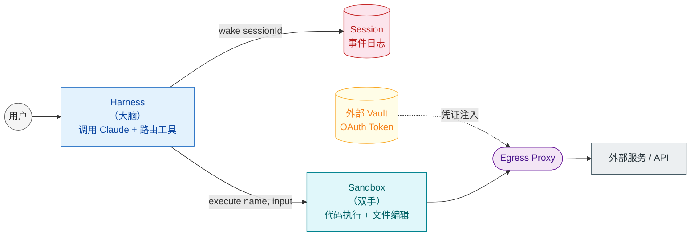

2026 年 4 月 13 日到 15 日，AI Agent 的 Infra 集中爆发了一批重要发布。

4 月 13 日，Cloudflare 发布了 **Sandboxes**，给每个 Agent 分配了一台专属的云端 Linux 实例，带有真实 shell、文件系统和后台进程，还支持快照存档和按需唤醒。两天后，Cloudflare 上线 **Project Think**（下一代 Agents SDK）和 **Browser Run**（Agent 专用的浏览器）。当天，OpenAI 发布 **Agents SDK 新版**，原生引入 sandbox 执行；**Vercel 宣布成为 OpenAI Agents SDK 的官方 sandbox 扩展**。

当头部玩家集中指向同一条路时，通常意味着某种底层共识已经形成。这次共识的主题很明确：AI Agent 的工具调用环境，正在全面沙盒化。

这远不止"给 Agent 加个隔离环境"这么简单。安全模型、成本结构、开发范式都在被重构，甚至连"Agent 是什么"这个基本定义，也在被改写。

---

## 安全：Prompt Injection 从"理论风险"变成"架构假设"

几年前，行业在讨论 LLM 的安全问题时，Prompt Injection 还更像是一个研究者演示的"魔术 trick"——精心设计一段提示词，让模型忽略前面的指令，输出一些不该输出的东西。那时候大多数人的反应是："挺有意思的，但生产环境里谁会这么干？"

但现在不一样了。

Agent 和早期聊天机器人最大的区别，在于**它真的有权限做事情**。Claude Code 可以读写你的代码库，Cursor Agent 可以执行 shell 命令，各种 Agent 框架可以调用 MCP 工具去查数据库、发邮件、甚至转账。当模型生成的代码或命令被直接执行时，Prompt Injection 就从"让模型说错话"升级成了"让模型替你执行一段危险代码"。

Anthropic 在 4 月 9 日发表的《[Scaling Managed Agents: Decoupling the brain from the hands](https://www.anthropic.com/engineering/managed-agents)》给出了一个直接的例子：他们的旧架构里，不可信代码和凭证共处同一个容器。Claude 生成的代码在那个容器里运行，而 OAuth token、API key 这些敏感信息也以环境变量的形式放在同一个容器里。这意味着，**一次成功的 Prompt Injection 攻击，只需要说服 Claude 读取自身的环境变量**，就能把 token 泄露出去。

这个发现促使他们彻底重构了架构。

在新的 Managed Agents 中，Anthropic 把 Agent 拆成了三个抽象组件：Session（追加式事件日志）、Harness（调用 Claude 并路由工具请求的循环）、Sandbox（代码执行和文件编辑环境）。其中最关键的一个设计决策是：**Harness 和 Sandbox 必须物理分离。**

Harness 负责思考，Sandbox 负责执行。Harness 知道该做什么，但它不直接执行代码；Sandbox 执行代码，但它**永远接触不到凭证**。当 Agent 需要调用一个 MCP 工具时，OAuth token 存储在外部安全 vault 中，由专门的代理用 session 关联的 token 去取凭证，Sandbox 里运行的代码对此一无所知。

Cloudflare 的做法也异曲同工。他们的 Sandboxes 采用了一种"安全凭证注入"机制：凭证不会以环境变量的形式在容器启动时进入 Sandbox，取而代之的是在**网络层通过可编程的 egress proxy 动态注入**。Sandbox 里的 Agent 可以正常发起出站请求，但凭证对 Agent 本身完全不可见。你可以在 Sandbox 子类上配置 `outboundByHost` 规则，为不同的目标主机附加不同的自定义认证逻辑。

两家公司的思路出奇地对齐：从"deny-list"（禁止做什么）转向"capability-based"（只允许做什么），再往前一步——**让凭证在物理上不可从执行环境触及**。

到这一层，Prompt Injection 和代码注入攻击已经被当作**第一性原理**直接写进架构。

这里有一个更深层的转变值得注意。传统安全模型默认假设"系统本身可信，需要防御的是外部攻击者"。但在 Agent 架构里，**系统自己生成的代码就是最大的不可信来源**。模型可能被注入、可能产生幻觉、可能在多轮对话中被潜移默化的诱导。你把这种代码直接放到有凭证的环境里运行，等于主动制造了一个内鬼。

所以沙盒化的核心安全命题已经变了：重点从"怎么防止坏人攻击 Agent"转移到了"**怎么防止 Agent 自己害自己**"。这个认知翻转，是旧架构和新架构之间最根本的分水岭。

---

## 规模：Agent 的"一对一"特性，让传统容器经济学崩了

安全是驱动力之一，但沙盒化能成为行业共识，还有更深层次的经济学原因。

传统 Web 应用是"一对多"的：一个服务实例可以同时服务成千上万个用户。这意味着你可以用几百台服务器支撑几百万用户，规模效应非常明显。容器和 VM 的定价模型，也是基于这个假设设计的：你租一个实例，让它保持运行，然后尽可能提高它的利用率。

但 Agent 不同。**Agent 是"一对一"的。**

一个 Claude Code 实例服务一个开发者。一个 OpenAI Agents SDK 的 sandbox 会话，通常也只服务一个终端用户的一个具体任务。当你把 Agent 部署到生产环境，场景已经从"100 个实例服务 100 万用户"变成了"100 万个用户可能各自需要一个 Agent 实例"。

Cloudflare 在 Project Think 的博客里算了一笔账：假设有 **10,000 个 Agent，每个每天只活跃 1% 的时间**。在传统的 VM/Container 模型下，你需要保持 **10,000 个实例常开**。因为容器不是为这种"极度稀疏"的负载设计的，启动一个容器需要几十秒，安装依赖可能需要几分钟，你不可能每次用户发消息都重新冷启动。

但 Cloudflare 的答案是 **Durable Objects**。同样是 10,000 个活跃 1% 的 Agent，Durable Objects 在任何时刻只需要保持 **约 100 个活跃实例**。因为 Durable Objects 支持 hibernation：Agent 空闲时进入休眠，成本几乎为零；收到消息时毫秒级唤醒，恢复之前的状态。

**生成一个新 Agent 的边际成本几乎是零。**

这个经济模型完全颠覆了传统容器的定价逻辑。当 99% 的时间你的 Agent 都在等 LLM 响应或等用户输入时，按 active CPU 时间计费 vs 按实例 uptime 计费，差距可能是两个数量级。

Anthropic 的 Managed Agents 也验证了这一点。他们把 Harness 从容器里拆出来之后，发现了一个意外的性能提升：**p50 TTFT（Time To First Token）下降了约 60%，p95 TTFT 下降超过 90%。**

原因是，在旧架构里，每次启动一次推理，都必须先完成容器启动、仓库克隆、依赖安装等一系列前置工作。解耦之后，Harness 可以直接开始调用模型，只有真正需要执行代码时才去分配 Sandbox。不需要 Sandbox 的会话，响应几乎是即时的。

**成本结构和性能结构同时指向同一个方向，架构演进的信号就已经足够确定。**

更进一步看，这种"一对一"特性可能永久改变了工程师对"并发"的理解。在 Web 服务里，并发是一个需要被管理的问题——怎么让有限的服务器资源服务尽可能多的用户。但在 Agent 世界里，并发是一种**默认状态**——每个用户自带一个独立进程，而且这些进程的生命周期不由服务端控制。你不能像关连接池一样关掉它们，因为用户可能下一秒就回来继续对话。

这意味着，Agent 基础设施的优化目标，从"提高单机利用率"变成了"降低空闲持有成本"。**谁能把空闲成本压到最低，谁就能在这个赛道里胜出。** Durable Objects 的 hibernation、Cloudflare Sandboxes 的快照恢复、Anthropic Session 的独立持久化，本质上都是在解决同一个问题：怎么让 Agent"睡着"的时候不花钱，"醒来"的时候不丢状态。

---

## 模型能力：Agent 正变得更擅长写代码驾驭系统

除了安全和规模，第三个推动力来自模型本身的能力演进。

过去几年，Agent 的主流交互模式是"工具调用"（tool calling）：模型每一步都从预定义的工具列表里选一个，填充参数，等待执行结果，然后再选下一个。这种模式很直观，也很容易理解，但它有一个根本性的问题：**当任务复杂时，token 消耗会爆炸。**

Cloudflare 在 API MCP server 上做了一个对比实验。如果采用传统的"每个 API 端点对应一个 MCP 工具"的 naive 方案，整个工具描述会消耗 **约 117 万个 tokens**。但如果只暴露两个工具——`search()` 和 `execute()`——让模型自己去搜索 API 文档并写出调用代码，token 消耗骤降到 **约 1,000 个 tokens**。

**这是 99.9% 的 token 降幅。**

这说明一个趋势：frontier 模型正在变得越来越擅长**写代码来驾驭一个系统**——写代码比一步一步地选择预定义工具更顺手。对模型来说，"写一个 Python 脚本批量处理数据"比"调用 20 次 read_file、10 次 write_file、5 次 run_shell"更自然，也更高效。

这直接催生了 `@cloudflare/codemode` 的设计思路（目前仍是 Cloudflare Agents SDK 里的 Experimental 包）。在 Project Think 里，Cloudflare 提出：与其让 LLM 在工具之间反复横跳，不如让它直接写一段程序，把整件事一次性做完。这段程序运行在 **Dynamic Worker** 里——一个毫秒级启动的 V8 isolate，只有几 MB 内存，但足以安全地执行模型生成的 JavaScript/TypeScript 代码。

Dynamic Worker 的安全模型也很有代表性。默认状态下，它**几乎没有任何环境权限**（`globalOutbound: null`，没有网络访问）。你需要显式地通过 bindings 授予能力。Cloudflare 说得很直白："We go from asking 'how do we stop this thing from doing too much?' to 'what exactly do we want this thing to be able to do?'"

这种 capability-based 的思路，和 Anthropic 的安全模型设计如出一辙。

**模型的能力边界变了，基础设施的接口设计也得跟着变。** 工具调用不会消失，但它正在从"唯一的交互方式"退化为"众多执行策略中的一种"。代码执行正在崛起，而它天然需要安全的沙盒环境。

但这里需要保留几分质疑。"让模型写代码"在 Cloudflare 的 API server 场景里确实能省 99.9% 的 token，因为 API 端点数量庞大、工具描述冗长。但在很多简单场景里，比如"打开文件 A，找到第 3 行，替换成 XXX"，写代码未必比直接调 `read_file` + `write_file` 更高效。代码有编译/解释开销、有错误处理开销、有时候还会引入模型自己编造的不存在的 API。

所以这场演进更像是"**增加了一个选项**"，它并不意味着旧范式被淘汰。未来的 Agent 架构，可能是多层混合的：简单工具调用走快速路径，复杂任务走代码生成路径，浏览器自动化走 Browser Run 路径。问题的关键不在于"用不用沙盒"，而在于"**怎么在正确的时间选择正确的执行层级**"。

---

## 架构演进：大脑与双手的解耦

前面说了这么多驱动力，这场演进的最终形态长什么样？

Anthropic 的 Managed Agents 可能是目前最清晰的架构蓝图。他们把 Agent 虚拟化成了三个稳定接口，灵感直接来自操作系统虚拟化硬件的思路：

- **Session**：追加式事件日志，记录所有发生的事情。接口是 `getSession(id)` 和 `emitEvent(id, event)`。
- **Harness**：调用 Claude 并路由工具请求的循环。接口是 `wake(sessionId)`。
- **Sandbox**：代码执行和文件编辑环境。接口是 `provision({resources})` 和 `execute(name, input) → string`。

关键洞察在于：**这三个组件的实现可以任意替换，而不会互相干扰。**

在最初的架构里，这三样东西被塞进同一个容器里。这带来了一个严重的问题：容器成了一个"宠物"（pet）——你有名字、有状态、出了问题你得亲手进去调试。更麻烦的是，容器里常常还有用户数据，工程师甚至不能随便进去看日志。如果容器崩溃，Session 就丢了，任务也丢了。

解耦之后，Harness 被抽离了容器。它通过 `execute(name, input) → string` 远程调用 Sandbox。Sandbox 死了？没关系，Harness 把错误返回给 Claude，Claude 自己决定要不要重试。Harness 自己崩溃了？也没关系，因为 Session 日志是独立存储的，新的 Harness 实例可以通过 `wake(sessionId)` 恢复，从最后一条事件继续执行。

这与云计算早期从"宠物"到"牲畜"（pets vs cattle）的演变同构。Anthropic 把这个类比用在了 Agent 基础设施上：**Sandbox 从宠物变成了牲畜**，可以随意替换、横向扩展、按需分配。

而且，这种解耦还带来了一个更深远的影响：**Harness 不知道 Sandbox 到底是什么。**

在 Anthropic 的架构里，每个执行环境都统一实现了 `execute(name, input) → string` 接口。Harness 看到的只是一个工具调用。这个 Sandbox 可以是一个容器、一部手机、甚至一个 Pokémon 模拟器。只要接口对齐，大脑就可以在任意双手之间传递工作。

Cloudflare 的架构也朝着同一个方向演进。他们的 **Project Think** 提供了一个 `Think` 基类，把 Agent 的完整生命周期封装起来：agentic loop、消息持久化、流式输出、工具执行、流恢复、扩展管理。开发者只需要实现一个 `getModel()` 方法，就能得到开箱即用的持久化文件系统、错误处理、可恢复流等全部能力。

而这套架构的关键威力，藏在它的**分层执行模型**里。

---

## Execution Ladder：沙盒不是非黑即白

Cloudflare 提出了一个叫 **Execution Ladder** 的概念。沙盒化超越了"有沙盒"和"没沙盒"的简单二元划分，它是一个从受限到开放的连续谱系。

| Tier | 环境 | 能力 |
|:---|:---|:---|
| 0 | Workspace | 持久化虚拟文件系统（SQLite + R2） |
| 1 | Dynamic Worker | 沙盒化 JS，无网络访问 |
| 2 | Dynamic Worker + npm | 运行时包解析 |
| 3 | Browser Run | 无头浏览器自动化 |
| 4 | Cloudflare Sandbox | 完整 OS 访问：git clone、npm test、cargo build |

这个设计的核心原则是：**Agent 在 Tier 0 就应该有用，每一层都是增量能力。**

也就是说，最简单的 Agent 不需要启动任何容器或虚拟机。它在 Workspace 里就能读写文件、记录状态、完成很多日常任务。只有当任务需要执行代码时，才上升到 Dynamic Worker；需要浏览器时才上升到 Browser Run；需要完整开发环境时才上升到 Cloudflare Sandbox。

这种渐进式能力释放，既保证了安全性（默认最小权限），又避免了过度工程化（不需要为每个 Agent 都分配一个完整容器）。

Cloudflare Sandboxes 的发布，补上了这个阶梯的最顶层。它是一个真正的完整操作系统环境，有 shell、有文件系统、有后台进程，而且支持快照恢复。一个具体的性能数字很能说明问题：

> 启动一个 sandbox，克隆 axios 仓库，然后 `npm install`，从头来需要 **30 秒**。但如果从快照恢复，只需要 **2 秒**。

这意味着 Agent 可以瞬间恢复到一个依赖齐备的工作状态，和人类工程师打开自己常用的开发环境几乎一样快。

Browser Run 则是这个阶梯上另一个很有意思的 tier。Cloudflare 把原来的 Browser Rendering 重命名为 Browser Run，定位非常清晰：**一个专门给 AI Agent 使用的浏览器。**

它支持 Puppeteer、Playwright、CDP，还新增了 MCP Client 支持——Claude Desktop、Cursor、Codex、OpenCode 这些 AI 编码代理可以直接把 Browser Run 当作远程浏览器使用。更有前瞻性的是 **WebMCP** 实验性支持：网站可以通过 `navigator.modelContext` 直接向 AI 代理暴露工具。这意味着未来网站和 Agent 之间可能会出现一个原生的协议层，用来取代传统的爬虫和 DOM 解析。

另外，Browser Run 还引入了 **Human in the Loop**。人类可以通过 Live View URL 直接介入 Agent 的浏览器会话，点击、输入、填凭证。下一步，Cloudflare 还计划支持 Agent 主动向人类发出求助信号，问题解决后再交还控制权。

这套东西叠加在一起，"沙盒"这个词已经装不下了。它其实是一个**完整的 Agent 执行操作系统**。

---

## OpenAI 的入场：沙盒成为 SDK 原生能力

Anthropic 和 Cloudflare 分别从"托管服务"和"边缘基础设施"两个方向推进沙盒化，而 OpenAI 的动作则代表了"模型厂商"的态度。

这次发布的是 Agents SDK Python 版 **v0.14.1**；TypeScript 版（`openai-agents-js`）当前还停在 v0.8.3，sandbox 支持尚在路上——**模型厂商的官方 Agent SDK，正在把 sandbox 当作 P0 能力在全语言栈追赶**。Python 版更新的核心就三件事：

1. **更强大的 Harness**：支持可配置记忆、沙盒感知编排、类 Codex 的文件系统工具、apply patch 工具、shell 工具执行。
2. **原生沙盒执行**：Agent 可以在受控的计算机环境中运行，读写文件、安装依赖、执行代码。
3. **Harness 与计算分离**：为了安全、耐久性和可扩展性，Agent 的状态和执行环境被明确解耦。

OpenAI 没有像 Cloudflare 那样自建沙盒栈，而是选择了**生态集成**路线。SDK 内置支持 7 家沙盒提供商：**Blaxel、Cloudflare、Daytona、E2B、Modal、Runloop、Vercel**。

为了让这些环境可移植，SDK 引入了一个 **Manifest** 抽象。开发者可以用 Manifest 描述 Agent 的工作空间：挂载本地文件、定义输出目录、从 AWS S3 / Google Cloud Storage / Azure Blob Storage / Cloudflare R2 引入数据。这样从本地原型到生产部署，Agent 的工作空间描述是一致的。

最有意思的是，OpenAI 也在 SDK 层面内置了 **snapshotting 和 rehydration**。如果 sandbox 容器挂了或过期了，SDK 可以把 Agent 的状态恢复到一个新容器里，从上一个 checkpoint 继续执行。这和 Anthropic Session 的持久化思路、Cloudflare 的快照恢复，形成了三方呼应。

Vercel 也宣布成为 OpenAI Agents SDK 的官方扩展。他们的宣传语很简单："Build agents that can run code, read files, and analyze data safely inside isolated microVMs."

**一个模型厂商把沙盒当作官方 SDK 的一等公民——这等于给整个行业的沙盒化背书，把它从某家 infra 厂商的卖点升级成了新默认。**

---

## 持久化：沙盒不是一次性的

很多人听到"沙盒"，第一反应是"用完即弃的临时环境"。但这场演进的一个关键发现是：**Agent 需要持久化，而且持久化必须在沙盒之外实现。**

Cloudflare Sandboxes 支持配置 `persistAcrossSessions`，让 sandbox 在休眠时把完整磁盘状态（OS 配置、依赖、修改过的文件）写入 R2，下次唤醒时从快照恢复。Anthropic 则更进一步，提出 **Session 不等于 Context Window**——上下文窗口只是当前喂给模型的内容，Session 记录的是从开始到现在的全部历史事件。Harness 可以通过 `getEvents()` 按位置切片读取、回退到某个时刻查看前因、在失败重试时重读完整上下文。Cloudflare 的 Session API 则把对话存成一棵带 `parent_id` 的树，支持 **forking**、**非破坏性压缩**和基于 SQLite FTS5 的**全文搜索**。

加上 Durable Objects 的 hibernation 和 Fiber 的 checkpoint 机制，长时运行的 Agent 终于达到传统服务端应用级别的可靠性。

**为什么"持久化"对 Agent 比对传统应用更重要？** 因为 Agent 的执行是非确定性的——即使输入完全相同，模型也可能因为温度参数、上下文内容或训练数据中的随机性做出不同选择。当它出错时，你很难像调试传统应用那样"复现问题"。把整个执行过程（每次响应、每次工具调用、每次状态变化）都记录成不可变的事件流，你才可能精确回溯到任何一个历史时刻，看清 Agent 当时看到了什么、做了什么。

在这个意义上，Session 同时扮演了 Agent 的**版本控制系统**、**调试器**和**审计日志**，早就超越了传统意义上的"持久化存储"。

---

## 三种沙盒哲学的分野

三家公司都在做沙盒化，但切入点和哲学有明显的差异。

**Anthropic 是自上而下。** 起点是一次真实的安全危机——旧架构里凭证和代码共处一室，Prompt Injection 可以直接泄露 token。他们先定义"安全隔离"这个第一性原理，然后推导出"Harness 和 Sandbox 必须物理分离"的架构结论。方案强调**解耦和不可知性**：Harness 不需要知道 Sandbox 在哪里、是什么，只通过标准化接口通信。

**Cloudflare 是自下而上。** 起点是他们已有的边缘计算基础设施——Durable Objects、Workers、V8 Isolate、R2 存储。核心创新是 **Execution Ladder** 和 **分层沙盒**：从最轻量的 Workspace 到最重量的完整 OS Sandbox，每一层都对应一个已经成熟的基础设施组件。

**OpenAI 是从中间切入。** 他们没有自建完整的沙盒栈，而是通过 **Manifest 抽象** 和 **生态集成** 把多家沙盒提供商连接起来。SDK 内置支持 7 家提供商，开发者可以用同一套 API 在不同后端之间切换。

**三种哲学会在不同场景里各自胜出，很难说谁会吞掉谁。** 企业级托管、合规敏感的选 Anthropic 路径；已经用 Cloudflare 边缘网络、服务稀疏活跃用户的选 Cloudflare 全栈；快速原型、想保留供应商灵活性的跟 OpenAI 生态走。

但不管选哪条路，终点都一样：**Agent 的执行环境必须被隔离、被解耦、被持久化。**

---

## 沙盒化的隐形成本

任何架构选择都有代价，有一些隐形成本需要提前想清楚。

**第一，调试复杂度显著增加。**

在旧架构里，Agent 的所有东西——模型调用、工具执行、文件读写、状态管理——都在同一个进程或同一个容器里。出了问题，你只需要看一组日志。但在解耦架构里，Harness、Sandbox、Session 是三个独立组件，问题可能出在任何一层。是 Harness 给 Sandbox 传了错误的参数？还是 Sandbox 执行成功了但返回格式不符合 Harness 的预期？又或者是 Session 恢复时丢失了某个关键事件？

Anthropic 自己也在博客里承认，旧架构里调试很痛苦：工程师必须 SSH 进容器 shell，但容器里常有用户数据，不能随便进。新架构虽然解决了"容器是宠物"的问题，但分布式调试的难度其实上升了。好消息是，Cloudflare 的 Browser Run 引入了 Session Recording 和 Live View，OpenAI 的 SDK 也提供了更细粒度的生命周期 hook。但这些可观测性工具本身也需要学习和配置。

**第二，远程调用引入了额外延迟。**

Harness 和 Sandbox 分离后，每次工具调用都要经过一次网络往返。对于轻量级操作（比如读一个小文件），本地执行可能是毫秒级，远程 Sandbox 调用可能需要几百毫秒。Cloudflare 的 Dynamic Worker 启动确实很快（毫秒级），但完整 OS Sandbox 的启动即使是快照恢复也要 2 秒。如果你的 Agent 需要频繁地在 Harness 和 Sandbox 之间来回切换，这些延迟会累积成明显的卡顿感。

**第三，开发体验的分裂。**

很多开发者习惯在本地跑 Agent：Claude Code 在终端里、Cursor Agent 在 IDE 里、Jupyter Notebook 在浏览器里。这些本地环境通常没有真正的沙盒隔离——它们直接访问你的本地文件系统、你的环境变量、你的 SSH key。但当 Agent 从本地迁移到生产环境时，突然之间它要在一个隔离沙盒里运行，很多"本地能跑"的代码在生产环境里会失败。文件路径变了、依赖版本变了、网络访问受限了、凭证注入方式也变了。

这种"本地-生产鸿沟"是沙盒化带来的真实摩擦。OpenAI 的 Manifest 抽象试图解决这个问题，但它只能规范工作空间的描述方式，没法消除不同沙盒后端的实际差异。

**第四，认知负担变重了。**

以前做一个 Agent，你只需要理解"模型 + 提示词 + 工具"这三样东西。现在你要理解 Harness、Sandbox、Session、Manifest、Snapshot、Rehydration、Execution Ladder、Capability-based Security……概念数量翻了一倍。对于已经熟悉传统 Agent 开发的工程师来说，这不是一个无痛的迁移。

长期来看，**这些代价是值得的，但短期内的确会拖慢一部分团队的进度。** 沙盒化就是一次架构升级，任何架构升级都需要付出学习和重构的成本。

---

## 新旧架构对比

把三家公司的做法放在一起看，可以总结出一张新旧架构的对比表：

| 维度 | 旧架构 | 新架构 |
|:---|:---|:---|
| 凭证位置 | 环境变量 / 容器内 | 网络层代理注入 / 外部安全 vault |
| 权限模型 | deny-list（禁止做什么） | capability-based（只允许做什么） |
| 代码与模型 | 同容器运行 | Harness 与 Sandbox 物理分离 |
| 失败恢复 | 容器死 = 任务丢 | Session 独立，可换容器续跑 |
| 实例经济学 | 常开容器，按 uptime 付费 | 休眠唤醒，按 active CPU 付费 |
| 扩展方式 | 垂直扩容单容器 | 按需分配多 Sandbox，并行执行 |

这张表里的每一条，都指向同一个底层共识：**Agent 的执行环境必须被当作不可信环境来设计。** 不管模型有多聪明、对齐做得多好，你都必须假设它生成的代码可能被注入、可能被诱骗、可能出错。Anthropic 把应对这件事的方法叫做 "structural fix"，Cloudflare 把它实现在网络层的 egress proxy 里，OpenAI 把它写进了 SDK 的默认最佳实践里——三家殊途同归。

---

## 生态博弈：沙盒层会成为新的战场吗？

趋势是明确的，但商业格局还不明朗。

目前沙盒赛道的玩家已经不少，把主要玩家的底层技术栈放在一起看，能看出这个市场正在走向分化：

| 提供商 | 底层虚拟化 | 启动速度 | 标志性定位 |
|:---|:---|:---|:---|
| Cloudflare Dynamic Worker | V8 Isolate | 毫秒级 | 为 codemode 设计的轻量执行层 |
| Cloudflare Sandbox | 完整 OS 容器 | 30s 冷启 / 2s 快照恢复 | 完整开发环境，接近本地体验 |
| Vercel Sandbox | Firecracker microVM | 毫秒级 | Amazon Linux 2023 + Node/Python |
| E2B | Firecracker（业界推断） | 官方未披露 | 代码执行沙盒老玩家，按 vCPU-秒计费 |
| Daytona | Docker in Docker | **90ms** | 以"极致冷启"为卖点 |
| Modal | 未披露 | 未披露 | 默认 5 分钟上限 / 可扩到 24h |
| Runloop | Custom bare-metal hypervisor | <2s（10GB 镜像） | 长时**有状态** agent，支持 arm64/x86 |
| Blaxel | MicroVM（rootfs 在内存） | **25ms resume** | "The first sandbox that sleeps but never dies"——standby 零成本 |

几个有意思的观察：

**第一，"让 Agent 睡着不花钱"已经成为跨厂商共识。** Cloudflare 的 Durable Objects hibernation、Blaxel 的 "sleeps but never dies"、Vercel 的 persistent sandboxes (beta) 走的都是同一条路，只是实现手段不同。

**第二，启动速度的竞赛已经到了毫秒级赛道。** Blaxel 25ms resume、Daytona 90ms 创建、Cloudflare Dynamic Worker 毫秒级——完整 OS 容器 2 秒的快照恢复已经属于"慢"的那一档。

**第三，定位正在分岔。** Runloop 明确走"长时有状态 agent"路线，和文章主题直接呼应；Daytona 强调 Docker 兼容性，吸引容器生态迁移者；Cloudflare 和 Vercel 则把沙盒当成更大 PaaS 栈的一部分去卖。

OpenAI 的策略很聪明：不自己建沙盒，而是通过 Manifest 抽象让开发者自由选择提供商。这在短期内有利于生态繁荣，但也带来一个问题：**如果 Manifest 或类似标准被某一方主导，沙盒层可能成为新的 vendor lock-in 战场。**

现在下结论还为时过早。但有一点是确定的：**沙盒层已经成为 Agent 平台的核心竞争力。** 就像云计算时代的操作系统和容器编排一样，谁控制了 Agent 的执行环境，谁就在很大程度上控制了 Agent 的可靠性、安全性和成本结构。

对开发者来说，这意味着选择沙盒提供商时，需要关注的不只是"能不能跑 Python"或"支持哪些依赖"。更重要的是：

- **启动速度**：冷启动和快照恢复分别是多少秒？
- **凭证隔离模型**：token 是如何注入的？Agent 能不能接触到？
- **与现有工具链的集成成本**：是否兼容 MCP？是否支持你现有的模型提供商？
- **定价模型**：是按实例 uptime 还是按 active CPU？在长时稀疏负载下的真实成本是多少？

值得补充的一点是：**小团队可能会在这场博弈中感受到越来越大的压力。** 大厂商可以把沙盒、模型、SDK、浏览器全部打包成一个完整平台，提供端到端的体验。小团队要么依附于某个大平台，要么被迫自己拼凑各种开源组件。这和云计算早期的格局非常相似——AWS、Azure、GCP 提供完整的一站式服务，自建 Kubernetes 集群则是一场漫长而痛苦的旅程。Agent 基础设施似乎正在重复同样的剧本。

---

## 未来 12 个月的判断

基于目前的发布和行业动向，未来一年可以做出四个具体判断。

**第一，MCP 协议会向"远程安全执行"方向快速演进。** 现在 MCP 还主要是本地工具调用协议，但随着沙盒化成为默认，MCP 服务器本身也需要在隔离环境中运行。下一个版本大概率会引入类似 Anthropic 的 capability-based 权限声明 + 类似 OpenAI Manifest 的环境描述能力，从单纯的"工具协议"扩展成"工具 + 执行环境"的协议。

**第二，Sandbox-as-a-Service 会爆发价格战。** Cloudflare 的按 active CPU 计费模式一旦跑通，E2B、Modal、Runloop 这些按实例或执行时间计费的玩家会被迫跟进。"休眠免费"和"快照恢复"会成为新的竞争卖点，沙盒的边际成本会被持续压低。

**第三，"Agent 专用浏览器"会成为一个独立的产品品类。** Browser Run 标志着传统浏览器自动化（Puppeteer / Playwright）和 Agent 浏览器的分野——后者需要 CDP、MCP、WebMCP、Live View、Session Recording、Human-in-the-Loop，这些功能对人类用户毫无意义。除了 Cloudflare，其他 infra 厂商甚至浏览器厂商自己大概率也会跟进。

**第四，小型团队会面临自建还是上云的两难。** 自己搭一套完整的 Harness-Sandbox-Session 分离架构，对几个人的团队来说可能是数周到数月的投入；选 Cloudflare/OpenAI 托管则要承担 vendor lock-in 和平台成本。越来越多的小团队会选"先用托管方案跑起来，规模大了再迁移"。

---

## 写在最后

回看这一波发布，最强烈的信号是：**AI Agent 正在完成从"玩具"到"基础设施"的跃迁。**

第一代 Agent 是聊天机器人，无状态、单次交互、出了错刷新页面就行。第二代 Agent 是 Claude Code、Codex 这些本地编码助手，有状态了，但仍然绑定在个人电脑上，没有耐久性保证，也没有真正的安全边界。

现在，第三代 Agent 正在成型：**durable、distributed、serverless、structurally secure**。沙盒化是这个时代的底层基座——沙盒保证可靠运行、解耦控制规模成本、持久化撑起长程任务，三者互为支撑，缺一不可。

如果你现在还在用本地脚本或者裸容器跑 Agent，那也没关系——prototype 阶段本来就不需要这么重。**但只要把 Agent 推向生产环境，沙盒化就是下一步的默认假设。**

## 参考资料

- [Project Think: building the next generation of AI agents on Cloudflare](https://blog.cloudflare.com/project-think/)
- [Agents have their own computers with Sandboxes GA](https://blog.cloudflare.com/sandbox-ga/)
- [Browser Run: give your agents a browser](https://blog.cloudflare.com/browser-run-for-ai-agents/)
- [Scaling Managed Agents: Decoupling the brain from the hands](https://www.anthropic.com/engineering/managed-agents)
- [The next evolution of the Agents SDK | OpenAI](https://openai.com/index/the-next-evolution-of-the-agents-sdk/)
- [Vercel Developers on X](https://x.com/vercel_dev/status/2044492058073960733?s=20)
