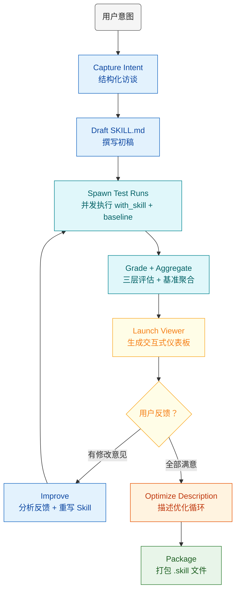
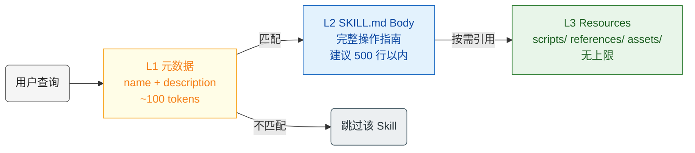
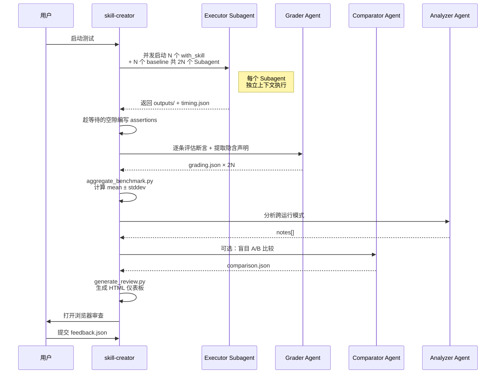
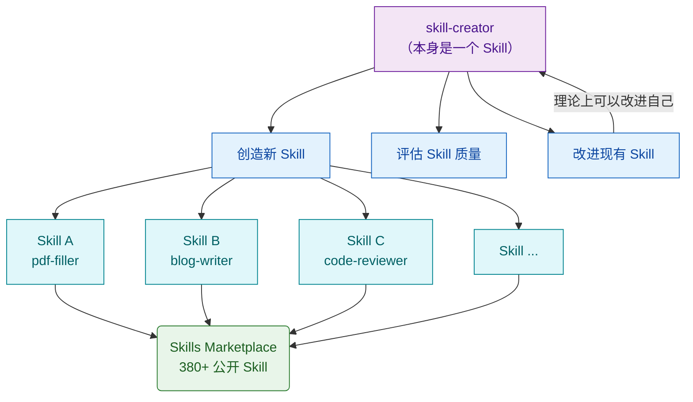

# 拆解 Anthropic 的 skill-creator：AI Agent 的技能工厂是怎么运转的

> 用 Skill 创造 Skill

写一份 SKILL.md 很容易 —— 随便抄个模板，填上 name 和 description，正文写点操作指南，就是一个"能用"的 Skill。

但"能用"和"好用"之间差着十万八千里。

怎么算"好用"？触发精不精准？该触发的时候不触发怎么办？不该触发的时候乱触发怎么办？同一个 Skill 跑 10 次，有几次能让用户满意？description 写多长合适？怎么知道改了之后变好了还是变差了？

这些问题靠手动调试根本没法回答。

Anthropic 自己显然也被这些问题折磨过，所以他们做了 [skill-creator](https://github.com/anthropics/skills/tree/main/skills/skill-creator) —— 一个用来**批量制造和迭代改进 Skill 的 Skill**。

skill-creator 并不是新东西，它从 2025 年 10 月 Agent Skills 发布时就存在了。但当时它基本就是一个交互式的脚手架工具 —— 问你几个问题，帮你生成 SKILL.md 初稿，完事了。

**2026 年 2 月 25 日，Anthropic 悄悄推了一个大更新**（[PR #465](https://github.com/anthropics/skills/pull/465)），skill-creator 几乎被重写了。这次提交改动了 20 个文件，新增 5200+ 行代码，删掉了旧的 `init_skill.py` 脚手架，换上了一套完整的评估和优化工具链：

- **三个专职评估 Agent**（Grader / Comparator / Analyzer）—— 全部新增，之前不存在
- **描述优化循环**（`run_loop.py` + `run_eval.py` + `improve_description.py`）—— 全部新增，自动化调优 description 的触发精度
- **基准测试框架**（`aggregate_benchmark.py`）—— 全部新增，with_skill vs without_skill 的 A/B 统计
- **交互式审查仪表板**（`eval-viewer/`）—— 全部新增，1800 行的 HTML + Python HTTP 服务器
- **JSON Schema 规范**（`references/schemas.md`）—— 全部新增，8 种 JSON 结构的完整定义
- **SKILL.md 本身大幅重写**（+336 / -214 行）—— 工作流从"生成初稿"扩展到 Draft-Test-Evaluate-Improve 完整闭环

更早的 2 月 6 日还有一个小更新（[PR #350](https://github.com/anthropics/skills/pull/350)），加了 `compatibility` 字段、把 Skill 名最大长度从 40 放宽到 64 字符。

换句话说，**现在的 skill-creator 和一个月前的 skill-creator 已经不是同一个东西了**。它从一个简单的模板生成器变成了一套完整的方法论和工具链：有结构化的创造流程，有三个专职评估 Agent，有量化的基准测试框架，有自动化的描述优化循环，甚至还有一个交互式的 HTML 仪表板让你审查每次运行的结果。

这篇文章把更新后的 skill-creator 从里到外拆一遍 —— 不只看它做了什么，更要看它**为什么这么做**。


## 一、Skill 快速回顾

先说清楚"Skill"是什么。

在 Agent Skills 规范里，一个 Skill 就是一个文件夹，核心是一份 SKILL.md。这个文件分两部分：YAML 前置元数据（name + description）和 Markdown 正文。前置元数据里的 `name` 和 `description` 决定了 Agent 什么时候调用这个 Skill，正文则是具体的操作指南。

一个标准的 SKILL.md 长这样：

````yaml
---
name: pdf
description: 处理 PDF 文件。用于读取、创建、合并或填写 PDF 表单。
---

# PDF 处理技能

## 读取 PDF
使用 pdftotext 快速提取文本：
```bash
pdftotext input.pdf -
```

## 创建 PDF
使用 PyPDF2 合并多个文件...

## 注意事项
- 处理大文件时考虑分批处理
- 中文 PDF 可能需要指定字体路径
````

简单来说，Skill 是 Agent 的**外挂知识模块**。不用重新训练模型，不用改代码，编辑一份 Markdown 就能改变 Agent 的行为模式。

那问题来了：手写一个 Skill 和用 skill-creator 造一个 Skill，差别在哪？

| 对比维度 | 手写 Skill | 用 skill-creator 造 Skill |
|---------|-----------|------------------------|
| 质量验证 | 人肉跑几个 prompt 看看 | 自动化测试 + 量化评分 |
| 描述优化 | 凭感觉写 description | 分层采样 + 迭代优化循环 |
| 迭代方式 | 改一下试一下 | Draft → Test → Evaluate → Improve 闭环 |
| 评估标准 | "感觉还行" | 断言评级 + 盲目 A/B 测试 + 模式识别 |
| 基线对比 | 没有基线 | 每次测试同时跑 with_skill 和 without_skill |
| 可复现性 | 低 | benchmark.json 完整记录每次运行的 pass_rate、耗时、token |

说白了，skill-creator 把"写 Skill"这件事从手工作坊变成了流水线。

先看看这个流水线的目录结构：

```
skill-creator/
├── SKILL.md                        # 核心工作流说明（480行）
├── agents/
│   ├── grader.md                   # 评分 Agent 规范（8步流程）
│   ├── comparator.md               # 盲目 A/B 比较 Agent
│   └── analyzer.md                 # 跨运行模式分析 Agent
├── scripts/
│   ├── run_loop.py                 # 描述优化主循环（333行）
│   ├── run_eval.py                 # 单次触发率评估（311行）
│   ├── improve_description.py      # 调 Claude extended thinking 改进描述
│   ├── aggregate_benchmark.py      # 基准测试聚合（mean ± stddev）
│   ├── package_skill.py            # 打包 .skill 分发文件
│   ├── quick_validate.py           # Skill 目录校验
│   ├── generate_report.py          # 优化过程 HTML 报告
│   └── utils.py                    # SKILL.md 解析（YAML frontmatter）
├── eval-viewer/
│   ├── generate_review.py          # 交互式审查仪表板（HTTP server）
│   └── viewer.html                 # 仪表板前端模板
├── references/
│   └── schemas.md                  # 所有 JSON 结构定义
└── assets/
    └── eval_review.html            # 描述优化评审 HTML 模板
```

整套系统大约 1900 行 Python + 1100 行 Markdown 规范（含三个 Agent 定义和 JSON Schema）。不算大，但每个文件都有明确的职责。


## 二、核心工作流 —— Draft-Test-Evaluate-Improve

这是 skill-creator 最核心的部分。一切围绕一个闭环运转：



逐阶段拆解。

### 阶段一：Capture Intent

skill-creator 不会上来就让你写 SKILL.md。它先做一轮结构化访谈，围绕 4 个核心问题：

1. **这个 Skill 让 Agent 做什么？** —— 明确能力边界
2. **什么用户 prompt 应该触发它？** —— 定义触发条件
3. **输出格式是什么？** —— 规范预期产出
4. **需不需要设置测试用例？** —— 按 Skill 类型判断

最后一个问题很有意思：skill-creator 会根据 Skill 的性质建议是否需要量化评估。如果你做的是"PDF 表单填写"这类有客观正确答案的 Skill，它会推荐搞测试用例；如果做的是"写作风格优化"这类主观性强的 Skill，它会建议以人工审查为主。

还有一个场景：如果用户是在当前对话中说"把刚才的操作变成一个 Skill"，skill-creator 会直接从对话上下文里提取答案 —— 用了哪些工具、执行了什么步骤、用户做过哪些纠正、输入输出格式是什么。这比从零开始问一遍高效得多。

### 阶段二：Draft

基于访谈结果生成 SKILL.md。这里有几个写作原则值得注意。

**description 要"稍微激进一点"**。skill-creator 的 SKILL.md 原文是这样说的：

> Currently Claude has a tendency to "undertrigger" skills — to not use them when they'd be useful. To combat this, please make the skill descriptions a little bit "pushy".

翻译过来就是：Claude 当前的倾向是**宁可不用也不乱用**。所以 description 要写得主动一点，把各种可能的触发场景都明确列出来。比如不要写"How to build a dashboard"，而要写"How to build a dashboard. Make sure to use this skill whenever the user mentions dashboards, data visualization, internal metrics, or wants to display any kind of company data, even if they don't explicitly ask for a 'dashboard.'"

**SKILL.md body 控制在 500 行以内**。超过了就拆到 references/ 目录下，body 里只放指引。

**解释 why 而不是堆砌 MUST**。skill-creator 原文又说了：

> Try hard to explain the **why** behind everything you're asking the model to do. If you find yourself writing ALWAYS or NEVER in all caps, that's a yellow flag — reframe and explain the reasoning.

这个我觉得是特别好的设计理念。与其写"ALWAYS use PyMuPDF"，不如写"PyMuPDF 比 pdftotext 好在哪里、什么场景下用什么"，让模型理解了道理之后自己做选择。

### 阶段三：Test

测试阶段的设计很精巧。

对每个测试用例，skill-creator 同时启动两个 Subagent —— **一个带 Skill 跑，一个不带 Skill 跑**（或者如果是改进已有 Skill，就用旧版本作为基线）。两组并发执行，结果存到独立的目录里。

为什么一定要跑基线？因为如果不跑基线，你根本不知道 Skill 到底有没有帮上忙。可能 Agent 不带 Skill 也能搞定这个任务，你的 Skill 只是增加了 token 开销而已。有了 A/B 对比，好坏一目了然。

测试用例保存在 `evals/evals.json` 里：

```json
{
  "skill_name": "pdf-filler",
  "evals": [
    {
      "id": 1,
      "prompt": "Fill out the W-9 form with my company info",
      "expected_output": "A filled PDF with all required fields populated",
      "files": ["evals/files/w9-blank.pdf"],
      "expectations": [
        "The output is a valid PDF file",
        "The company name field contains the provided name",
        "The EIN field is correctly formatted"
      ]
    }
  ]
}
```

每个 eval 有一个 `expectations` 列表，就是后面 Grader Agent 要逐条评判的断言。但注意：skill-creator 建议先不写 expectations —— 先跑一遍看看结果长什么样，然后在等待运行完成的间隙再补断言。这个"趁等待时间干活"的设计贯穿了整个工作流。

工作目录的组织方式：

```
pdf-filler-workspace/
└── iteration-1/
    ├── eval-0-fill-w9/
    │   ├── eval_metadata.json      # prompt + assertions
    │   ├── with_skill/
    │   │   ├── outputs/            # Skill 产出的文件
    │   │   ├── timing.json         # token 和耗时数据
    │   │   └── grading.json        # Grader 评分结果
    │   └── without_skill/
    │       ├── outputs/
    │       ├── timing.json
    │       └── grading.json
    ├── benchmark.json              # 聚合统计
    └── feedback.json               # 用户反馈
```

### 阶段四：Evaluate

三个 Agent 分工协作，下一节细说。

### 阶段五：Improve → 循环

读取 `feedback.json` 中的用户反馈。空反馈意味着"没意见"，focus 修改的重点放在用户有具体抱怨的测试用例上。

skill-creator 对改进 Skill 有几条指导原则，我觉得写得特别实在：

**从反馈中泛化，而不是逐条修补**。原文说得很直白：如果你只是针对这几个测试用例做 overfitting 式的修改，那这个 Skill 用到其他场景上就废了。要从失败中抽象出更通用的规律。

**保持精简**。如果某个指令在转录（transcript）里看起来一直在让 Agent 做无用功，就大胆删掉。

**观察重复工作**。如果三个测试用例跑下来，每个 Subagent 都独立写了一个类似的 `create_docx.py`，那就说明这个脚本应该被提取出来放到 `scripts/` 目录里，让 Skill 直接调用。

循环退出的三个条件：用户说满意了、反馈全空、或者连续几轮没有明显进步。


## 三、三层渐进式加载

Agent Skills 规范用了一个叫渐进式加载（Progressive Disclosure）的策略。这里从 skill-creator 的视角看它怎么被具体运用，以及为什么 L1 层（description）的设计如此重要。

Agent 在处理用户请求时，不会一股脑把所有 Skill 的完整内容塞进上下文。上下文窗口的空间是有限的，如果装了 50 个 Skill 的全文，光 Skill 内容就占掉大半窗口了。实际策略是分三层按需加载：



| 层级 | 内容 | Token 开销 | 加载时机 | 作用 |
|-----|------|-----------|---------|------|
| L1 | name + description | ~100 | 始终在上下文中 | 决定是否触发 |
| L2 | SKILL.md body | 500 行以内 | Skill 被触发时加载 | 提供操作指南 |
| L3 | scripts/ references/ assets/ | 无上限 | body 中明确指引时按需加载 | 执行脚本、查阅参考 |

这里有个关键问题：**L1 的 description 是整个触发链的入口**。如果 description 写得不好 —— 太泛导致乱触发，太窄导致该用的时候不用 —— 后面两层再精彩也没用，因为 Agent 根本不会去读。

skill-creator 对 description 的写法有几条实操建议：

1. **聚焦用户意图**。不要描述 Skill 内部怎么工作（"Uses PyMuPDF to extract text"），而要描述用户想做什么（"Use when the user needs to read, fill, merge, or create PDF files"）。
2. **用祈使句**。"Use this skill for..." 比 "This skill does..." 更容易触发。
3. **列举边缘场景**。"Even if they don't explicitly mention PDF but describe tasks that involve document forms, contracts, or printable files" —— 把那些不那么明显的触发条件说清楚。
4. **控制长度**。100-200 词，不超过 1024 字符。太长了反而影响理解。

skill-creator 还特别指出了一个 Skill 触发的"盲区"：简单的单步任务（比如"帮我读一下这个 PDF"）可能不会触发 Skill，因为 Agent 觉得自己用基础工具就能搞定。只有复杂的、多步骤的、明确需要专业知识的查询才能可靠地触发 Skill。所以你的测试查询也要足够复杂才有测试价值。

这也正是为什么 skill-creator 专门有一整套描述优化循环（第五节详细展开）—— 目标就是**让 L1 的触发精度尽可能高**。


## 四、评估系统 —— 三个 Agent 各司其职

评估是 skill-creator 最有意思的部分。它不是简单地跑完测试人肉看结果，而是设计了三个专职 Agent 组成一套评估流水线。

### Grader Agent：断言评级 + 评估批评

Grader 的工作分 8 步，定义在 `agents/grader.md` 里。

**Step 1-2：读取输入**。读完整的执行转录（transcript），再检查输出目录里的所有文件。不只依赖转录说了什么，还要自己打开输出文件验证 —— 因为 Agent 可能声称"成功生成了 PDF"但实际上文件是空的。

**Step 3：逐条评估断言**。对每个 expectation 做 PASS/FAIL 判定，必须引用具体证据。判定标准有个细节值得注意：不只看"形式上满足了"，还要看"实质上完成了"。比如一个断言是"输出文件包含公司名称"，如果文件确实包含了这个名字但整个文件内容是乱码，Grader 应该判 FAIL —— 因为这不是真正的任务完成，只是偶然匹配。

**Step 4：提取隐含声明**。这一步超出了预定义断言的范围。Grader 会从输出中自动提取事实性声明（"表单有 12 个字段"）、流程声明（"使用了 PyMuPDF"）和质量声明（"所有字段都已正确填写"），然后逐条验证。这能捕获到预定义断言覆盖不到的问题。

**Step 5：读取执行者笔记**。如果 Subagent 在执行过程中遇到了不确定的地方，会写到 `user_notes.md` 里。Grader 会把这些不确定性也纳入评分考量。

**Step 6：评估"评估"本身**。这是我觉得设计得最好的一步。Grader 不只打分，还会反过来质疑断言质量：

> A passing grade on a weak assertion is worse than useless — it creates false confidence.

它会指出哪些断言"通过了但没意义"（比如只检查文件名不检查内容），哪些重要结果没有任何断言覆盖，哪些断言根本无法从可用输出中验证。

输出的 `grading.json` 大致长这样：

```json
{
  "expectations": [
    {
      "text": "输出是一个有效的 PDF 文件",
      "passed": true,
      "evidence": "outputs/ 目录中存在 filled_w9.pdf，文件大小 245KB，可正常打开"
    },
    {
      "text": "公司名称字段已填写",
      "passed": true,
      "evidence": "pdftotext 提取结果第 3 行：'Company Name: Acme Corp'"
    },
    {
      "text": "EIN 格式正确",
      "passed": false,
      "evidence": "EIN 字段显示 '12345678'，缺少连字符，正确格式应为 '12-3456789'"
    }
  ],
  "summary": {
    "passed": 2, "failed": 1, "total": 3, "pass_rate": 0.67
  },
  "claims": [
    {
      "claim": "使用 PyMuPDF 填写了表单字段",
      "type": "process",
      "verified": true,
      "evidence": "转录 Step 4：'Tool: Bash - python fill_form.py using fitz module'"
    }
  ],
  "eval_feedback": {
    "suggestions": [
      {
        "assertion": "输出是一个有效的 PDF 文件",
        "reason": "只检查文件存在和大小，一个随机生成的二进制文件也能通过。应改为验证 PDF header 魔数字节 '%PDF-'"
      }
    ],
    "overall": "断言覆盖了主要功能点，但 EIN 格式断言的预期格式应写在 eval 定义里，而非让 Grader 猜测"
  }
}
```

对于可以用程序检查的断言，Grader 还会优先写脚本来验证，而不是"用眼睛看"。脚本更快、更可靠，还能跨迭代复用。

### Comparator Agent：盲目 A/B 测试

Comparator 做的事情更简单也更有趣。它拿到两份输出，标记为 A 和 B，**不知道哪个是 with_skill 的版本，哪个是 without_skill 的**。完全盲评，消除偏见。

它的评估流程：

1. **读取两份输出**，理解任务要求
2. **自动生成评价标准（rubric）**，分内容维度和结构维度，各有 3 个打分项（1-5 分）
3. **逐项打分**，算出综合分（1-10）
4. **选出赢家**，要求明确表态 —— "ties should be rare"

这个设计的精妙之处在于：因为 Comparator 不知道哪个是"我们的版本"，所以它没有预设立场。如果无 Skill 的版本反而做得更好，它会如实报告。

### Analyzer Agent：跨运行模式识别

前两个 Agent 都在看单次运行的结果。Analyzer 拉高视角，看所有运行的聚合数据，找规律：

- 哪些断言在**两种配置下都 100% 通过**？（这个断言没有区分度，不管有没有 Skill 都过了）
- 哪些断言在两种配置下都**100% 失败**？（可能断言本身有问题，或者超出模型能力）
- 哪些断言**方差极高**？（可能是 flaky test，跑一次过、跑一次不过）
- Skill 带来了多少额外的**时间和 token 开销**？值不值？

它的输出是一个 `notes[]` 数组，每条都是一个具体的、有数据支撑的观察。比如：

```
"Assertion 'Output is a PDF file' passes 100% in both configurations — may not differentiate skill value"
"Eval 3 shows high variance (50% ± 40%) — run 2 had an unusual failure that may be flaky"
"Skill adds 13s average execution time but improves pass rate by 50%"
```

三个 Agent 的协作流程：



这套流程有没有让你想起什么？

我觉得像 **Evaluation-Driven Development** —— 先写评估用例，再写实现，跑评估，看结果，改实现，循环。和 TDD 的思路一脉相承，只不过评估对象从代码变成了 Skill，执行者从程序员变成了 Agent。

### eval-viewer：交互式审查仪表板

这个值得单独说一下。`eval-viewer/generate_review.py` 启动一个本地 HTTP 服务器（默认端口 3117），提供一个自包含的 HTML 审查页面。

页面分两个 tab：

**Outputs tab**：逐个展示测试用例。每个用例显示 prompt、输出文件（文本内联渲染、图片内联显示、PDF/XLSX 提供下载）、上一轮的输出（折叠显示，方便对比）、Grader 的评分结果、以及一个文本输入框让你写反馈。键盘左右箭头切换用例，所有反馈自动保存。

**Benchmark tab**：统计摘要。每种配置（with_skill / without_skill）的 pass_rate、耗时、token 使用量，以及 Analyzer 的观察笔记。

从 iteration 2 开始，还能传入 `--previous-workspace` 参数，让仪表板同时展示上一轮的输出和反馈，方便看迭代是否真的在进步。

这个仪表板完全基于 Python 标准库实现，零外部依赖。它的设计体现了一个理念：**让人尽快看到结果**。skill-creator 的 SKILL.md 里专门用大写字母强调了这一点：

> GENERATE THE EVAL VIEWER *BEFORE* evaluating inputs yourself. You want to get them in front of the human ASAP!


## 五、描述优化循环的技术细节

描述优化循环（Description Optimization Loop）是 skill-creator 里技术含量最高的部分。核心逻辑在 `scripts/run_loop.py`，整合了 `run_eval.py`（触发率评估）和 `improve_description.py`（描述改进）两个模块。

### 整体思路

给定一组测试查询（有的应该触发 Skill，有的不应该），反复修改 description，直到触发率达标。

跑一次优化循环的命令长这样：

```bash
python -m scripts.run_loop \
  --eval-set trigger_eval.json \
  --skill-path ~/.claude/skills/my-skill \
  --model claude-opus-4-6 \
  --max-iterations 5 \
  --verbose
```

### 触发率评估的底层实现

`run_eval.py` 的 `run_single_query` 函数揭示了触发检测的具体机制。

它的做法是：在项目的 `.claude/commands/` 目录下临时创建一个命令文件（相当于注册一个假 Skill），然后用 `claude -p` 运行用户查询，通过解析 stream-json 输出来检测 Claude 是否调用了 `Skill` 或 `Read` 工具去读取这个命令文件。

```python
def run_single_query(query, skill_name, skill_description, timeout, ...):
    # 1. 在 .claude/commands/ 下创建临时命令文件
    unique_id = uuid.uuid4().hex[:8]
    clean_name = f"{skill_name}-skill-{unique_id}"
    command_file = project_commands_dir / f"{clean_name}.md"
    command_file.write_text(f"---\ndescription: |\n  {description}\n---\n...")

    # 2. 用 claude -p 执行查询，监听 stream-json 输出
    cmd = ["claude", "-p", query, "--output-format", "stream-json",
           "--verbose", "--include-partial-messages"]
    process = subprocess.Popen(cmd, stdout=subprocess.PIPE, ...)

    # 3. 实时解析流事件，检测是否触发了 Skill
    while time.time() - start_time < timeout:
        # 解析每一行 JSON 事件
        event = json.loads(line)
        if event.get("type") == "stream_event":
            se = event["event"]
            if se["type"] == "content_block_start":
                # 看 Claude 是不是在调用 Skill 或 Read 工具
                if cb["type"] == "tool_use" and cb["name"] in ("Skill", "Read"):
                    pending_tool_name = cb["name"]
            elif se["type"] == "content_block_delta":
                # 检查工具参数里是否包含我们注册的 Skill 名
                accumulated_json += delta["partial_json"]
                if clean_name in accumulated_json:
                    return True  # 触发了！

    # 4. 清理临时文件
    command_file.unlink()
```

注意几个设计选择：

- 用 `--include-partial-messages` 做**流式检测**，而不是等完整响应。一旦发现 Claude 开始调用 Skill 工具，就立即返回 True，不等它真的执行完。这大大缩短了评估时间。
- 每次查询用 `uuid` 生成唯一的命令文件名，避免并发时冲突。
- 如果 Claude 的第一个工具调用不是 Skill 或 Read（比如直接调了 Bash），立即返回 False —— 说明 Claude 决定自己处理，没打算用 Skill。
- 清除 `CLAUDECODE` 环境变量，允许在 Claude Code 会话内嵌套调用 `claude -p`。

并发评估时，用 `ProcessPoolExecutor` 开最多 10 个 worker 同时跑：

```python
with ProcessPoolExecutor(max_workers=num_workers) as executor:
    for item in eval_set:
        for run_idx in range(runs_per_query):  # 默认跑 3 次
            future = executor.submit(run_single_query, item["query"], ...)
```

### 60/40 分层采样

`run_loop.py` 的 `split_eval_set` 函数实现了分层采样：

```python
def split_eval_set(eval_set, holdout=0.4, seed=42):
    """按 should_trigger 字段分层，60% train / 40% test"""
    random.seed(seed)

    # 按正负样本分组
    trigger = [e for e in eval_set if e["should_trigger"]]
    no_trigger = [e for e in eval_set if not e["should_trigger"]]

    # 各自打乱后切分
    random.shuffle(trigger)
    random.shuffle(no_trigger)

    n_trigger_test = max(1, int(len(trigger) * holdout))
    n_no_trigger_test = max(1, int(len(no_trigger) * holdout))

    test_set = trigger[:n_trigger_test] + no_trigger[:n_no_trigger_test]
    train_set = trigger[n_trigger_test:] + no_trigger[n_no_trigger_test:]
    return train_set, test_set
```

为什么要分层？因为测试查询分"应该触发"和"不应该触发"两类，如果随机分组，可能一组全是正样本，另一组全是负样本，评估就没意义了。`max(1, ...)` 确保每组至少有一个正样本和一个负样本。

### 核心循环

```python
def run_loop(eval_set, skill_path, ..., max_iterations=5,
             runs_per_query=3, holdout=0.4, ...):
    train_set, test_set = split_eval_set(eval_set, holdout)

    for iteration in range(1, max_iterations + 1):
        # train + test 一起跑，利用并发
        all_results = run_eval(
            eval_set=train_set + test_set,
            description=current_description,
            runs_per_query=runs_per_query,
            trigger_threshold=0.5,
            ...
        )

        # 按查询内容拆回 train / test
        train_queries_set = {q["query"] for q in train_set}
        train_result_list = [r for r in all_results["results"]
                             if r["query"] in train_queries_set]
        test_result_list  = [r for r in all_results["results"]
                             if r["query"] not in train_queries_set]

        # 训练集全过 → 提前退出
        if train_summary["failed"] == 0:
            break

        # 只把训练集结果喂给改进模型（测试集对它不可见）
        blinded_history = [{k: v for k, v in h.items()
                           if not k.startswith("test_")}
                          for h in history]
        new_description = improve_description(
            ..., eval_results=train_results,
            history=blinded_history, ...
        )
        current_description = new_description

    # 按 test 得分选最优，防止过拟合
    best = max(history, key=lambda h: h["test_passed"] or 0)
    return {"best_description": best["description"], ...}
```

几个关键设计决策：

1. **train + test 放在同一个 batch 里并发跑**。不是先跑完 train 再跑 test，而是合在一起利用并行度，跑完后再拆分。
2. **改进模型看不到 test 结果**。`blinded_history` 会过滤掉所有 `test_` 前缀的字段。模型只能根据 train 的表现来调整 description，test 分数纯粹用来选最终结果。这和机器学习里的训练/验证集分离是同一个道理。
3. **最终选 test 得分最高的 iteration，而不是最后一个 iteration**。因为最后一个 iteration 的 description 可能对 train 过拟合了，而在 test 上反而退步了。

### Claude Extended Thinking

`improve_description.py` 是整个循环的"大脑"。它调用 Claude 的 extended thinking（扩展思考）能力来分析失败原因并生成改进后的 description：

```python
response = client.messages.create(
    model=model,
    max_tokens=16000,
    thinking={
        "type": "enabled",
        "budget_tokens": 10000,
    },
    messages=[{"role": "user", "content": prompt}],
)
```

10000 tokens 的思考预算，让模型有充分的空间去分析为什么某些查询没触发、某些查询误触发了。

prompt 的构造也很讲究。它会告诉模型：

- 当前的 description 是什么
- 当前的 train 得分（不含 test）
- 哪些查询触发失败了（FAILED TO TRIGGER），附带触发率数据（比如 "triggered 1/3 times"）
- 哪些查询误触发了（FALSE TRIGGERS）
- **之前所有尝试过的 description 和得分**（带 `<attempt>` 标签），并明确指出"DO NOT repeat these — try something structurally different"
- Skill 的完整内容（供参考）

prompt 的结尾有一段关键指导：

> What I DON'T want you to do is produce an ever-expanding list of specific queries that this skill should or shouldn't trigger for. Instead, try to generalize from the failures to broader categories of user intent.

这直接阻止了模型做"头痛医头"式的修补 —— 不要把失败的查询关键词塞进 description，而要抽象出更通用的意图模式。

还有一个细节：如果生成的 description 超过 1024 字符，会发起第二轮对话要求缩短，同样启用 extended thinking。


## 六、基准测试与打包分发

### 基准聚合

`aggregate_benchmark.py` 负责把散落在各个目录下的 grading.json 汇总成一份标准化的基准报告。

它的统计方式很清晰：对每种配置（with_skill / without_skill），分别计算 pass_rate、time_seconds、tokens 三个指标的 mean、stddev、min、max，然后算两种配置之间的 delta。

```python
def calculate_stats(values):
    n = len(values)
    mean = sum(values) / n
    if n > 1:
        variance = sum((x - mean) ** 2 for x in values) / (n - 1)
        stddev = math.sqrt(variance)
    else:
        stddev = 0.0
    return {"mean": round(mean, 4), "stddev": round(stddev, 4),
            "min": round(min(values), 4), "max": round(max(values), 4)}
```

注意用的是**样本标准差**（除以 n-1），不是总体标准差。因为我们只跑了几次运行，是对"真实性能"的采样估计。

benchmark.json 的输出大致长这样：

```json
{
  "metadata": {
    "skill_name": "pdf-filler",
    "timestamp": "2026-02-26T10:30:00Z",
    "evals_run": [1, 2, 3],
    "runs_per_configuration": 3
  },
  "run_summary": {
    "with_skill": {
      "pass_rate": {"mean": 0.85, "stddev": 0.05, "min": 0.80, "max": 0.90},
      "time_seconds": {"mean": 45.0, "stddev": 12.0, "min": 32.0, "max": 58.0},
      "tokens": {"mean": 3800, "stddev": 400, "min": 3200, "max": 4100}
    },
    "without_skill": {
      "pass_rate": {"mean": 0.35, "stddev": 0.08, "min": 0.28, "max": 0.45},
      "time_seconds": {"mean": 32.0, "stddev": 8.0, "min": 24.0, "max": 42.0},
      "tokens": {"mean": 2100, "stddev": 300, "min": 1800, "max": 2500}
    },
    "delta": {
      "pass_rate": "+0.50",
      "time_seconds": "+13.0",
      "tokens": "+1700"
    }
  },
  "notes": [
    "Assertion 'Output is a PDF file' passes 100% in both configurations",
    "Skill adds 13s average execution time but improves pass rate by 50%"
  ]
}
```

delta 一目了然：Skill 让通过率提升了 50 个百分点，代价是多花 13 秒和 1700 tokens。这种信息对决策非常有价值 —— 有些 Skill 效果好但太慢，有些改善不大但几乎零开销，有些反而让结果变差了（delta 为负）。

### 打包分发

`package_skill.py` 把 Skill 目录打成 `.skill` 文件（本质是 ZIP）：

```bash
python -m scripts.package_skill path/to/my-skill
```

打包前会做基本的校验（SKILL.md 是否存在、frontmatter 是否有 name 和 description），然后排除不需要分发的内容：`__pycache__`、`node_modules`、`.DS_Store`、根目录下的 `evals/` 目录。

生成的 `.skill` 文件可以上传到 Skills Marketplace 让其他人安装使用。


## 七、元技能的自我参考性

写到这里，我想说一个 skill-creator 身上最有意思的特性：**它本身就是一个 Skill**。

打开 `skill-creator/SKILL.md`，开头就是标准的 YAML 前置元数据：

```yaml
---
name: skill-creator
description: Create new skills, modify and improve existing skills,
  and measure skill performance. Use when users want to create a
  skill from scratch, update or optimize an existing skill, run
  evals to test a skill, benchmark skill performance with variance
  analysis, or optimize a skill's description for better triggering
  accuracy.
---
```

它是一个 Skill，同时也是制造 Skill 的工具。用 Skill 规范编写，然后能创造和改进其他 Skill —— 理论上包括它自己。

这个结构在计算机科学里叫 **self-hosting**（自举）。最经典的例子是编译器：GCC 用 C 写成，然后能编译 C 代码，包括编译 GCC 自己的源代码。第一版 GCC 需要用其他编译器编译出来，但之后的所有版本都可以用上一版的 GCC 来编译。

skill-creator 也是这个逻辑：第一版的 SKILL.md 需要人手写出来，但后续的改进可以用 skill-creator 自己的评估和优化流程来驱动。



这种自我参考性不只是巧合。skill-creator 的 SKILL.md 里有一句话暴露了 Anthropic 的野心：

> This task is pretty important (we are trying to create billions a year in economic value here!)

他们把 Skill 看成一个需要**工业化生产**的产品线。skill-creator 是这条生产线上的核心机器 —— 一台能造机器的机器。

一台能造机器的机器，这是工业革命的起点。


## 八、生态现状

2025 年 12 月，Anthropic 正式发布 Agent Skills 开放标准。OpenAI 的 Codex CLI 随后采纳了同样的格式 —— YAML 前置元数据 + Markdown 正文。标准统一意味着一个 Skill 理论上可以在不同的 Agent 平台之间复用。

社区已经积累了 380+ 个公开 Skill，Skills Marketplace 上线。从 PDF 处理到代码审查，从前端开发到数据分析，各种垂直领域都有人在造 Skill。

skill-creator 在这个生态里的角色是**质量基础设施**。没有它，Marketplace 上大概率会充斥着写完就扔、没经过任何测试的 Skill —— 你不知道它在什么场景下有效，通过率多少，比不用 Skill 好多少。有了 skill-creator，至少每个 Skill 可以带一份 benchmark.json，用数据说话。

回头看整个 skill-creator 的设计，最让我觉得值得学习的不是某个具体算法，而是一个理念：**对 AI 的产出质量不要凭感觉，要用数据量化**。不管是 Skill 的触发率、pass_rate 还是 token 开销，全都有对应的指标和检测方法。这套思路完全可以迁移到其他场景 —— 任何你需要系统化地评估和改进 AI 输出质量的地方，都可以借鉴这个 Draft-Test-Evaluate-Improve 的闭环。

> AI Agent 自己给自己造知识模块，自己评估自己造出来的东西，自己改进自己的作品 —— 这条路走下去，终点在哪，我还真不好说。


## 参考资料

- [Agent Skills 官方仓库（GitHub）](https://github.com/anthropics/skills)
- [skill-creator 源码目录](https://github.com/anthropics/skills/tree/main/skills/skill-creator)
- [PR #465 - 本文讨论的大更新](https://github.com/anthropics/skills/pull/465)
- [PR #350 - compatibility 字段等更新](https://github.com/anthropics/skills/pull/350)
